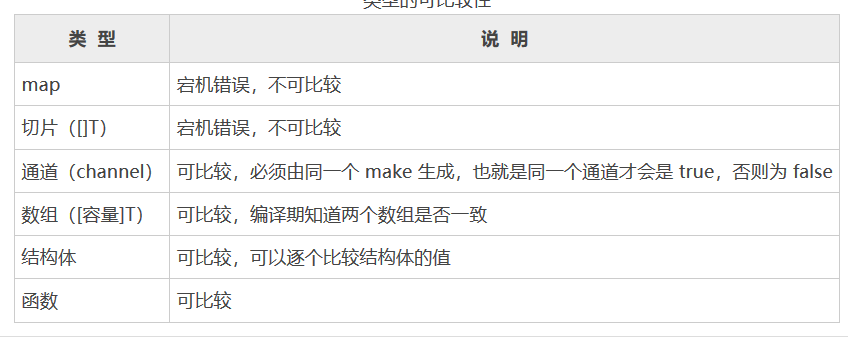

## 1.介绍

* 指针类型（引用类型），若没有初始化接口就使用，默认输出nil
* 是一组方法签名的集合， 
* 是调用方和实现方均需要遵守的一种协议，大家按照统一的方法命名参数类型和数量来协调逻辑处理的过程。 
* 接口的主要工作是仅提供由方法名称、输入参数、返回类型组成的方法签名集合。

```go
使用组合实现对象特性的描述。
对象的内部使用结构体内嵌组合对象应该具有的特性，
对外通过接口暴露能使用的特性。
```

## 2.特性

*    对其它类型行为的抽象和概括 
     *    接口类型不会和特定的实现细节绑定在一起，通过这种抽象的方式我们可以让我们的函数更加灵活和更具有适应能力。 
     *    接口不实现方法，体现程序设计中的多态和高内聚低耦合的思想
     *    由类型（如：结构体）来声明方法实现他们
*    是非侵入式的 ，
     *    是 双方约定的一种合作协议 。接口编写者无须知道接口被哪些类型实现，接口实现者只需知道实现的是什么样子的接口，但无须指明实现哪一个接口，编译器知道最终编译时使用哪个类型实现哪个接口，或者接口应该由谁来实现。  
*    隐式实现
     *    没有必要对于给定的具体类型定义所有满足的接口类型；简单地拥有一些必需的方法就足够了 

## 1.语法

```go
type 接口类型名 interface{
    
    method1(参数列表)返回值列表  // 签名方法,所有方法都没有方法体，即都没有实现的方法
    method2(参数列表)返回值列表
    ...
}

接口类型名：
	使用 type 将接口定义为自定义的类型名。
	Go语言的接口在命名时，一般会在单词后面添加 er
方法名：
	当方法名首字母是大写时，且这个接口类型名首字母也是大写时，此方法可被接口所在的包（package）之外的代码访问。
参数列表、返回值列表：参数列表和返回值列表中的参数变量名可以被忽略

签名方法
	只能是函数，不能是变量

// 接口不需要显示实现，只要一个变量，含有接口类型中的所有方法，那么这个变量就实现这个接口。因此：go中没有implement这样的关键字
	   type usb interface{
            start()
            close()
        }

        type phone struct{}

        func (p *phone) woorking (usb usb){	// 实现了接口的方法，是全部的方法
            usb.start()	
            usb.close()
}
```

## 2.接口签名

```go
签名包括方法中的名称、参数列表、返回参数列表
```

## 2.实现接口

### 条件

```go 
type usb interface{
    start(i int)
    close()
}
// Phone 实现 usb 接口，它实现了usb 内的所有方法
type phone struct{}
func (p *Phone) start(i int){
    fmt.Println( 2 * i)
}
func (p *Phone) close() {}

// Toy 实现可 usb 接口，它实现了 usb 内的所有方法
type Toy struct{}
func (t *Toy) woorking (usb usb){	// 实现了接口的方法，是全部的方法
    usb.start()	
    usb.close()
}

//----------------------------------------------------


1. 接口的的签名和实现接口的类型的方法的一模一样：包括：名称、参数列表、返回参数列表
2. 接口中所有方法均被实现

// -------------------
1. 判断一个类型（ struct ）是否实现了一个接口完全是自动的
2. 一个类型（ struct ）实现了接口中定义的签名方法（所有的方法，少一个都不行），则成该类型实现该接口
```

### 自定义类型

*   只要自定义数据类型，就可以实现接口，不仅仅是结构体类型

    ```go
    type A interface{
        say()
    }
    type integer int			// 自定义类型
    func (i integer) say(){	 	//这个地方实现了接口 A 的 say()，实现了接口
        fmt.Print("integer say i=",i)   
    }
    
    var i inter = 10
    var b A = i		
    b.say()   // 可以通过接口进行调用
    ```

### 单类型多接口

*   一个类型可以实现多个接口

    ```go
    // 多个接口，各个内部方法不一致，一个类型将两个接口的方法均实现，也是实现了两个接口
    // 多个接口，内部方法一致，类型实现方法，即实现接口，因为go只关心方法实现
    // 接口间彼此独立，不知道对方的实现。
    
    
    type Bird interface{
        flying
    }
    type Fish interface{
        swimming()
    }
    
    
    // Monster 实现了 Bird Fish 接口
    type Monster struct{}
    
    // Monster 实现了 Bird Fish 接口
    type (m Monster) flying(){
        fmt.Print("Monster flying")
    }
    // Monster 实现了 Fish 接口
    func (m Monster) swimming() (){				
        fmt.Print("Monster swimming()")
    }
    
    type WuKong struct {
        Monster				// WuKong 继承了 Monster
    }                        //WuKong 继承了monkey，就自动继承了monkey 结构体的字段和方法，可以直接使用
    
    
    var monster Monster
    var a2 A = monster //实现AIterface 
    var b2 B = monster // 实现BIterface
    a2.flying()
    b2.Hello()
    
    
    
    
    //总结
    2.当WuKong结构体需要扩展功能，同时不想破坏继承关系，则可以实现某个接口即可
    3.可以认为：实现接口是继承机制的补充
    
    //疑问
    1.直接定义函数接受者是可以，但是无法提前进行设计，不方便进行任务统筹设计
    
    ```

    

### 多类型单接口

*   多个类型可以实现相同的接口

    ```go
    // 体现 go 只关心方法实现
    
    type bird interface{
        flying()
    }
    
    // Wukong 实现了 bird 接口
    type Wukong struct{}
    func (w Wukong) flying(){
        fmt.Println(" 悟空 实现鸟接口，他可以飞")
    }
    
    // Bajie 实现了 bird 接口
    type Bajie struct{}
    func (b Bajie) flying(){
        fmt.Println(" 八戒 实现鸟接口，他可以飞")
    }
    
    // ------------------------------------------------
    1. 一个接口的方法，不一定需要由一个类型完全实现，接口的方法可以通过在类型中嵌入其他类型或者结构体来实现。
       可以通过多个结构体嵌套成一个结构体，这几个结构体各自实现的方法加起来，可以实现一个接口，就是嵌套而成的结构    体就实现了该接口
    
    ```

    


# 调用访问

* 通过接口访问

    ```go
    如果 a 实现了接口 b , 那么就可以将 a 的实例直接赋值给 b
    
    由于 pig 实现了 Walker 接口，因此可以被隐式转换为 Walker 接口类型保存于 a 中
    p1 := new(pig)
    var a Walker = p1
    
    
    
    //接口本身不能创建实例，但是可以指向一个实现了改接口的自定义类型（结构体） 的变量（结构体实例）
    
    type AInterface interface{
        say()
    }
    type Stu struct{
        Name string
    }
    func (stu stu) say(){ //这是接口的say()
        fmt.Print("sru Say()")
    }
    func (stu *stu) sing(){ //这是接口的say(),  这个地方是指针接收器
        fmt.Print("stu sing")
    }
    func main(){
      var stu Stu // 结构体变量，实现Say() 实现了 AInterface
        var a AInterface = stu // 接口指向一个实现它的结构体的实例
        var b AInterface = &stu  // //这个地方就要使用指针
        a.say()
    }
    
    // 一个自定义类型(struct)只有实现了某个接口，才能将该自定义类型的实例（变量）赋值给接口类型
    ```

    


# 2.设计原则

* 开闭原则
    * 在修改一个功能的时候，不是通过修改已有代码完成的，而是通过额外添加代码来完成的
    * 完成 interface 基本实现以后，可以通过添加额外的 struct 的方法进行扩展
* 依赖倒转


## 2.接口类型

### 介绍

*   静态类型

    ```go
    static type : 就是变量声明时候的类型,编码的时候后，肉眼可见
    var age int  
    即：int 是静态类型
    ```

*   动态类型

    ```go
    concrete type : 系统编译的时候，才知道的类型
    
    // 实例--------------------------------
    var i interface{} 
    i := 18
    
    第一行代码： 对于 i 声明了 interface{}类型，所以 i 静态类型是 interface{}
    第二行代码： 给 i 赋值一个 int 类型，此时 i 的静态类型还是 interface{},但是其 动态类型变成了 int
    
    即：当程序运行到 i := 18 的时候，变量 i 的类型才会发生变化，即程序运行的时候才能看见的类型
    
    // 实例-----------------------------------
    对于结构体怎么说呢
    
    ```

    


## 2.空接口

### 介绍

*   空接口没有任何方法

*   所有的类型都实现了空接口 ： 所有的类型都至少实现了 0 个方法

* 空接口的类型是 ： interface {}

    ```go
    var i interface{}
    ```


### 值保存到空接口

*   空接口的内部实现保存了对象的类型和指针

*   空接口保存一个数据的过程会比直接用数据对应类型的变量保存稍慢。在开发中，应在需要的地方使用空接口，而不是在所有地方使用空接口

    ```go
    // 空接口可以实现（保存）任意类型的值
    
    var any interface{} 
    any = 1
    fmt.Printf("%T", any)  // any 静态类型为 interface{}  动态类型为 int
    any = "hello"
    fmt.Printf("%T", any)  // any 静态类型为 interface{}  动态类型为 string
    
    var i interface{} = 666
    ```


### 从空接口取值

*   保存到空接口中的值，不能直接取出来，需要用断言取值

    ```go
    // 将 1 保存在空接口 any 中
    var any interface{} = 1  // any 静态类型为 interface{}  动态类型为 int ,
    
    // 把一个空接口的对象，再赋值给一个规定类型的对象复制，会报错
    // 并不是任意类型都可以承接空接口类型的值
    // any 静态类型为 interface{} 即变量 i 的类型还是 interface{}  动态类型为 int ,
    // 类似于无论集装箱装的是茶叶还是烟草，集装箱依然是金属做的，不会因为所装物的类型改变而改变。
    
    var b int = i
    
    // 使用断言从空接口取值
    var b int = any.(int)
    ```

### 空接口的值比较

*   空接口保存不同的值后，可以和其他变量值一样使用 （==）进行比较

*   保存的值类型不同

    *   Go语言会优先比较值的类型。因此类型不同，结果就是不相同

*   保存的值为动态类型 

    *   无法进行比较

    


### 保存任意值的字典

```go
map[interface{}]interface{}  //  键值都为interface{}类型
```

### 空接口保存函数

```go
当函数作为参数，被调用函数将参数类型指定为interface{}，是没有办法直接调用该方法的  

// 不太懂

func ServeHTTP(s string) {
	fmt.Println(s)
}

type Handler func(string)

func panduan(in interface{}) {
	Handler(in)("wujunbin")
}

func main() {
	panduan(Handler(ServeHTTP))
}

根据错误提示是说要我们先进行类型断言才可以继续使用该类型的函数

	if v, ok := in.(Handler); ok {
		//跟什么类型判断就只能调用什么类型的方法
		v("BrainWu")
	}

只有让传进来的in参数先与Handler进行类型判断 如果返回值是OK则代表类型相同才能进行对应的方法调用
另外进行类型断言之后如果断言成功 就只能使用该类型的方法比如对一个结构体S进行与A接口断言

S实际上实现了A B两个接口

A interface 具有 a()方法  B interface 具有 b()方法 如果结构体S作为参数被传入一个函数中并且在该函数中是interface{}类型

那么进行与A的类型断言之后就只能调用a()而不能调用b()因为编译器只知道你目前是A类型却不知道你目前也是B类型
 
		

```


## 2.接口的 nil  

*   带有类型的 nil 赋值给接口

    *   只有 data 是 nil , 此时接口和 nil 不相等

    ```go
    // 定义一个结构体
    type MyImplement struct{}
    // 实现fmt.Stringer的String方法
    func (m *MyImplement) String() string {
        return "hi"
    }
    // 在函数中返回fmt.Stringer接口
    func GetStringer() fmt.Stringer {
        // 赋nil
        // s 变量此时被 fmt.Stringer 接口包装后，实际类型为 *MyImplement，值为 nil 的接口。
        var s *MyImplement = nil
        // 返回变量
        return s
    }
    func main() {
        // 判断返回值是否为nil
        // 
        if GetStringer() == nil {
            fmt.Println("GetStringer() == nil")
        } else {
            fmt.Println("GetStringer() != nil")
        }
    }
    
    
    // 改进 -----------------------------------------
    
    // 可以在函数返回时，发现带有 nil 的指针时直接返回 nil
    func GetStringer() fmt.Stringer {
        var s *MyImplement = nil
        if s == nil {
            return nil
        }
        return s
    }
    ```

*   显式将 nil 赋值给接口

    *    type 和 data 都将为 nil ，此时接口和 nil 是相等的

    

    


## 3.指针和接口

* 接口没有规定是否应该使用一个指针接收器还是一个值接收器来实现接口。当给定一个接口值是，不能保证底层类型是否为指针 ：fun (this *cat) speak  中的 *cat 就是接收器

    ```go
    // 在接口的情况下，如果方法有指针接收器，那么接口将具有动态类的指针
    ```


## 4 接口组成

### 1.底层

```go 
接口由两部分组成
1.	type 类型指针 类型 : 指向该值底层类型的方法表
2.	data 数据指针 值   : 用于指向实际数据

// 毕竟不是源码分析，贴上源码，你知道有这回事儿就行了，对于简单学习，这里就可以了，先别深究
```

### 2.空接口 - eface

```go
// 空接口的 : 不带方法的接口
type 类型指针 ：nil
data 数据指针 ：nil

//-- 源码 ----------------
type eface struct {
    _type *_type
    data  unsafe.Pointer
}
```

### 3.非空接口 - iface

```go
// 非空接口 ： 带有方法的接口
type 类型指针  ： tab
	记录静态类型、动态类型、方法列表等信息
data 数据指针  :  data

//--源码-----------

/ runtime/runtime2.go
// 非空接口
type iface struct {
    tab  *itab
    data unsafe.Pointer
}
 
// 非空接口的类型信息
type itab struct {
    inter  *interfacetype  // 接口定义的类型信息
    _type  *_type      // 接口实际指向值的类型信息
    link   *itab  
    bad    int32
    inhash int32
    fun    [1]uintptr   // 接口方法实现列表，即函数地址列表，按字典序排序
}

// runtime/type.go
// 非空接口类型，接口定义，包路径等。
type interfacetype struct {
   typ     _type
   pkgpath name
   mhdr    []imethod      // 接口方法声明列表，按字典序排序
}
// 接口的方法声明 
type imethod struct {
   name nameOff          // 方法名
   ityp typeOff                // 描述方法参数返回值等细节
}
```


* 一个接口值由两个字组成
    * 一个字：
    * 一个字：
    * 32 位机器一个字是 32 bits ,64 位机器一个字是 64 bits
* 包含两个字的大小，类似于（value , key）

# 5.使用

* 一个项目经理，开发一个软件，为控制和管理软件，项目经理就可以自定义一些接口，然后由程序员去具体实现
* 制造一架飞机，专家值序定下功能/规则，让别人去实现
* 不断添加 struct ,来实现

# 6.注意

10空接口interface{}没有任何方法，所有的类型都实现了空接口，即我们可以把任何一个变量赋给空接口

```go
// 就是所有类型都可以赋值给空接口
// 当参数不知道是什么接口类型，就可以用到空接口
type I interface{}  // 空接口
var i I = stu // ok
fmt.Print(t)

var t2 interface{} = stu
var num1 float64 = 8.8
t2 = num1
t =num1
fmt.Print(t2,t)

```

11.如果之定义接口，但是没有定义实现的方法

* 存在继承的多个接口：有重复的方法，子代会出现重复定义，编译器不通过

12、空接口承载数组、切片以后，该随想无法进行切片

# 8.类型断言

* assert
* 由于接口是一般类型，不知道具体类型，如果要转成具体的类型，就需要使用类型断言

### 类型转换

```go
// 断言就是一种类型判断

// 写法 一 ：断言失败会出现 panic ，所以尽量不使用
value := i.(Type)	

// 写法二 ：
value,ok := i.(Type)
if ok { //断言成功
    fmt.Print("convert success")
}else{
    fmt.Print("convert fail")
    
// if y,ok := x.(float32);ok{}
    i		: 接口  // i 必须是皆苦
    Type	: 一种类型（实现接口 i 的类型），转换的目标类型
	value   : x 的值
    ok		: 如果添加或者处理，出现错误会出现宕机
   
 3. 无论 T 是什么类型，
    如果 x 是 nil 接口值，类型断言都会失败 ，同时会触发 panic
	如果不进行 ok 判断处理，出现错误，也会触发 panic
```

#### Type 为 具体类型

```go
Type 是某个具体数据类型  ：会检查 i 的动态类型是否等于具体类型 Type	 
	等于就断言成功
		: 将 i 转换成 Type 类型,赋值给 value, 并返回 i 的动态值、动态值
	    ：即从它的操作对象中获得具体的值
	不相等就断言失败
		： 将 t 置为 T 类型的 0 值, ok 置为 false，判断出错
    
    var i interface{}
    i = 6.66  //静态类型为 interface{} , 动态类型为 float64 ,动态值为6.66
    f := i.(float64)  // 断言成功 f== 6.66 ,类型为 float64


```


#### Type 为 接口

```go
Type 是接口类型 ： 会检查 i 的动态类型是否满足 接口 Type ( i 的动态类型是否能实现接口 Type) 
	实现就断言成功
		将接口 i 转换成 Type 接口，赋值给 value 并返回 i 的动态值、动态类型，ok设置为 true

    不能实现就断言失败
		将 t 置为 T 类型的 0 值, ok 置为 false，判断出错


// 飞行动物接口
type Flyer interface{ fly() }
// 行走动物接口
type Walker interface{ walk() }

// 定义鸟类 
type Bird struct{}
// 鸟类实现飞行动物的接口
func(b *Bird) fly() {
 	fmt.Println("bird: fly")   
}
// 鸟类实现行走动物的接口
func (b *Bird) walk() {
    fmt.Println("bird: walk")
}
// 鸟类
type Pig struct {}
// 猪类实现行走动物接口
func (p *Pig) walk() {
    fmt.Println("pig: walk")
}

func main(){

    // Walker 有方法 walker()
    var walker Walker
    
    // 创建 bird 实例,类型是 *mian.Bird
    bird := new(Bird)
    
    // bird 实现了 Walker 接口，赋值成功
    // Walker 的方法集得到扩充，额外拥有了 bird 的 fly() 方法
    // walker 的静态类型是 Walker interface ， 动态类型是 *mian.Bird
    walker = bird
    
    // 进行断言，断言成功
    // Walker 的动态类型，有fly() 方法，实现了 Flyer 接口
    // 将 waklker 转换成 Flyer 接口，并返回 walker 的动态类型、动态值
    m , ok := walker.(Flyer)
    if ok {
        fmt.Println(ok)
        fmt.Printf("%T",m) // m 的类型就是 *mian.Bird, 
    }
}
```


### 接口与类型转换

```go
// i 必须为 initerface 类型才可以进行类型断言 

// 判断普通变量的类型
// 要进行接口转换
s := "BrainWu"
if v, ok := s.(string); ok { //这样子是错的，因为 s 不是 interface 类型
	fmt.Println(v)
}

// 应该进行转换
if v, ok := interface{}(s).(string); ok{
    fmt.Println(v)
}
```


### 分支判断类型

*   类型判断和类型转换这两个操作都比直接操作多几倍的消耗。

#### 介绍

```go
// 一个 type-switch 流程控制代码块的语法

switch 接口变量.(type) {
    case 类型1:
    // 变量是类型1时的处理
    case 类型2:
    // 变量是类型2时的处理
    …
    default:
    // 变量不是所有case中列举的类型时的处理
}

    接口变量：表示需要判断的接口类型的变量。
    类型1、类型2……：表示接口变量可能具有的类型列表，满足时，会指定 case 对应的分支进行处理。


x.(type)    // 只适用于 switch 语句，用于判断输入的参数是什么类型
	x 		必须是接口；基本就是空接口
	type	是固关键字
	返回 		x 的类型

```

#### 判断基本类型

```go
func printType(v interface{}) {
    switch v.(type) {  //type固定写法,用来判断基本类型
    case int:
        fmt.Println(v, "is int")
    case string:
        fmt.Println(v, "is string")
    case bool:
        fmt.Println(v, "is bool")
    }
}
```

#### 判断接口类型

```go
type A interface{}
type B interface{}
func print(method interface{}){
    switch method.(type){
        case A:
       	     fmt.Print(A)
        case B:
        	fmt.Print(B)
    }
}
```


# 补充

* go 中所有的东西都是按照值传递的，每次调用函数，传入的值都会被渎职，对于有值接收者的的方法，在调用该方法时将复制该值

* 函数可以接收 interface{} 作为参数，但是最好返回 interface{}

* 函数中的参数甚至接受者都是通过值传递

*  **自定义类型的实例为空，且函数方法不访问类型实例的私有属性时，可以正常运行！** 

    ```go
    https://blog.csdn.net/qq_26981997/article/details/77802372
    ```

# 以后需要注意


