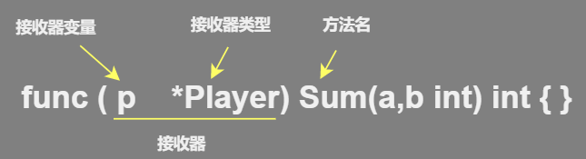

# 

## 1. 介绍

### 结构体

*   介绍
    *   是自定义的数据类型，代表一类事物
    *    只是一种内存布局的描述，只有当结构体实例化时，才会真正地分配内存， 
    *   必须在定义结构体并实例化后才能使用结构体的字段。 
*   类型
    *   结构体是值类型

### 结构体实例化

* 结构体变量（实例）

  实际的，代表一个具体变量
  
  
### 实现

```go
“实现”是个动词，指的是使用某种计算机编程语言将某种程序设计思想写出来的过程，而且要保证写出来的代码是在可以在计算机上直接运行的。

实现就是将某种原理性的东西转化为可执行的程序代码的过程，同一种原理可以使用多种不同的语言实现，即使是使用同一种语言，也可能有不同的实现方式

原理是便于人类使用自然语言描述和理解的，而实现是可以在计算机上运行的。

接口就是可供bai外部调du用的方法，实现就是对zhi这些方法的dao编程实现
```


### 字段

  *   别称
      
      *   结构体字段（字段）  ： 结构体成员（成员）、成员变量（变量）、结构体属性（属性）
      
  *   特性
      *   字段拥有自己的类型和值，可以是任意数据类型
      *   字段名必须唯一；
      *   字段的类型也可以是结构体，甚至是字段所在结构体的类型。
      *    同类型的变量也可以写在一行 
      
*   ## 2.字段/属性

    * 创建结构变量后，没有复制，默认只是零值
    * 不同结构体的变量的字段是独立的，互不影响，一个结构字段的更改，不影响另一个结构体
    * struct中的所有字段在内存是连续的

### 结构体格式

```go
type 结构体名称 struct{
    field1 type //字段  字段名 、字段类型
    field2 type // 字段  
}

1. 关键字 type 可以将各种基本类型定义为自定义类型
2. 类型名：标识自定义结构体的名称，在同一个包内不能重复。
3. struct{}：表示结构体类型，type 类型名 struct{}可以理解为将 struct{} 结构体定义为类型名的类型。
4. 字段1、字段2……：表示结构体字段名，结构体中的字段名必须唯一。
5. 字段1类型、字段2类型……：表示结构体各个字段的类型。

```


## 2.声明/初始化/访问

### 点操作符-选择器

```js
访问结构体成员需要使用点号操作符，点号操作符也被称为选择器(selector)
结构体.成员名
```


### 1.结构体初始化

```go
1. 非指针类型			var  [搭配 {}     ]
2. 指针类型				 new  [搭配 var * &]
3. 取结构体的地址实例化	 &	  [搭配 var *  ]

4. 类型推倒
```

### 2.字段名初始化

```go
1. 声明的时候填充
	1. 键值对填充
	2. 值列表
2. 声明后填充
	1. 键值对填充
	2. 值列表
	3. 访问字段名填充

//----------------------------------------
1. 键值对填充
	1. 键值对的填充是可选的，不需要初始化的字段可以不填入初始化列表中,
	2. 默认值是字段类型的默认值
	3. 键值之间以:分隔，键值对之间以,分隔	
2. 值列表填充
	1. 在“键值对”初始化的基础上忽略“键”
	2. 以使用多个值的列表初始化结构体的字段。
	3. 必须初始化结构体的所有字段。
    4. 每一个初始值的填充顺序必须与字段在结构体中的声明顺序一致。
    5. 键值对与值列表的初始化形式不能混用。
3. 注意
	1. 以上两者如果横着写不需要写最后字段后面逗号，如果竖着写，每个字段最后都需要逗号
    	var p = Person{ "lihua"，20}
    	var p = Person{
            "lihua"，
            20,
        }
```

### 3.初始化赋值

```go
type Person struct{
    name string
    age  int
}
```

#### 1.非指针类型

```go
1. 声明后，通过字段名填充
    var Lihua Person  
        Lihua.Age =  20

2. 声明后，通过值列表进行填充
	var Lihua Person = Person{}
		p2 := Lihua{"lihua",20}
3. 声明时，进行填充字段
    var p = Person{
        name："lihua",
        age:20,
       }
    var p = Person{ "lihua"，20}
4. 类型推导
	p := &Person{}
```


#### 2.指针类型

```go
// 非指针类型，加上 *（如 Person 变成 *Person） 就变成指针了

1.var p1 *Person = new(Person)
	// p1 是一个指针，因此变准的给字段赋值方式
	(*p1).name = "john"
     p1.name = "john"
    // 上面两句话是一样的，底层会对 p1.name进行处理成 (*p1).name
    // 结构体指针访问字段的标准方式:(*结构体指针).字段名=结构体指针.字段名

// 2.  结构体进行 & 取地址操作时，视为对该类型进行一次 new 的实例化操作
 	var Lihua *Person = &Person{}  //  p := &Person{}
	
	var stus *stus = &stu{"小明"，10001，male}  
	
```


#### 3.取结构体地址

```go
// 1. 返回结构体的指定指针类型
    var p = &Person{
            name："Tom",
            id:"1000",
            gender:"male ",
       }
```


### 4.匿名结构体

```go
// 匿名结构体没有类型名称，无须通过 type 关键字定义就可以直接使用
// 也可以不进行初始化成员

ins := struct {
    name string
}{
    // 字段值初始化
    name : lihua,
}
```


### 5. 与接口初始化

* ## 就是使用工厂方法，如何进行初始化

* 模型设计哪里用的很多

#### 1.符号使用

  ```go
  type Paper interface
  
  type Pen struct{}
  func (this *Pen) use(){   		 //这个地方是指针接收器
  	fmt.Print("调用成功")
  }   
  ====================================================
  func NewPen() *Pen{				//这个看情况
      // 
      return &Pen{}					//这个地方就要使用指针
  }
  
  （this *open）
  	返回： 接口 		只有 &
  		  结构体	 必须是成对存在，或者都不存在
  （this open）
  	返回： 接口		必须有 & ，或者都不写
  		  结构体     必须有 & ，或者都不写
  ```

  

#### 2.初始化 / 实例化

* 接口 作为类对象	Paper
* 接口 作为对象        paper Paper

```go
type Paper interface

type PenOne interface{
    write()
}
type Pen struct{
    Paper		// 使用 paper Paper都是一样的实例化/初始化过程
    Num int
}

func (p *Pen) write(){...}

---------------------------------------------------------------------
func (p *Pen) CreatePen(paper Paper,num int) Paper{
    p.Paper = paper
    p.Num = num
    return it
}
---------------------------------------------------------------------
// 初始化 pen 结构体初始化，里面含有一个接口，所以需要设置一个参数，但是返回的是它实现的实例....
func CreatePen(paper Paper,num int) Paper{
    return &Pen{
        Paper:paper,
        Num :num,
    }
}

---------------------------------------------------------------------
func CreatePen() *Pen {
    return &Pen{paper,num}
}

---------------------------------------------------------------------
// 这一种也适用于空结构体的情况
func CreatePen() *Pen {
    return &Pen{}	// 这个返回的是各个字段的零值
}

// Paper 是一个接口，所以传参进来，应该是 Paper 已经实例化了一个 struct,这个strut传进来的
// 这个 struct 实现了 Paper 接口，实例化的时候，返回的就是一个接口


```

#### 3.调用接口函数

* 接口作为类对象

    ```go
    type com interface{
        display()
    }
    
    type cn interface{
        display()
    }
    type cn1 struct{
        com
    }
    func (c *cn1) display(){
        c.com.display()		
        // 尽量不要用缩写的 c.display，虽然这样因为可以，但是会造成混淆
        // 而且两者使用相同的函数，会造成递归这个函数，
    }
    ```


#### 4.多参数化简传递

```go
// 将参数放在一个结构体中，可以化简参数变成一个参数

type Coordinate struct {
	X int
	Y int
}
type IgoChessman struct {
	Color string
}
// 等于说这里有三个参数，一个通过自身的结构体穿进去了，另外两个通过一个结构体，穿进去
func （igo *IgoChessman）Display(coordinate Coordinate){	// 这里传入结构体，就可以化简成一个参数
	fmt.Println("&v 的棋子在（%d,%d）的位置"，igo.Color,coordinate.X,coordinate.Y)
}
```


```go
type shape interface {
    Area() float64
}

type Rect struct {
    width float64
    height float64
}
func (r *Rect) Area() float64 {	
    return r. width * r.height
}

func main(){
    r := Rect{5.0,4.0}
    var s shape := &r  
    area := s.Area()
    fmt.Println(area)
}

// 在接口的情况下，如果方法有指针接收器，那么接口将具有动态类型的指针而不是动态类型的值
// 所以为接口变量分配类型值的时候，我们要分配类型为value的指针
```


## 3.构造函数 - 工厂模式

*    Go语言的类型或结构体<font color=red>没有构造函数的功能</font>
*    使用结构体初始化的过程来模拟实现构造函数 
*    没有提供构造函数相关的特殊机制，用户根据自己的需求，将参数使用函数传递到结构体构造参数中即可完成构造函数的任务。 

### 功能特性

*    每个类可以添加构造函数，多个构造函数使用函数重载实现。
*   构造函数一般与类名同名，且没有返回值。
*   构造函数有一个静态构造函数，一般用这个特性来调用父类的构造函数。
*   在Go里我们一般不会返回多个struct，而是返回一个interface，而具体实现，都满足这个interface

### 模拟构造函数重载

```go
type Cat struct {
    Color string
    Name  string
}
func NewCatByName(name string) *Cat {	  // 用名字构造猫结构的函数，返回 Cat 指针。
    return &Cat{				    	// 取地址实例化猫的结构体
        Name: name,				    	// 始化猫的名字字段，忽略颜色字段。
    }
}
func NewCatByColor(color string) *Cat {
    return &Cat{
        Color: color,
    }
}

// 颜色和名字两个属性的类型都是字符串，由于Go语言中没有函数重载，为了避免函数名字冲突，使用 NewCatByName() 和 NewCatByColor() 两个不同的函数名表示不同的 Cat 构造过程
```

### 模拟父级构造调用

```go
type Cat struct {
    Color string
    Name  string
}

// lackCat 结构，并嵌入了 Cat 结构体，BlackCat 拥有 Cat 的所有成员，实例化后可以自由访问 Cat 的所有成员。
type BlackCat struct {
    Cat  // 嵌入Cat, 类似于派生
}

// “构造基类”
// NewCat() 函数定义了 Cat 的构造过程，使用名字作为参数，填充 Cat 结构体。
func NewCat(name string) *Cat {
    return &Cat{
        Name: name,
    }
}

// “构造子类”
// NewBlackCat() 使用 color 作为参数，构造返回 BlackCat 指针
func NewBlackCat(color string) *BlackCat {
    
    // 实例化 BlackCat 结构，此时 Cat 也同时被实例化。
    cat := &BlackCat{}
    
    // 填充 BlackCat 中嵌入的 Cat 颜色属性，BlackCat 没有任何成员，所有的成员都来自于 Cat
    cat.Color = color
    return cat
}
```


3. 

（这两个是啥？需要百度）

## 5.方法 - 接收器

### 接收器

#### 介绍

*   某种类型的变量

*    Go语言建立的“接收器”强调方法的作用对象是接收器，也就是类实例，而函数没有作用对象。 

*   别称

    *   有的人称接收器   是类型

*   接收器 = 接收器变量 + 接收器类型

    

#### 接收器变量

```go
命名： 官方建议使用接收器类型名的第一个小写字母，不是 self this 之类的命名
接收器类型的一个实例（简化记忆：别名）
```

#### 接收器类型

*   可以作为接收器类型的

    ```go
    1.  是（几乎）任何类型，不仅仅是结构体类型，任何类型都可以有方法 
    2.  可以是其他允许类型的指针
    ```

*   不能作为接收器类型的

    ```go
    1. 接口类型
        因为接口是一个抽象定义，而方法却是具体实现，
        这样做了就会引发一个编译错误`invalid receiver type…`。
    
    2.  指针类型
    	但是可以是其他任何允许类型的指针
    ```


#### 类型 T 的方法集

*    型 T（或 T）上的所有方法的集合 
*    一个类型加上它的方法等价于面向对象中的一个类 
*    Go语言中，类型的代码和绑定在它上面的方法的代码可以不放置在一起，它们可以存在不同的源文件中，唯一的要求是它们必须是同一个包的。


#### 分类

*    指针接收器 

    ```go
    1. 由一个结构体的指针组成，更接近于面向对象中的 this 或者 self。
    2. 指针的特性，调用方法时，修改接收器指针的任意成员变量，在方法结束后，修改都是有效的。
    
    
    // 定义属性结构
    type Property struct {
        value int  // 属性值
    }
    // 设置属性值 , 可以修改成员值，即便退出方法，也有效
    func (p *Property) SetValue(v int) {
        // 修改p的成员变量
        p.value = v
    }
    // 取属性值
    func (p *Property) Value() int {
        return p.value
    }
    func main() {
        // 实例化属性
        p := new(Property)  // 默认值 value = 0
        // 设置值
        p.SetValue(100)
        // 打印值
        fmt.Println(p.Value()) //100
    }
    ```

    

*    非指针接收器 

    ```go
    // 会在代码运行时将接收器的值复制一份，在非指针接收器的方法中可以获取接收器的成员值，但修改后无效。
    // 方法变得类似于只读的方法，方法内部不会对成员进行任何修改。
    
    // 定义点结构
    type Point struct {
        X int
        Y int
    }
    // 非指针接收器的加方法
    func (p Point) Add(other Point) Point {
        // 成员值与参数相加后返回新的结构
        return Point{p.X + other.X, p.Y + other.Y}
    }
    func main() {
        // 初始化点
        p1 := Point{1, 1}
        p2 := Point{2, 2}
        // 与另外一个点相加
        result := p1.Add(p2)
        // 输出结果
        fmt.Println(result)  // {3 3}
        fmt.Println(p1.X)    // 1
    	fmt.Println(p2.X)    // 2
    }
    ```

*   使用

    ```go
    1. 小对象由于值复制时的速度较快，所以适合使用非指针接收器，
    2. 大对象因为复制性能较低，适合使用指针接收器，在接收器和参数间传递时不进行复制，只是传递指针。 
    ```

    


### 方法

#### 介绍

*    Go 方法是作用在接收器（receiver）上的一个函数 
*   作用在指定数据类型上的（即和指定的数据类型绑定），因此自定义类型都有方法，而不仅仅是struct

#### 方法签名

```go
包括 ：方法名、参数列表、返回参数列表
```


#### 1.方法声明和调用

```go
func (接收器变量 接收器类型) 方法名(参数列表) (返回参数) {
    方法体
    return 返回值
}

1.接收器变量


2. 接收器类型
	接收器类型和参数类似，可以是指针类型和非指针类型
	表示方法和接收器类型进行绑定，或者说该方法作用于 接收器类型

3. 方法名 参数列表 返回参数  和函数一样

----------------------------------------------------------------------
type A struct{
    Num int
}
func (a A)test(){ // 表示A结构体有一个方法，方法名为test
    fmt.Print(a.Num) 
}
// (a A) 体现 test 方法和 A绑定
// a 相当于结构体 A 的别名，表示那个结构体(A)变量调用，a 就是它的副本，这个不是固定的，可以随意指定


// 调用
p.test()  // 结构体别名.方法名

------------------------------------------
func (a *A)test(){ // 表示A结构体有一个方法，方法名为test
    fmt.Print(a.Num) 
}
Pupil := &A
Pupil.test()
```


#### 2.方法调用和传参机制原理

* 方法的调用和传参机制和函数的一样，不同的就是，方法会调用方法的变量，当做实参也传递给方法（值类型进行值拷贝，引用类型进行地址拷贝）

#### 3.注意

1. 结构体是值类型，方法调用过程中遵守值传递机制，是只拷贝传递方式

2. 方法访问范围控制：

   和函数一样，方法名首字母小写，包内访问；方法首字母大写，跨包使用

3. 方法作用在指定的数据类型上（即：和指定的数据类型绑定），因此自定义类型都可以有方法，不仅仅是 struct

   ```go
   type integer int
   func(i integer)print(){
       fmt.Print("i=",i)
   }
   
   // 编写一个方法，可以改变 i 的值
   func （i *integer）change(){
       *i = *i + 1
   }
   
   func main(){
       var i integer = 10
       i.print()
       i.change
   }
   ```

4. 如果一个类型实现了String()这个方法，那么fmt.Println 默认会调用这个变量的String()进行输出


5. 在方法中修改结构体变量的值，可以通过结构体指针的方法来处理\

   

   

#### 4.方法和函数的区别

1. 调用方式不同

   * 函数：函数名（实参列表）
   * 方法：变量.方法名（实参列表）

2. 接受者不同

   * 函数：当为值类型时，不能讲指针类型的数据直接传递，反之亦然

     ```go
     func test(p Person)  // test(p)
     func test(p *Person)  //test(&p)
     ```

     

   * 方法：当为值类型时，可以直接用指针类型的变量调用方法，反之亦然

     ```go
     func (p Person) test(){}
     func (p *Person) test(){}
     p.test() 等价于 &p.test()
     
     // 总结
     1.不管调用形式如何，真正决定值拷贝还是地址拷贝，看这个方法和哪个类型绑定
     2.和值类型绑定，就是值拷贝：（p Person）
     3.和指针类型绑定，就是地址拷贝（p *Person）
     ```

#### 方法重载

*   方法
    *    方法是函数，所以同样的，不允许方法重载 
    *    对于一个类型只能有一个给定名称的方法 
*   基于接收器类型
    *   可以重载
    *    有同样名字的方法可以在 2 个或多个不同的接收器类型上存在 


## 6.工厂模式

* go的结构体没有构造函数，通常用工厂模式来解决这个问题
* 解决结构体首字母小写，不可以跨包引用的问题
* 注意还有字段名字小写的情况

```go
// 使用工厂模式实现挎包创建结构体实例（变量）
--------------------------------------------------
//student.go文件
package model
// student 结构体首字母是小写，因此只能在model使用
type student struct{  //小写
    Name string    // 大写
    score float64  // 小写
}
//结构体名称小写 工厂模式
// 访问字段名大写的
func NewStudent(n string，s float64) *student {
    return &student{
        Name : n,  //大写的
        score : s,
    }
}

// 吓到return中结构体中的字段，是需要传参的


//字段名小写
func (s *student) GetSore()float64{
    return s.score  // ok
}
--------------------------------------------------
// main.go文件
package main
import(
	"fmt"
    "go_code/chapter10/factory/model"
)

func main(){
    //student 结构体首字母是小写，工厂模式可以解决
    var stu = model.NewStudent("tom",100)
    fmt.Println(*stu) // &{...}
    fmt.Println(stu.Name,stu.GetScore)
}  // 注意这里的调用
```


## 7.抽象

就是把对象的属性，放在一个结构体中

## 8.封装

* encapsulation
* go开发过程中没有特别强调封装，go本身对面向对象的特性做了化简的

### 1.概念

* 把抽象出来的字段和对字段的操作封装在一起，数据被保护在内，程序的其他只有通过授权的操作（方法），才能对字段进行操作

### 2.好处

* 隐藏实现细节
* 可以对数据进行验证，保证安全合理

### 3.实现

* 对结构体中的属性进行封装

* 可以通过方法、包实现封装

* 步骤：

  * 将结构体、字段(属性)的首字母小写（不能导出，其他包不能使用，类型private）

  * 给结构体所在包提供一个工厂模式的函数，首字母大写，类似一个构造函数

  * 提供一个首字母大写的 set 方法 ：设置小写字段的值

  * 提供一个首字母大写的 Get 方法 ：取小写字段的值

    ```GO
    
    type person struct {
        Name string
        sal float64  	// 其它包不能直接访问..
    }
    
    // 写一个工厂模式的函数，相当于构造函数
    // 注意其中没有小写的字段,大写字段写入工厂模式，不需要set get
    func NewPerson(name string) *person {
        return &person{
            Name : name,
        }
    }
    
    // Set 函数 设置小写字段的值
    func (p *person) SetSal(sal float64) {
        if sal >= 3000 && sal <= 30000 {
            p.sal = sal
        } else {
            fmt.Println("薪水范围不正确..")
        }
    }
    
    // Get 函数 取得小写字段的值
    func (p *person) GetSal() float64 {
        return p.sal
    }
    
    func main(){
        p := NewPerson("小李子")
        p.SetSal(6666)
        p.GetSal()	 	// 6666
        fmt.Println(p) // {"小李子"，6666}
    }
    ```


## 8.继承

### 1. 介绍

* 解决代码复用问题
* 多个结构体出现相同字段和方法，只在一个 结构体写完，其余的结构体只用继承这些属性即可
*  Go语言中的继承是通过内嵌或组合来实现的 ，不过 相比较于继承，组合更受青睐。 
* 嵌套一个匿名结构体。


### 2.效果

```go
A 结构体 继承了 B 结构体
 // A 就继承了 B 的字段和方法，可以直接使用
```


### 2. 嵌套

#### 内嵌+组合

```go
// 内嵌
	匿名字段
	匿名函数
// 组合
	有名函数

// Go语言的结构体内嵌特性就是一种组合特性
```

#### 1.匿名字段

```go
// 在一个结构体中对于每一种数据类型只能有一个匿名字段。注意是 每种

type outerS struct {
    b int
    c float32
    int // anonymous field
}
func main(){
    outer := new(outerS)
    outer.b = 6
    outer.c = 7.5
    outer.int = 60
}
```


#### 2.匿名结构体

```go
// 一个结构体嵌套了另一个匿名结构体，那么这个结构体可以直接访问匿名结构体的字段和方法


type Goods struct{
    Name string
    Price int
}

type Book struct{
    Goods  //这就是嵌套匿名结构体 Goods 匿名字段是结构体，这个就是你的数据类型
    Wrinter string
}
 // 在实例化 Book 的同时，也会实例化 Goods
```


#### 3.有名结构体

```go
// 结构体嵌套一个有名结构体，这种模式就是组合，组合关系，
// 则在访问组合的结构体的字段或方法是，必须带上结构体的名字

type Book struct{
    g Goods  //这就是嵌套有名结构体 Goods，访问有名结构体就需要带上有名结构体的名字
    Wrinter string
}

var b Book
b.g.Name = "Jack"

```


#### 4.内嵌结构体特性

*    内嵌的结构体可以直接访问其成员变量

     

     ```go
     // 如果结构体有多层嵌入结构体，结构体实例访问任意一级的嵌入结构体成员时都只用给出字段名，而无须像传统结构体字段一样，通过一层层的结构体字段访问到最终的字段。 
     
     type A struct {
         a int
         Name string
     }
     
     type B struct {
         a int
     }
     type C struct {
         A
         B
         a int
     }
     func main() {
         c := &C{}
         
         // 可以缩写成 c.Name = "lihua"
         c.A.Name = "lihua"	
         
         c.A.a = 1     // 如果使用 c.a 就会出现变异错误 ？？？
         fmt.Println(c)
     }
     
     
     
     //  嵌入结构体的成员，可以通过外部结构体的实例直接访问 
     1.缩写 c.Name
        先看 b对应的类型有没有Name
            有：直接调用 c 类型的Name字段
            没有： 就看 c 中嵌套的匿名结构体(有就调用，没有就报错)
        如果出现成员命名冲突
     		采用就近访问的原则。（如希望访问匿名结构体的字段和方法，可以通过匿名结构名来区分）
     
     // 成员名字冲突
     		必须写明 这个成员是术语哪个结构体的
     
         c.a() //这个就是采用就近原则
         c.A.a)  //这个指定是匿名函数的
     ```

     

*   内嵌结构体的字段名是它的类型名

    *    一个结构体只能嵌入一个同类型的成员，无须担心结构体重名和错误赋值的情况 

    *    内嵌结构体字段仍然可以使用详细的字段进行一层层访问，内嵌结构体的字段名就是它的类型名 

        ```go
        var c Color
        c.BasicColor.R = 1
        c.BasicColor.G = 1
        c.BasicColor.B = 0
        ```

        


### 3. 内嵌结构体初始化

*    结构体内嵌的类型作为字段名像普通结构体一样进行初始化 

    ```go
    // 车轮
    type Wheel struct {
        Size int
    }
    
    // 车
    type Car struct {
        Wheel
    }
    
    func main(){
        c := Car{
            While : While {
                Size : 19,
            },
        }
    }
    ```

    

*   初始化内嵌匿名结构体

    ```go
    // 车轮
    type Wheel struct {
        Size int
    }
    // 车
    type Car struct {
        Wheel
        // 引擎
        Engine struct {
            Power int    // 功率
            Type  string // 类型
        }
    }
    
    
    func main() {
        c := Car{
            // 初始化轮子
            Wheel: Wheel{
                Size: 18,
            },
            // 初始化引擎
            Engine: struct {
                Power int
                Type  string
            }{
                Type:  "1.4T",
                Power: 143,
            },
        }
    }
    ```


### 4. 多重继承

* 为了代码的简洁性，尽量不使用多重继承
* 就是一个函数内嵌多个匿名结构体，
* 多个匿名结构体，如：两个匿名结构体有相同的字段和方法（同时结构体本身没有同名的字段和方法），在访问时，就必须明确指定匿名结构体名字，否则编译错误

```go
type A struct{
    Name string
    age int
}
type B struct{
    Name string
    age int
}

type C struct{
    A
    B
}

func main(){
    var c C
    // 使用c.Name就会出错，因为A B都有Name这个属性，所以就必须指定匿名结构体的名字
    // 这个规则也适用于方法
    //注意多重继承的初始化赋值，可以看看继承与接口的第一个代码
    c.A.Name = "tom"
}

```


### 5. 优势

* 提高代码的复用性
* 代码的扩展性和维护性提高了


## 操作

*   增、改
*   删
*   查