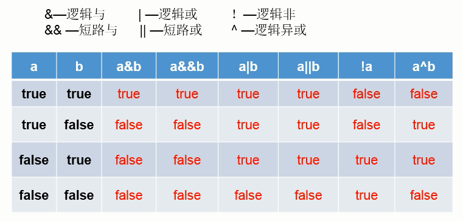

## 概念

```java
元
    一元运算符 ： 只有一个可以进行操作 ， a++
    二元运算符 ： 只有两个数可以进行比较 ， 加法
    三元运算符 ： 需要三个数据进行操作的运算符
```


## 总准则

```java
基本类型
    进行计算的是 ：变量中存储的值
引用类型
    进行运算的是 ：对象的引用
注意
    不能对布尔值进行计算
```


## 运算符

*   别称
    *   操作符
    *   运算符是一种特殊的符号，用以表示数据的运算、赋值和比较等
*   作用
    *   作用于操作数，用于生成新值
    *   有些操作符可以改变操作数自身的值

## 算术运算符

*   对数值类型的变量进行运算

### 基础运算符

```js
+             正号、字符串相加、加
-             负号/减
*             乘
/             除(取整)                       （相除，取整，小数会舍去，）
%             求余(取模)                     （取余数，小数会舍去）
```

### 自增减运算符

```go
符号
    ++            自增                      
    --            自减                      
位置
	// 把自增减符号当成一个操作： 注意是表达式的值、变量的值
	// 前缀和后置： 先操作、后操作
	/*
	a++
		表达式的值：
		变量的值  ：
		
	
	*/
	前置（先自加） ： 先让变量操作增减，然后输出变量的值
	后置（后自加） ： 先输出变量的值，然后让变量操作增减 

使用
	单独使用 ： 自己单独是一行
		使用的是 a 的值 
	混合使用 ：和其他操作混合
		使用的是表达式 、 a 的值，两种情况
	常量不能进行自增减

例子
// 前置
	
	int a = 10;
	// y 取得是 表达式的值
	int y = a++;   // a=11  y=10 ：后置，后操作，先输出
	int x = ++a;   // a=12 x=12 ： 前置， 先操作，后输出

注意
	1. 自增不会改变变量自身的类型
```

### 正负号

```go
+ 变量/数字
- 变量/数字
例子
	-3
	+3
```

## 逻辑运算符

### 介绍

```java
两个逻辑
    相同： 结果都是一样的
    不同：
    	不短路：// 符号前后的运算都会执行
    	短路后：// 短路后，后面的运算不会执行(性能)
```




### 逻辑位

```java
介绍
    在计算机运算的时候，都是以补码的方式来运算的
    主要看两元的类型
    	
    	boolean 就是逻辑     
    	数字     就是为运算符 
运算符         运算
&         
    // 且真 ： 一假为假
    按位与  双目运算，功能是参与运算的两位数各对应的二进制相与，规则：同时为1，结果为1
|         
    // 或真： 一真为真
    按位或  双目运算，功能是参与运算的两位数各对应的二进制相或，规则：一个位1，结果为1
^   
    // 不一样就返回真
    按位非  双目运算，功能是参与运算的两位数各对应的二进制相非。规则：二进位不同，结果为1


int x = 1;
int y = 1;
//------------------------------------------
if (x++==2 & ++y==2) { // (false & true)
    x=7;
}
// x=2
// y=2

//-----------------------------------------
if (x++==1 & ++y==1) { // (true & false)
    x=7;
}
// x=7
// y=2
```


### 短路逻辑

```java
介绍
    用于连接多个条件(一般来讲就是关系表达式)，
	结果：一个bool值
/*
	位运算的 Q	& | ^  将原数字转换为二进制进行比较， 没有短路
	逻辑运算符		  结果是 boolean           ， 存在短路
*/

运算符                 运算
&&                    逻辑与，两边均为真，才是真              短路与，第一个条件为假，第二个就不会执行
||                    逻辑或，一个为真就是真                  短路或，第一个条件为真，第二个就不会执行
!                     逻辑非， 条件是true,则逻辑为false   

注意
	&& 和 || 都是短路的 ， 可以节省一定额性能
```

## 位运算符(二进制)

### 介绍

```java
主要是针对 整数 进行操作
```


### 逻辑位

```java
参看 
    逻辑运算符 -- 逻辑位运算符
```


### 移位运算符

```go
// 便携记忆： 左为尊，是乘

<<        左位    
	双目运算，把<<左侧的运算数的各二进位全部左移若干位，高位丢去，低位补0，左移n位就是乘以2的n次方 // 一定范围
>>        右移    
	双目运算，把>>左侧的运算数的各二进制全部右移若干位，右移n位就是除以2的n次方 // 一定范围
>>> 	  无符号右移
// 备注：就把二进制的补码，被冻结成尺子，让整个尺子进行》箭头的方向移动，对，就是整体移动
1.右移运算符：低位溢出，符号位不变，并用符号位补溢出的高位
2.左移运算符：符号位不变，低位补0
3. 移动计算是有一定的限度的， 并不是完全是 2 的 n 次方

注意
	5>>2  或者 5<<2  计算都是将 5 变为二进制，然后进行位运算 
```


## 赋值运算符c

### 赋值

```go
=           简单的赋值运算
```

### 复合赋值

```js
介绍
	复合运算符其中隐含一个强制转换类型
例子
	byte num = 5;
	num += 5;  // 此时 num 的类型就是 int	
基础复合
	+=          相加后再赋值
    -=          相减后再赋值
    *=          相见后再赋值
    /=          相减后再赋值
    %=          取余后再赋值
-----------------------------------------------------
二进制位复合
	<<=            左移后赋值
    >>=            右移后赋值
    &=             按位与后赋值
    ^=             按位异后赋值
    ！=            按位或后赋值
```

## 关系运算符

### 二元比较运算符

#### 介绍

1. 又叫比较运算符,
2. 关系运算符： 结果是bool型，不是true就是false
3. 关系运算式：
    * 关系运算符组成的表达式，
    * 用在 if 结构结构条件中或者循环结构条件中
    * 又叫关系表达式
4. 结果是：
    * bool类型，不是true就是false
    * 不允许连续写 1 < x < 3  是错误的

#### 大小比较

```js
 <           小于
 >           大于
 <=          小于等于
 >=          大于等于
```

#### 等值比较

```
介绍
	基础类型 ：  进行的是数值的比较
	引用类型 ：  进行地址值的比较
符号
    ==          相等
     ！=         不等
```


### 多元比较运算符

#### 三目运算符

``` c++
语法
    条件表达式？ 表达式为 true 执行 : 表达式为 false 执行
    数据类型 a ? a 为真执行 ： a 为假执行； 
注意
	（2 < 3) ? 表达式1 ： 表达式2；
	1. 表达式1 和 表达式 2 的类型需要是一致的
        // 理解 result = (a ? b) ? 1 :2 不然 result 类型无法确定
        是int 必须都是 int , 是字符串必须都是 字符串
	2. 可以嵌套        
```


## 运算符的优先级

* 运算符：是用来在程序运行时执行数学或逻辑运算的 
* 优先级：
    * 就是当多个运算符出现在同一个表达式中时，先执行哪个运算符。
    * 优先级确定表达式中项的组合
* 推荐使用 括号 

| 类别       | 运算符                                                       | 结合性   |
| ---------- | ------------------------------------------------------------ | -------- |
| 后缀       | () [] ->  new  .(点) ++(前置)  --(前置)                      | 从左到右 |
| 一元       | +（正号）、-（负号）   !  ~  ++(后置)  --(后置)   (type)*  &  sizeof | 从右到左 |
| 乘除       | *（乘号）  /  %                                              | 从左到右 |
| 加减       | +  -                                                         | 从左到右 |
| 移位       | << >>                                                        | 从左到右 |
| 关系       | < <=  > >=                                                   | 从左到右 |
| 相等       | ==  !=                                                       | 从左到右 |
| 位与 AND   | &                                                            | 从左到右 |
| 位异或 XOR | ^                                                            | 从左到右 |
| 位或 OR    | \|                                                           | 从左到右 |
| 逻辑与 AND | &&                                                           | 从左到右 |
| 逻辑或 OR  | \|\|                                                         | 从左到右 |
| 条件       | ?:                                                           | 从右到左 |
| 赋值       | =  +=  -=  *=  /=  %=>>=  <<=  &=  ^=   \|=                  | 从右到左 |
| 逗号       | ,                                                            | 从左到右 |


注意：

* 优先级级别越大的，先运算，记不住的就加括号
* 计算顺序从右到左的只有两个：赋值运算符、单目运算符

大概运算符

1. 括号，++，--
2. 单目运算
3. 算数运算符
4. 移位运算
5. 关系运算符
6. 位运算符
7. 逻辑运算符
8. 赋值运算符
9. 逗号
## 运算符重载

```java
java 不支持运算符重载
```


   

​    

   ​    

   


