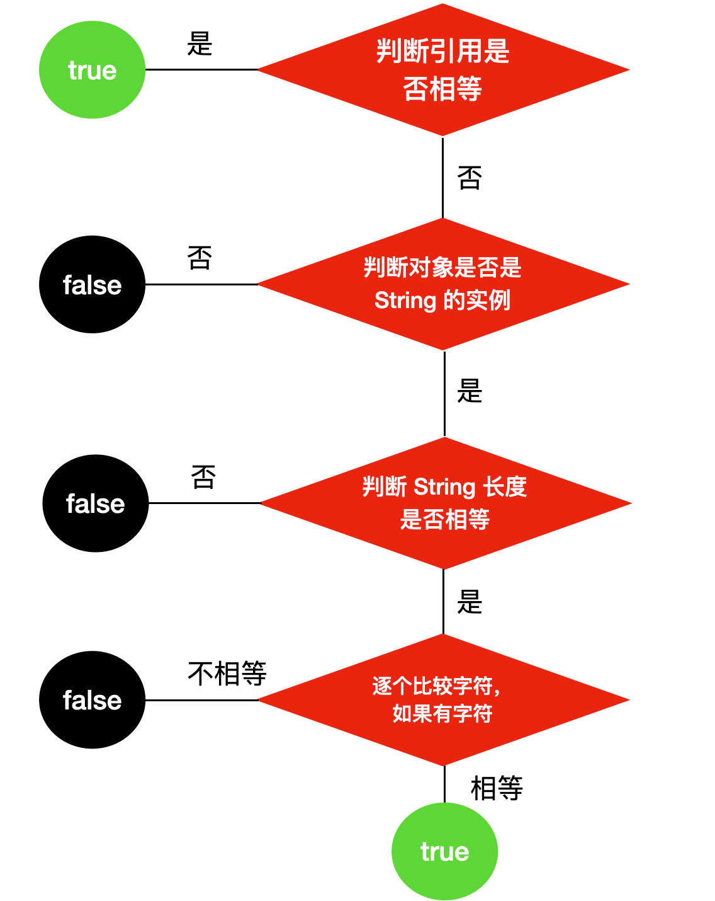

## 二元运算符

## 大小

```java
大小的比较得到的都是 boolean 值
```


## 相等

### 介绍

```java
等于 == 
不等 !=

补充
    对象使用 a.equals(b); 重载
```

### ==

```java
使用
	基础类型： 比较的就是两边的值
    引用类型：判断的是两边的 引⽤ 是否相等，也就是判断两个对象是否指向了同⼀块内存区域。
    
```


### equals

#### 介绍

```js
作用
	对比对象的内容， 默认的 Object.equals 对比的是对象的地址
重写之前
	和 == 相同
重写以后
	// 比较的是两个对象的内容
	对象内容：注意内容相同，地址不一定相同
    对象地址： 默认方式
使用
	这个能够够自动生成，使用好的 编辑器就好

```

#### 特点

```java
    
Java中对Equals的要求
1. 对称性：
	如果x.equals(y)返回是"true"，那么y.equals(x)也应该返回是"true"。
2. 反射性：
    // 自反性
    x.equals(x)必须返回是"true"。
3. 类推性：
// 传递性
    如果x.equals(y)返回是"true"，而且y.equals(z)返回是"true"，
    那么z.equals(x)也应该返回是"true"。
4. 一致性：
    如果x.equals(y)返回是"true"，只要x和y内容一直不变，
    不管你重复x.equals(y)多少次，返回都是"true"。
5. 非空性，
    // 所以需要提前判断 x 是否是 null ，然后再使用
    x.equals(null)，永远返回是"false"；
    x.equals(和x不同类型的对象)永远返回是"false"。
```


#### hashCode

```java
注意
	一个类重写 equals 的同时，最好重写 hashCode 
    hashCode 相同，内容不一定相同
    
// 字符串重写
    1. ⾸先会判断要⽐较的两个字符串它们的 引⽤ 是否相等。
    	如果引⽤相等的话，直接返回 true ，
    	不相等的话继续下⾯的判断
    2. 再判断被⽐较的对象是否是 String 的实例
    	如果不是的话： 直接返回 false
    	如果是的话： 再⽐较两个字符串的⻓度是否相等
    	⻓度如果相同： 会⽐较字符串中的每个 字符 是否相等，⼀旦有⼀个字符不相等，就会直接返回 false。
    
// 重写 equals ⽅法必须重写 hashcode ⽅法    
    equals ⽅法是⽤来⽐较对象⼤⼩是否相等的⽅法，
    hashcode ⽅法是⽤来判断每个对象 hash 值的⼀种⽅法。
    如果只重写 equals ⽅法⽽不重写 hashcode ⽅法，
    	很可能会造成两个不同的对象，它们的hashcode 也相等，造成冲突。
原因
    1. 如果在 Java 运⾏期间对同⼀个对象调⽤ hashCode ⽅法后，⽆论调⽤多少次，都应该返回相同的hashCode，但是在不同的 Java 程序中，执⾏ hashCode ⽅法返回的值可能不⼀致。
	2. 如果两个对象的 equals 相等，那么 hashCode 必须相同
	3.如果两个对象 equals 不相等，那么 hashCode 也有可能相同，所以需要重写 hashCode ⽅法，
    	因为你不知道 hashCode 的底层构造（反正我是不知道，有⼤⽜可以传授传授），
    	所以你需要重写hashCode ⽅法，来为不同的对象⽣成不同的 hashCode 值，
    	这样能够提⾼不同对象的访问速度。hashCode 通常是将地址转换为整数来实现的。
```



### 区别

```java
equals
```


## 多元运算符

### 逻辑运算符

```java
逻辑操作符
	&& 
    || 
    !

语法例子
    // 逻辑表达式 操作符 逻辑表达式
    (1<10) && (2>0)
注意
    不可以将非布尔值当做布尔值在逻辑表达式中使用
```

