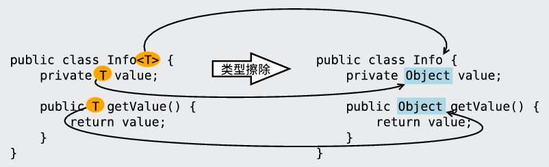
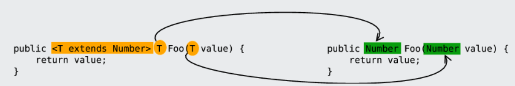
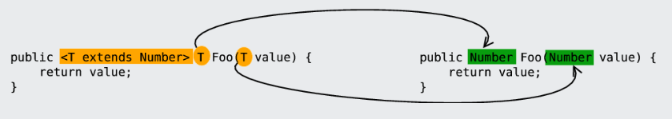

## 介绍

* jdk5+
* 泛型： 适用于许许多多的类型 ，实现参数化类型的概念
* 是一种使用未知的数据类型， 我们不知道使用什么数据类型的时候，使用
* 泛型可以看成一个变量 ，来接收数据类型

## 好处

* 避免了类型装换的麻烦， 存储的是什么类型 ，取出的就是什么类型
* 把运行编译期（代码运行之后抛出的出异常），提升到编译期(写代码的时候报错)

## 弊端

* 泛型是什么类型， 只能存储什么类型的数据
* 通常情况下，只会存储一种类型的对象


## 泛型类型

### 介绍

```java
E e : Element 元素
T t : Type 类型
    
创建对象的时候， 就会确定泛型的数据类型 ： new 的时候
会把数据类型作为参数传递 
```

### 泛型方法

```java
定义
    泛型定义在方法的修饰符和返回值类型之间
    修饰符 <泛型> 返回值类型 方法名（ 参数类表<泛型> ）{} ；
    
注意
    // 方法中可以不用指明参数类型，编译器会自动推倒，参数类型推断
    参数传递的是什么类型， 泛型就是什么类型
    
类型推断
    泛型只对赋值有效，其他不起作用
    // 例子
显式类型
    ？？？
例子
    public class GenericClass {       
        public <M> void method_1 (M m) {}
        
        // 静态的泛型方法
        // 静态方法不建议创建对象使用
        public static <M> void method_2 (M m) {}
    }

	// 测试
	GenericClass gc = new GenericClass();
	// 传递什么类型，泛型就是什么类型
	// 泛型就是整数
	gc.method_1(10);
	GenericClass.method_2("34")
```

### 泛型类

```java
定义使用
    修饰符 class 类名<代表泛型的变量> { } ；
例子
    public class GenericClass<E> {
        private E name;
        public E getname(){
            return name;
        }
        public void setname(E name){
            this.name = name;
        }
    }
    // 使用
	// 不写数据类型， 模式是 Object 类型
	GenericClass gc = new GenericClass();
	Object obj = gc.getname();
	
	// 创建 对象，泛型使用 Inte个人类型
	GenericClass<Integer> gc2 = new GenericClass<>();
	Intefer obj2 = gc2.getName();
```

### 泛型接口

```java
语法例子
    public interface GenericInterface<I> {
    	public abstract void method(I i);
	}
使用
    // 方式一
    // 定义接口的实现类， 实现接口， 指定接口的泛型
        public interface Iterator<E>{
            E next();	
        }
        // 实现 Iterator 接口， 并指定接口的泛型为 String ,所以重写 next 方法泛型，默认就是 String
        public final class Scanner inplements Iterator<String>{
            // 进行 next() 方法重写
        }
	// 方式二
	// 接口使用什么泛型， 实现类就使用什么泛型，类跟着接口走
	// 相当于定义了一个含有泛型的类，常见对象的时候确定泛型的类型
		public interface GenericInterface<I> {
            public abstract void method(I i);
        }
		public class Gener implements GenericInterface<I> {
              public abstract void method(I i){
                  System.out.println(i)
              };
        }
		// 调用的时候确定类型
		Gener<Integer> g = new Gener<>();
		g.method(10);
```

## 泛型中的符号

### 通配符

```java
介绍
    泛型通配符 ：？ 代表任意的数据类型
    泛型没有继承的概念
 注意
    不能创建对象使用
    只能作为方法的参数用
 语法例子
    public static void printArray(ArrayList<?> list){
		Iterator<?> it = list.iterator();
    	while (it.hasNext) {
            // 取出的元素是 Object ，可以接收任意数据类型
            Object o = new it.next();
            System.out.print(o);
        }
	}
```

### 泛型限制

#### extends

```java
泛型的上限
    格式 ： 类型名称 < ? extends 类 > 对象名称
    意义 ： 
    	extends 类： 只能接收该类型的子类
    	extends 接口： 只能接收实现该接口的类
泛型上限
     // 方法的参数类型是 Collection ，同时需要时 Number 或者它的子类
     public static void get(Collection< ? extends Number> coll){};
```


#### super

```java
 泛型的上限
    格式 ： 类型名称 < ? super 类 > 对象名称
    意义 ：只能接收该类型及其父类
    
例子
    // 泛型下限
    // 方法的参数类型是 E ，E 只能接收 Number 或  Number 类型的父类
	public static void get( <E super Number> coll){}
```

### 类型参数

```java
介绍
    <T> 表示传入的参数，改参数的值为一个数据类型，这个参数就称为类型参数
例子
    // 泛型定义的时候
    public class Test<T>{ ... }
	// 使用
	new Test<String>()
	// 解释
	String  是一个数据类型，当成参数传过去使用 ， 即称其为 类型参数
```


## 泛型擦除

### 介绍

```java
介绍
    型这个特性是从JDK 1.5才开始加入的，因此为了兼容之前的版本，Java泛型的实现采取了“伪泛型”的策略，即Java在语法上支持泛型，但是在编译阶段会进行所谓的“类型擦除”（Type Erasure），将所有的泛型表示（尖括号中的内容）都替换为具体的类型（其对应的原生态类型），就像完全没有泛型一样	
    
擦除原则
    1. 消除类型参数声明，即删除<>及其包围的部分。
    2. 根据类型参数的上下界推断并替换所有的类型参数为原生态类型：
    	如果类型参数是无限制通配符或没有上下界限定则替换为Object，
    	如果存在上下界限定则根据子类替换原则取类型参数的最左边限定类型（即父类）。
    3. 为了保证类型安全，必要时插入强制类型转换代码。
    4. 自动产生“桥接方法”以保证擦除类型后的代码仍然具有泛型的“多态性”
```

### 1. 擦除类定义中的类型参数

#### 无限制类型擦除

```java
1. 
    类定义中的类型参数没有任何限制时，在类型擦除中直接被替换为Object，
    即形如<T>和<?>的类型参数都被替换为Object，参见1。
```



#### 有限制类型擦除

```java
    类定义中的类型参数存在限制（上下界）时，在类型擦除中替换为类型参数的上界或者下界，
    比如
    	形如<T extends Number>和<? extends Number>的类型参数被替换为Number，
    	    <? super Number>被替换为Object，参见2。
```




### 2. 擦除方法定义中的类型参数

```java
擦除方法定义中的类型参数原则和擦除类定义中的类型参数是一样的，这里仅以擦除方法定义中的有限制类型参数为例
```




### 3. 桥接方法和泛型的多态

```java
例子
    public interface Info<T> {
        // just return var:-) 
        T info(T var); 
    }
    public class BridgeMethodTest implements Info<Integer> {
        @Override
        public Integer info(Integer var) {
            return var;
        }
    }
// 擦除
public interface Info {
    // just return var
    Object info(Object var);
}

public class BridgeMethodTest implements Info {
    @Override
    // 和Info接口要求覆盖的info方法不一致：参数类型不一致
    public Integer info(Integer var) {  
        return var;
    }
}
// java 处理
public class BridgeMethodTest
    implements Info
{
 
    public BridgeMethodTest()
    {   
    }   
 
    public Integer info(Integer integer)
    {   
        return integer;
    }   
 
    public volatile Object info(Object obj)
    {   
        return info((Integer)obj);
    }   
}
解决
    Java编译器会自动增加一个所谓的“桥接方法”（bridge method）来满足Java语法的要求，
    同时也保证了基于泛型的多态能够有效
    // 即
    Java编译器在BridgeMethodTest中自动增加了两个方法：
    	默认构造方法和参数为Object的info方法，
    	参数为Object的info方法就是“桥接方法”
    
    // 们在使用基于泛型的多态时不必过多的考虑“桥接方法”，Java编译器会帮我们打理好一切。
```


## 参考

```java
http://softlab.sdut.edu.cn/blog/subaochen/2017/01/generics-type-erasure/
```

