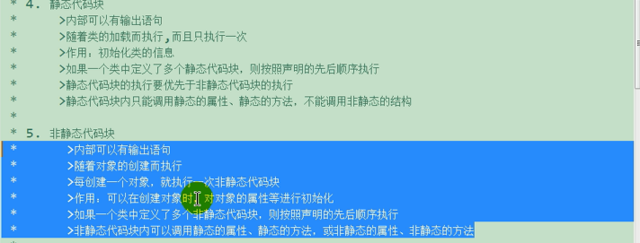

## 介绍

```java
属性	= 成员变量 = field = 域 = 字段
方法  = 成员方法 = method = 函数
```


## 类

### 使用步骤

```java
// 定义一个标准类 ，这样的标准类叫做  Java Bean
1. 所有的变量成员都要进行私有化 ： private 修饰
2. 为每一个变量成员设置一对 getter/setter 方法(视权限控制来)
3. 编写一个无参构造方法
4. 编写一个全参构造方法
    
```


### 声明

#### 方式

```c++
方式
    1. 先声明后赋值
    2. 声明的时候赋值
    
标准格式
    class 类名 {
        访问权限： 属性(字段属性)；
        访问权限： 行为(方法)
    };
    
语法实例
// 先声明后赋值
    // 先声明 ，相当于告诉编译器，等下会声明这个类，不用报错
    class Person；
    // 赋值
    class Person {
        Person(){};
    }

// 声明的时候赋值
	class person {
         Person(){};
    };
```

#### 限制

```java
限制
    1. 一个文件中 可以有多个类
    	// 每个编译单元(文件) 都只能有一个 public 类
    	但是只能有一个 public 类，其 public 类的名字和 文件(xxx.java)名字相同
    	每个编译单元都有单一的公共接口， 用 public 实现
    	这个接口可以按照要求包含众多的支持宝访问权限的类
    2. public 类的名称必须完全与含有该编译单元的文件名相匹配， 包括大小写
    3. 文件中可以都不使用 public 类
    	其中就不需要遵命名字的限制了，但是最好不要这样做
```


#### 关键字/权限

```c++
介绍
    成员类	     ： public/default
    成员内部类   : public protected default private
    局部类       : 不能用任何修饰符， 因为没有谁能访问它， 除了在类内部运行
    
注意
外部类不能使用 private 除了该类外， 其他类都不能进行访问
        
// 访问权限
    public	公共权限
    	类内部可以访问  ， 类外不能访问
    protected  保护权限
    	类内部可以访问 ， 类外不能访问 , 子类可访问父类保护内容
    private 	私有权限(默认)
    	类内部可以访问  ， 类外不能访问 ， 子类不可访问父类私有内容
// 状态
    static  静态成员(类独有) ，静态成员都有访问权限
    	静态成员变量 
    	静态成员方法
    friend 友元类
    	
// 属性
    类的属性和行为统一称为成员 
    属性 ,  成员属性 ， 成员变量
// 行为方法
    类的属性和行为统一称为成员 
    行为 ， 成员方法 ， 成员函数

 

// 接口不需要显示实现，只要一个变量，含有接口类型中的所有方法，那么这个变量就实现这个接口
```

### 实例化+赋值

#### 概述

```c++
介 绍
    // 实例化 、 实现 、 创建一个类对象、类的实例化
    实现类，将类变成一个实际的类
    主要还是字段属性的赋值 ，方法就直接传参调用了
    
实例创建
    // 构造函数 new
    new 类类型(); 
例子
    
    class Student {
        public string name;
        protected string Car;
        private string password;
        
        public Student(){};
        
        public Student() {
                // 类内部均可以访问到
                name = "lili";
                Car = "ziz";
                password = "123";
            }
    }
    创建实例
        Student stu = new Student();

```

#### 匿名对象

```java
介绍
    创建的对象， 没有显式赋值给一个变量， 就是匿名变量
特点
    只能调用一次
public class Person {
    private String name;
    
    public void say() { Systerm.out.println("666")};
}

匿名对象
    new Person().say();
非匿名对象调用
    Person p = New Person();
	p.say();
便捷使用
// 工厂模式
public class Factory {
    public Person person() {
        return new Person();
    }
}    

// 开发中使用
public class Test{
    public void test(Person person){
        person.name；
    }
}
```


```java
属性：
    类实例.属性
    类实例.方法()
```


## 成员变量(属性)

### 赋值

```java
1. 在构造函数中进行字段赋值 -- 创建对象的时候进行赋值
2. 创建对象之后进行赋值
    实例对象.属性名 = 属性值；
```


### 封装 - 私有化

```java
介绍
    不能直接使用 类实例.属性名 进行类的属性字段进行限制访问
    只能通过提供响应的 set get 方法进行访问
特点
    高能聚： 类内部的数据操作细节自己完成， 不允许外部干涉
    低耦合： 仅对外暴露方法进行操作(少量)
// 成员变量没有指定值，就使用类型的默认值
//  将成员变量私有，不暴露给方法
注意
    对于 boolean 返回值， getter 函数设置成 isXXX ,setter 方法不变
例子
class Person {
    // 通过类内方法进行读写权限设置
    private String name;  // 可读可写
    private int age;	 // 只读
    private tring lover;  // 只写

    // 设置名字
    public void setName(string Name) {
        name = Name;
    }
    // 获取姓名
    public string getName() {
        return name;
    }
    // 年龄设置
    public int getAge() {
        // 年龄初始化
        age = 0;
        return age;
    }
    // 爱人权限设置
    public setLover(string name) {
        lover = name;
    }

```


## 成员方法

### 概述

```java
概述	
	成员方法就是写在类中的方法， 就是之前说的方法
	方法定义的位置不分先后 。 不调用不执行
	方法之间不能 嵌套
    

  
```

### 语法结构

```java
构成
    修饰符
    	权限修饰符 
    	 关键字修饰符
    参数
        可有、可无(不传递参数)
    返回值
        可有、可无（void）
    
语法格式    
    访问修饰符  关键字修饰符  返回值类型 函数名(参数列表){ // 函数体  }
    public static void get(int a){ ... }
```

### 声明定义

```java
方式
    // 普通类中 ：
	声明的时候定义（赋值)）
    // 抽象函数 、 接口
    先声明 ， 后定义
    // 注意
         声明：说的是写函数的时候，不写函数体
```

### 方法结构

#### 修饰符

#### 返回值

```c++
返回值
	描述了函数返回值的类型 
    只能有 1 个或者 0 个返回值
多个值返回
    使用数组 、 类等： 将返回结果，封装到一个数组或者对象中
分类
    无返回值
    	返回值的位置 使用 void 占位
    	不包括返回值，函数执行完毕后，不会返回任何值
    有返回值
		必须以 return 语句结尾，除非函数明显无法运行到结尾处， 
例子
    无返回值
    // return语句不能返回任何值, 只是用来结束函数 ，在函数最后一行的时候，可要可不要
    public void Add(int num1, int num2) {
        return;
    }

	有返回值
    // 只能有(1 或者 0 个)参数
    public int Add(int num1, int num2) {
        return num1 + num2;
    }

注意
返回局部变量
    方法
        // 返回局部变量 ， 看数组返回

    原因
    	因为局部变量是存储在内存的栈区内，当函数调用结束后，局部变量所占的内存地址便被释放了，
        因此当其函数执行完毕后，函数内的变量便不再拥有那个内存地址，所以不能返回其指针。
		
    	除非将其变量定义为 static 变量，
    	static 变量的值存放在内存中的静态数据区，不会随着函数执行的结束而被清除，故能返回其地址。
```


#### 参数

##### 介绍

```java
介绍
    // 形参和实参只是函数的参数在不同的生命周期中的叫法
    形参 ： 函数定义(声明)的时候， 函数参数的叫法， (定义的参数)
    实参 ： 
    	函数调用的时候，函数参数的叫法, (接收的参数)
    	是一个局部变量 ， 参数的数据，由参数调用者提供
	形参， 参数列表
    	形式的参数，其本身并没有数据。 只是一个占位作用
        表示函数的输入 ，形参列表可以是多个
    
使用
    函数在调用时都必须按照声明顺序为所有参数提供实参（参数值）
    函数调用时，也没有默认参数值，也没有任何方法可以通过参数名指定形参
    形参和返回值的变量名对于函数调用者而言没有意义
    
例子
    有参 ： 参数列表中有值
    	方法执行需要数据条件才能完成任务
    	public static int sum(int a, int b) {...};
    无参 ： 参数类表中留空
    	一个方法不需要任何数据条件 ， 可以自己独立完成任务
        public static int print() {...};
	数组参数
        //  每种方式都会告诉编译器将要接收一个整型指针
        // 	函数体内，仍旧可以使用 arr[i] 访问数组数据
        public static void showArr(int[] arr) {
            arr[i]
        }
	对象参数
        // 传递进来的其实就是传递进来的地址
        public static void showArr(Phone phone) {
            phone.name
        }
```


##### 可变参数

```java
介绍
    jdk1.5 之后
    定义一个方法需要接受多个参数，并且参数的类型一致， 可以简写
语法
    // 终极写法 Object... obj
    修饰符 返回值类型 方法名(参数类型... 形参名){ }；
    // 等价于
    修饰符 返回值类型 方法名(参数类型[] 形参名){ } ；
注意
    参数
    	类型确定
    	个数不确定：可传入的参数个数 >= 0
    一个方法
    	只能有一个，
		必须写在参数列表的结尾
    可变参数和重载方法冲突的时候。优先使用重载方法
底层
    // 可变参数就是不用显示编写数组语法了
    是一个数组， 根据传递参数的不同，创建不同的长度的数组，来存储这些参数（>= 0个）
    
例子
    public int sum(int a, int... args){
    	。。。
	}
```

#### 参数传递方式

##### 介绍

```java
//   java 中没有指针的概念， 只有值传递
java 都是值传递，
    普通类型： 具体的值
    引用类型： 对象所在的内存地址的值
```

##### 值传递

```java
值传递
    // 默认使用
    函数在调用实参时，将数值传入给形参
    把参数的实际值复制给函数的形式参数。在这种情况下，修改函数内的形式参数不会影响实际参数
    
特点
    1.	传递的是值的拷贝，数据量大，越大效率越低
    2.	在函数内修改，不会影响到原来的值
    3.	变量直接存储值，内存通常在栈中分配


类型
    // 下面的不管是不是使用 new 都是进行值传递的
    基础类型
    	传递的是传入变量的值的拷贝， 传递以后互不关联
    基础类型的包装
    	因为是存在自动装箱、自动拆箱，所以也是引用传递
    // 注意
	   	String  类型也是值传递
   
    	
例子
public class demo1 {
    public void change(int a){
        a += a;
        System.out.println(a);
    }
    public static void main(String[] args) {
        int s = 10;
        demo1 demo1 = new demo1();
        demo1.change(s);	// 20
        // 参数传递并没有改变原变量的值
        System.out.println("传递过后："+s);  // 10
    }
}

// 过程分析例子
int a=1, b=2;
	开辟一个内存 ，内存中 a 的值为 1 ，b 的值为 2
swap(a,b);
    // 参数传递
    在内存中再开辟内存 num1 num2 ,然后把 a 的值赋值给 num1, b 的值赋值给 num2
    此时内存中有四个内存空间变量 a=1 b=2 num1=1 num2=2
    // 函数内部进行数值交换
	// int temp = num1;
    开辟一个 内存为temp 的空间 ， 将num1 的值给 temp , 
	此时内存空间 ：a=1 b=2 num1=1 num2=2 temp=1
	// num1 = num2;
    将内存空间 num2 的值赋值给 内存空间 num1
    此时内存空间 ：a=1 b=2 num1=2 num2=2 temp=1
	// num2 = temp;
   将内存空间 temp 的值赋值给 内存空间 num2
    此时内存空间 ：a=1 b=2 num1=2 num2=1 temp=1
    // 最后，回收 temp
    此时内存空间 ：a=1 b=2 num1=2 num2=1 
    // cout << a << endl;   // a=1


```

##### 引用地址值传递

```java
介绍
    // 是引用类型
    传递的是传入变量的值的拷贝， 只不过这个值是源数据的内存地址
 注意
    基础类型及其包装类，是无法进行引用值传递的，需要借助数组、map等

例子
public class demo1 {
    public void change(int[] a){
        a[1] = a[1] + 10;
        System.out.println(a[1]);

    }
    public static void main(String[] args) {
        int[] s = {1,3};
        demo1 demo1 = new demo1();
        demo1.change(s);
        System.out.println("传递过后："+s[1]);
    }
}
```

##### 特殊

```java
引用类型进行值传递
	引用类型传递进去进行操作， 就是在对内存地址上的数进行的操作，
    // 只要不对引用的类型直接操作，就不会改变引用类型的值
例子

public class demo1 {
    public void change(int[] a){
//        a[1] = a[1] + 10;
//        System.out.println(a[1]);
        int s = a[1];
        s++;
        System.out.println(s);  // 13

    }
    public static void main(String[] args) {
        int[] s = {1,3};
        demo1 demo1 = new demo1();
        demo1.change(s);
        System.out.println("传递过后："+s[1]);  // 3
    }
}
```


#### 函数体


### 方法绑定

#### 介绍

```java
绑定就是
    ⼀个⽅法的调⽤与调⽤这个⽅法的类连接在⼀起的过程被称为绑定。
分类
    静态绑定 == 前期绑定 == 编译时绑定
    动态绑定 == 后期绑定 == 运⾏时绑定
    
特点
    静态绑定
    	1. 编译期触发，能够提早知道代码错误
        2. 提⾼程序运⾏效率
    动态绑定
    	1. 使⽤动态绑定的前提条件能够提⾼代码的可⽤性，使代码更加灵活。
		2. 多态是设计模式的基础，能够降低耦合性。
```

#### 静态绑定

```java
介绍
    在程序运⾏前，也就是编译时期 JVM 就能够确定⽅法由谁调⽤，这种机制称为静态绑定
出现标识
    // 构造⽅法也是前期绑定
    ⼀个⽅法由 private、static、final 任意⼀个关键字所修饰，那么这个⽅法是前期绑定的
 
详解
private：
     private 关键字是私有的意思，
     如果被 private 修饰的⽅法是⽆法由本类之外的其他类所调⽤的，
     也就是本类所特有的⽅法，所以也就由编译器识别此⽅法是属于哪个类的
 final：
    final 修饰的⽅法不能被重写，
    但是可以由⼦类进⾏调⽤，如果将⽅法声明为 final 可以有效的关闭动态绑定
static： 
    static 修饰的⽅法⽐较特殊，不⽤通过 new 出某个类来调⽤，
    由 类名.变量名 直接调⽤该⽅法    
    new 可以认为是开启多态的导⽕索，
    ⽽由类名.变量名直接调⽤的话，此时的类名是确定的，并不会产⽣多态，
```

#### 动态绑定 -- 多态

```java
介绍
    在运⾏时根据具体对象的类型进⾏绑定
    除了由 private、final、static 所修饰的⽅法和构造⽅法外，
    JVM 在运⾏期间决定⽅法由哪个对象调⽤的过程称为动态绑定
    
理解
    如果把编译、运⾏看成⼀条时间线的话，
    在运⾏前必须要进⾏程序的编译过程，那么在编译期进⾏的绑定是前期绑定，在程序运⾏了，发⽣的绑定就是后期绑定‘
    
过程
    1. 虚拟机提取对象的实际类型的⽅法表；
    2. 虚拟机搜索⽅法签名；
    3. 调⽤⽅法。
例子
public class Father {
     void drinkMilk(){
     System.out.println("⽗亲喜欢喝⽜奶");
 }
}
public class Son extends Father{
     @Override
         void drinkMilk() {
         System.out.println("⼉⼦喜欢喝⽜奶");
     }
     public static void main(String[] args) {
         // 编译器并不知道son 对象真正引⽤的是谁，
         // 在程序运⾏时期才知道，这个 son 是⼀个 Father 类的对象，但是却指向了Son 的引⽤
         Father son = new Son();
         son.drinkMilk();
 	}
} 

// 多态的原则
    继承
    重写
    ⽗类引⽤指向⼦类对象
```

### 方法调用

#### super

```java
介绍
    指定使用父类的成员的修饰符
    可以显式调用父类的：方法、属性、构造器
方法
    局部变量 ： 直接写成员变量
    本类成员 ： this.成员
    父类成员 ： super.成员
使用
    在子类的成员方法中， 访问父类成员变量
    子类成员方法中， 访问父类成员方法
    子类的构造方法中， 调用父类的构造方法
使用
    构造器
    	使用 super(形参列表) ， 调用父类中声明指定的构造器
    方法调用
    	super.方法名（）
    位置
    	1. 必须使用在子类构造器的首行
    		类构造器中：super this 两种构造， 不能同时使用 ，不能循环无限调用
    	2.默认的是使用 super()
    		构造器首行，没有显式声明 super this, 默认使用父类的空构造方法
    	3. 多个类构造器，至少有一个是需要调用 super 方法
```


#### this

```java
介绍
    this 指定访问本类的内容， 表示当前对象
用法
    子类成员方法中 ： 访问本类的成员变量
    子列成员方法中 ： 访问本类的成员方法
    子类构造函数中 ： 调用本地类的另一个构造函数
    
注意
    本类中调用另一个构造函数， 必须是第一个语句，也必须是唯一一个
    public Son extends Father {
    	public Son() {
            this(123);
        }
    	Public Son(int sum) {
            sum = 0;
        }
	}

特别注意
    super this 两种构造， 不能同时使用 ，不能循环无限调用
```


### 构造函数

#### 介绍

```java
构造函数
    // 构造方法属于 静态方法 ，默认实现 static 
    用于创建对象时为对象的成员属性赋值
    用来初始化类
    
语法
    // 参数可有可无, 无返回值（连 void 都没有）
    public 类名(参数列表){
    	方法体
	};
注意
    名称与类名称一致、可重载、
    无返回值（不写 void , 更不要写 return）
    不能使用修饰符
    	final
    	static
    	abstract synchronized native 
    
    // 默认修饰符 static
    程序在调用对象的时候会自动调用，而且只会调动一次
    // 因为二者都要求被放在构造器的首行
	super()和this()是不能同时出现在构造器中，
    
书写准则
    尽量使用简单的方式让对象进行正常状态
    尽量避免调用其他方法, 非要调用，要调用 final(private) 方法 ,
```

#### 语法定义

```java
分类
    参数分类 ： 有参构造 、 无参构造(默认构造函数)
    类型分类 ： 普通构造 、 引用构造
    
特点
    如果没有手动设置构造函数，编译器会提供一个空的构造方法 ，编译器提供的构造函数是空实现
    如何提供了非空构造，则不会提供默认构造方法
    


例子
public class Person {
    private int age;
    // 普通构造
    public Person() { " 无参构造函数" }；
    // 有参构造
    public Person(int a) {
        // "有参构造函数"
        
        // 属性、方法的使用, 可以不使用，但是最好带上
    	// 属性使用
         this.age = 18;
        // 方法使用
        this.setAge(18);
    }
```

#### 函数调用

##### 普通调用

```java
// 对于跨包的需要看模块化调用哪里
new 类名(参数)
```


##### 调用自身 - this

```java
概述
    必须放在第一行，所以这也决定了，构造函数只能调用一次

// 调用自身的构造函数： this(...)
介绍
    需要放在第一行， 否则会报错
    class Food{
        String name;
        Food(){ }
        Food(String name){
            this();            //调用无参构造函数Food()
            //... 其他代码
        }
        Food(String name,double price){
            this(name);        //调用有参构造函数Food(String name)
            //... 其他代码
        }
    }
	
```


##### 调用父类 - super

```java

```

#### 运行规则

```c++
基类的构造器总是在导出类的构造过程中被调用，并且按照继承层次网上链接，让每个基类的构造器都被调用
 子类开始构造
    基类构造
  子类构造结束
//----------------------
调用基类构造器
    不断递归调用，
按照声明顺序调用成员的初始化方法
调用导出类构造器主体
 
注意
    1. 尽量不要在构造函数中调用多态的方法（）
    因为： 你调用某个方法，但是这个方法操纵的成员还没有初始化，这会导致 bug
    
```

### 主方法

```java
介绍
    main() 方法
    	可以是程序入口， 
    	也可以是一个普通的静态方法， 
    	也可以作为与控制台进行交互:替换scanner
            运行时： java 类名 "tom" "123"   // 传给形参 String[] args
            输出：System.out.println(args[0])
```


### 重载

```java
介绍
    overload
    //    同一个类中，参数不同，
    同一个类中， 允许存在一个以上的同名函数，但是他们的参数必须不同（参数的类型、个数 、顺序不同）

核心条件
    参数的类型、个数 、顺序不同
无关条件
    参数名称无关 
    函数返回值无关，没有有返回值都行
    跟限定词无关
作用
    记住一个方法名称 ，可以实现多个功能
 注意
	1.不要使用参数顺序不同来构成重载

重载类型提升    
    // 基本类型的重载
    形参类型是一个比较大的类型 ： int
    实参类型是一个比较小的类型 ： char
    // 形参类型 > 实参类型
        会自动出现类型提升
    // 形参类型 < 实参类型
        需要提前进行窄化转换（进行类型转换）， 否则报错
    
例子
    public void test(int a) {}
	public void test(String s){}
```

### 重写  - override 

```java
介绍
    //  类继承， 有一个 @override
    子类继承父类以后，可以对父类中同名、同参数的方法，进行覆盖操作
注解
    @Override
    1. 这个只是一个注解，让 jdk 帮你进行检测，可有可无，但是最好写上，主要用于父子类之间
特点
    // 约定俗称：子类的叫重写， 父类中的叫被重写的方法
    1. 方法名、参数列表
    	父子方法中需要一致
    2. 权限修饰符
    	子类权限修饰符不能小于父类原有的
    	子类不能重写父类中权限为 private 的方法
    3. 其他修饰符
    	父子要么都是 static(static方法不能被重写)
    	要么都不是
    4. 返回值类型
    	父类为 void , 则 子类 也必须返回 void
      	父类为 基本类型 , 则 子类 也必须返回 基本类型，不存在类型提升
  		子类返回值的类型必须是父类的返回值类型或者其子类
    5. 抛出的异常
    	子类重写抛出的异常类型不大于父类方法中的异常类型
	
```

### 实现 - override

```java
方法实现  // 参看接口中的方法
    接口实现， 类实现接口的中的方法
    重写后的⽅法其⽅法的声明和参数类型、顺序必须要与⽗类完全⼀致；
```


## 成员类-内部类

### 介绍

```java
介绍
    一个类内部包含另一个类
分类
    成员内部类
    局部内部类（包含匿名内部类）
使用
    外部类有一个方法，这个方法返回一个内部类的引用
    作为外部类的结构
```

### 权限修饰符

```java
成员类	     ： public/default
    
// 内部类
// 成员内部类 静态内部类    
一级修饰符 ：public protected default private
二级修饰符： static/default    

局部类       : 不能用任何修饰符， 因为没有谁能访问它， 除了在类内部运行
```

### 成员内部类

#### 语法格式

```java
语法格式
	修饰符 class 外部类名称 {
        
        修饰符 class 外部类名称 {
        }
    }
        
编译后的结果
    // 编译后的嵌套类， 内部类的class 文件 名称是
    外部类 $ 内部类 . class    
```

#### 实例化

```java
创建原则
    // 内部类对象会连接到创建它的外部类对象上（内部类拥有外部类的所有权限）
    在拥有外部类之前不能进行内部类的创建

外部类内使用
    
    1. 非静态方法 直接创建 new
    // 方法属于调用对象，动态绑定
    public class Body { 
        public Inner inner() { return new Inner(); }
        public class Heart {
            public void beat(){ 。。。}；
        }
    }
	2. 静态方法中
     // 方法属于类，不属于某个对象
        所在在创建内部类之前，需要先有外部类对象
        
main: 外部类外使用
    // 需要提前知道外部类对象， 否则内部类无法连接外部类     
    1. 外部类  方法   创建
       // Inner inner = ( new Body() ).inner();  new 和 点 平级从左到右
       Inner inner = new Body().inner();
    2. 外部类  构造方法 创建
    	// 缩写 Body.Heart heart = new Body().new Heart();
        Body body = new Body();
        Body.Heart heart = body.new Inner();
```


#### 特点

##### 非 static

```java
特点
    // 内部类
    1. 自动拥有外部类的全部访问权限
    2. 作用域只在类内部
    
内部成员
    其内部不能含有 static 方法或者字段，也不能包含静态类
    
原因
// 内部类自动拥有外部类的全部访问权限
    当外部类创建一个内部类对象，内部类会捕获一个外部类的引用,内部类通过这个引用进行访问
    这个处理编译器自动处理， 不用使用者管理
    
例子
    public class Body {
        private String name = "55";

        public class Heart {
            // 自动拥有外部类的全部访问权限
            public void beat(){
                 System.out.println(name)  // 55
            }
            // 手动获取外部类引用
            public Body outer(){
                // return new Body();
                return Body.this;
            }
        }
    }
```

##### static

```java
介绍
    别称： 类嵌套
    将内部类声明为 static
    不需要内部类队形与其外围类对象之间有联系， 
特点
    // 静态内部类包含
    静态内部类不在保留对外部对象的引用
    创建嵌套类的对象，不需要外围类的对象
    不能从嵌套类对象中访问费静态的外围类对象
 内部成员
    成员随意
    
语法
    修饰符 class 外部类名称 {
        修饰符 static class 外部类名称 {
        }
    }
    
使用
    1. 在接口中使用
    	// 参看接口中的 成员类
    	接口中的类自动 public static 化
    	甚至在内部类实现其外围接口
    2. 在类中使用
    	用于测试代码，上限的时候删除测试文件
例子
// 在类中使用
// 生成一个独立的类 TestBed$tester, 运行这个类进行测试，
// 产品发布前删除掉 TestBed$tester.class 文件即可
 public class TestBed {
     public void fun() {System.out.print("f()")}
     public static class tester {
         public static void main(String[] Args){
             TestBed t = new TestBed();
             t.f();
         }
     }
 }

调用
// 访问外部类成员
无论一个内部类被嵌套多少层， 他都透明访问多有嵌入它的外围类的所有成员    
```


#### 内外同名变量

```java
public class Body {
    int num = 20;
    public class Inner {
        int num = 30 ;
        public void method() {
            int num = 40;
            System.out.println(num);  // 40
            System.out.println(this.num);  // 30 内部类属性
            System.out.Println(Body.this.num); // 20 外部类属性
        }
    }

}
```

### 局部内部类

#### 定义

```java
介绍
    // 局部之中，没有类可以访问，所以不能使用修饰符
    一个类定义在一个方法的内部 ， 那么这个类就是局部类
 	局部 ：只有当前所属类方法体内才能使用， 除了这个方法外面就不能使用
    
 位置
    一个方法体重
    一个代码块中
 语法例子
    public class Outer {
        public void methOuter(){
            // 局部类
            // 当前类出了方法就不能用了，所以初始化要在方法内部
            public class Inner {
                int num = 10;
                public void show(){
                    System.out.print(num);
                }
            }
            
            Inner inner = new Inner();
            inner.show();
        }
    }
	// main 调用
	Outer outer = new Outer();
	// 变相调用局部类中的方法
	Outer.methOuter();
```


#### 访问方法中的常量

```java
介绍
    内部类需要访问外部类方法中的成员变量，这个局部变量必须是 final 的
    jdk8+ 
    	只要局部变量事实不变， 那么这个 final 可以省略
    jdk7-
    	局部内部类中的方法(A) 想调用另一个局部类中方法(B)中的局部变量， 要求被调你用的方法需要是 final 修饰的
原因
    new 出来的对象在堆内存中
    局部变量跟着方法走， 在栈内存中
    方法运行结束，立刻出栈，局部变量会马上消失， 但是 new 出来的对象会一直在堆中存在， 直到垃圾回收消失
    所以
    	对象声明周期更长，只要变量不变，就可以 copy 一份到栈中，
```


### 匿名内部类

#### 基础

```java
介绍
    如果接口的实现类 or 父类的子类 ， 只需要使用唯一的一次，
    那么这种情况下就可以省略掉该类的定义， 改为使用 匿名内部类
    
特点
    匿名类没有构造器
    一个匿名类只能显示一个接口
使用
    1. 实现接口
    2. 扩展了有非默认构造器的类
    3. 执行字段初始化
    4. 通过实例初始化实现构造（匿名类不可能有构造器）
```

#### 基础语法

```java
语法
    // 省略实现类：匿名内部类，创建对象只能创建一次
    接口名称 对象名 = new 接口名称() {
		// 覆盖重写所有的方法
	}

	// 省略对象 : 匿名对象 ， 方法只能使用一次
	// 创建之后，立即执行你要执行的方法
	new 接口名称（）{
        // 覆盖所有方法
    }.test();
```

#### 使用

```java
abstract class Base{
    private String name;
}
public class c {
    // 如果传入的参数需要在匿名内部类中使用， 必须是 final 字段
    // 匿名内部类，使用类外部定义的对象， 编译器要求其参数需要时 final 的
    // 如果只是传过来，但是不使用，就不需要 final 了
    public static Base getBase(){
        return new Base(final String Name; int i){
            // 重写Base 的方法
            private String name = Name;
		};
    }
}
```


```java

    
优势
    // Lambda 表达式
    即制定了一种做事的方案，其实就是一个函数
    无参数 ： 不需要任何条件就可以执行
    无返回值 ： 该方案不产生任何结果
    代码块 ： 方法体才是具体执行步骤

注意
     匿名内部类创建对象的时候， 只能创建一次，创建多个对象，只能使用实现类
        
        
    匿名对象， 当前行执行结束后，系统会立即回收掉匿名对象
    只有右边的对象， 没有左边的名字和赋值运算符
     
```

## 代码块




## 类中指针

### 拷贝

```c++
介绍
    深拷贝 ： 简单的赋值拷贝操作 
    浅拷贝 ： 在堆区重新申请空间， 进行拷贝操作
总结
    如果属性有在堆区开辟的 ， 一定要自己提供拷贝函数，防止浅拷贝带来的问题
    
例子
    class Person {
        Person() {
            cout << "默认构造函数" <<endl;
        }
        
        Person(int age， int height) {
            Age = age;
            // 开辟一个堆区的数据
            Height = new int(height)；
            cout << "有参数构造函数" << endl;
        }
        // 0----------------------------------------------------------
        // 解决浅拷贝这样的问题，使用深拷贝
        // 自己实现拷贝构造函数，解决浅拷贝函数
        Person(const Person & p) {
            cout << "拷贝函数调用" << endl;
            Age = p.Age;
            // 深拷贝操作
            Height = new int(*p.Height);
        }
        // 0----------------------------------------------------------
        ~Person() {
            // 析构代码， 将堆区开辟数据做释放操作
            if (Height != NULL) {
                delete Height;
                Height = NULL;
            }
            cout << "析构函数" << endl;
        }
        
        int Age;
        int *Height;  // 指针开辟到堆区
    }

	void test1() {
        // 堆区的存储特点是，先进先出
        // 所以程序先释放 p1 随后释放 p2
        Person p1(18);
        // 下面利用编译器提供的拷贝函数， 会做浅拷贝
        // p2 拿到的 Height 和 p1 拿到 Height 的堆内存地址是一样
        // 前面 p1 已经进行过释放了（标记为未分配），这里 p2 再进行释放操作， 就会出现错误
        Person p2(p1);
        // 0----------------------------------------------------------
        // 深拷贝解决
        // p2 拿到的 Height 和 p1 拿到 Height 的堆内存地址是不一样的了
        // p2 重新开辟了一个新的堆内存
        Person p2(p1)；
        
        // 0------------------------------------------------------------

    }

	int main() {
        test1();
    }
```


### 空指针访问成员函数

```c++
介绍
    c++ 空指针也可以调用成员函数，
    但是要注意使用有没有使用到 this 指针 ，用到 this , 要加以判断代码的健壮性
    
例子
    class Person {
    public :
        int age;
        void showClass(){ cout <<"showclass"<< endl; };
        // 属性前边都默认加了一个 this 箭头
        // cout << this->age << endl
        void showage(){ 
            // 防止空指针
            if (this == NULL) {
                return;
            }
            cout << age << endl;
        }；
    }

	void test(){
        Person *p = NULL;
        p->showClassName();
        // 下面出现  this 冲突 , p 是空指针，是空的东西，
        // 方法调用 this 指向一个空的值 ，再访问其中的属性，所以会报错
        p->showage();
    }
```


## 操作

### 两个对象使用同一个方法

```java
实际上使用的是方法存储在堆区的地址
```


### 两个引用指向同一个对象

```java
Phone phone  = new Phone();
System.out.println(phone.brand);  // null

// 将 per 中存储的地址值赋值给 two ,通过修改 two , 会修改 per 的属性值
Phone two = phone;
two.brand = "qwe";
System.out.println(two.brand); // qwe
System.out.println(phone.brand);  // qwe

Person two = per;
```

### main

```java
可以为每个类都创建一个 main 方法， 可以让每个单元测试变得很简单，也无需删除，可以将其留到下次使用
```

### 相等比较

```js
== 		
    比较的是内存地址
作用
	对比对象的内容， 默认的 Object.equals 对比的是对象的地址
结果
	// 以下有一个为真就会返回真
	对象内容： 重写， 注意内容相同，地址不一定相同
    对象地址： 默认方式
注意
	一个类重写 equals 的同时，最好重写 hashCode 


```


## 类底层

### 构造函数

```java
// 构造器不是  static 的
// 类的构造器虽然没有用 static 修饰，但是实际上是 static 方法
1. 而在类的构造器中，是有隐含的 this 绑定的，因为构造方法是和类绑定的，
    	从这个角度来看，构造器不是静态的。
2. 从类的方法这个角度来看，因为 类.方法名不需要新创建对象就能够访问，
    	所以从这个角度来看，构造器也不是静态的
3. jvm
    static 方法 ：
    	调用 static 方法时是使用的 invokestatic 指令
    	invokestatic 指令是专门用来执行 static 方法的指令
    构造器方法： 
    	new 对象调用的是 invokespecial 指令
    	invokespecial 是专门用来执行实例方法的指令
    所以从这个角度来看，构造器也不是静态的
```


### 变量和方法存储

```c++
介绍
    
    类的成员变量和变量方法分开存储
    	成员变量 ： 非静态对象 -- 对象上
    	成员方法 ： 
    		方法体 ： 放在方法区域
    		堆上 ：  在对象存储区域 ， 放的是其在方法区的地址索引
    		栈上 ： 压栈执行，执行完出栈
    对象上：（占用对象的空间）
   		非静态成员变量， 对象在堆上
    不同对象
    	不同对象占用不同的堆空间
    	但是对空间中存储的成员方法的地址是一样的
    --------------------------------------------
实例
    空对象占用内存空间  1 ；
    	c++ 编译器会给每个空对象也分配一个字节空间 
    	为了区分空对象占用内存的位置 ， 每一个空对象也应该有一个独一无二的地址
    非空对象
    	非静态成员的属性字段的大小之和 ，不包括对象方法
    	因为静态成员不属于任何一个对象
```


## 复用

* 继承
* 组合
* 代理

```java
组合
    通常用于在新类中使用现有类的功能而并非它的接口的情况，
    即 ： 用户看到的是新的类定义的接口，而非嵌入的对象的接口
使用
    // 优先使用组合
   组合： 不用在程序设计的时候进入继承的层次结构中，可以动态选择类型，
   继承： 在编译的时候就需要知道确切类型
   通用准则 ：用继承吧表达行为间的差异，并用字段表达状态上的变化
```


