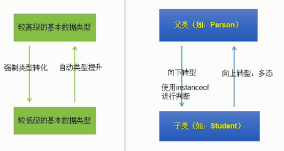

## 多态

## 介绍

```java
多态不能单独来看，他是类关系中一部分，与其他特性协同工作
```


### 基础

```java
多态的前提
    extends 继承 或者 implements 实现
    只适用于方法，不适用于属性：
    	属性
    		都是看左边
    	方法
            编译： 看左边，父亲， 只能调用父类的方法
            运行： 看右边， 子类， 执行是子类重写的父类的方法
    多态是一个运行时行为
    
 介绍
    polymorphism , 一般用 multi 表示
    // 对象既可以作为自身类型使用，也可以作为他的基类使用
    // 对象既可以作为自身类型使用，也可以作为他的接口使用
    父类引用指向子类对象： 子类的对象赋给父类的引用
 格式
    父亲名称 对象名 = new 子类名称();
	接口名称 对象名 = new 实现类名称();
注意
    编译： 看左边，父亲， 只能调用父类的方法
    运行： 看右边， 子类， 执行是子类重写的父类的方法

例子
    public class Father {
        public void method(){};
    }
	public class Son extends Father {
		@Override
        public void method(){};
    }
	// main 函数中
	Person son = new Son();
```

### 重名冲突

```java
变量重名
    // 编译看左边 ， 运行看左边
    1. 通过对象名称进行访问： 看等号左边是谁， 就优先用谁，没有则向上找
    	// obj 进行变量访问，先从 father 类中找
    	Father obj = new Son()
    2. 通过成员方法进行访问 ： 方法属于谁，优先用谁 ，没有则向上查找
    	public class Son{
            int num = 10;
            public void show() {
                // show 方法属于 Son , 所以优先调用 Son 中的 num
                num += 1;
            }
        }
方法重名
    总原则
    	// Father ob = new Son();
    	// 编译看左边 : 出现红线错误， 父类没有相关方法
    	// 运行看右边
    	new 的是谁， 就优先使用谁 ， 没有的话就向上找
    
    // 成员变量、方法
    	成员方法属于谁，就调用谁的 
    	子类没有重写就属于父类，子类重写了就属于子类
	// 使用 
	Father ob = new Son();
	ob.method();  // 先从子类找， 子类找不到父类
```

## 转型



### 特点

```java
运行时类型识别
    // 运行期间进行检查
    java 中所有转型都会进行检查，即使你进行显示转换，也要进行确保是我们需要的类型,没有调用没有的方法
    如果不是，就会抛出 claaCastException 类转型异常
```


### 向上转型

```java
格式
	对象向上转型， 其实就是多套写法
 格式
    父类名称 对象名 = new 子类名称；
 含义
    右侧创建一个子类对象， 把它当成一个父类来使用
  特点
    向上转型的时候一定是安全的, 小范围(猫)转向大范围（动物）， 向上转型为更大范围动物
    子类转型父类，可能导致方法丢失
    
 类比
    // int --> double 自动转型
     double num = 100 ;
 例子
    // 创建一只猫， 把它当成动物看待 
    Animal animal = new Cat();
```

### 向下转型

```java
介绍
    其实是一个还原动作
格式
    // 将父类对象还原为原本的子类对象
    子类名称 对象名 = (子类名称)父类对象；
特点
    不安全，因为父类不一定有子类的所有的方法

例子
    Animal animal = new Cat();
	// animal 本来创建的时候就是一只猫，才能向下转型为猫
	Cat cat = (Cat)animal; 
```

### instance of

```java
介绍
    判断父类引用的对象是什么子类
语法
    对象 instanceof 类名称
结果
    boolean 值， 判断对象是否可以做类的实例
特点
    1. a instanceof A 返回 true , a instanceof B 返回 true
    	则： B 是 A 的父类
使用
    进行向下转型的时候，需要提前进行判断，判断之后再转型
例子
    // 判断父类引用原本是不是 Dog
    // 判断对象 dog 是否是 类 Animal, 是的话返回 true
    if (Dog instanceof Animal){}
```

### 自动转型

```java
语法例子
    // 相当于里式替换原则， 使用父类的地方，子类也可以是实现
	computer.user(USB usb);
    // 一个类实现可接口，那么这个类可以发生自动向上转型
    Mouse mouse = new Mouse();
    computer.user(mouse);

    USB usbMouse = new Mouse();
    computer.user(usbMouse);

// 类比
    method(int num);
    a = 10,
    method(a);
```


## 多态实现原理

### 虚拟方法

```java
介绍
    子类中定义了与父类相同参数的方法， 在多态的情况下，将此时的父类中的方法称为虚拟方法
调用
    父类根据赋值给它的不同子类队形，动态调用属于子类的该方法，这样的方法是在编译器无法确定的
    Person e = new Student();
	e.getInfo(); // 调用 Student 类的 getInfo() 方法

```


### 方法调用绑定

```java
绑定
    将一个方法调用和一个方法主体关联起来
前期绑定
    程序执行前绑定，由编译器和连接程序实现， 是面向过程语言中默认的方式
后期绑定
    // 动态绑定 、 运行时绑定
    运行时根据根据对象的类型进行绑定
    所以需要某种机制，在对象中设置某种类型信息，
    让编译器不知道对象的类型，但在运行时能够判断对象类型，找到正确的方法体
// 注意
    // private 属于 final 
	java 中除了 static final 方法外，全部都是后期绑定，这是自动发生的
    使用 final 就是关闭动态绑定，不要试图通过 final 来优化性能！！！
```

### 产生正确的行为

```java
java 中所有的方法都是通过动态绑定实现多态的
```

## 需要注意

```java
1. 私有方法 无法被覆盖
  // 私有方法默认是 final 的
2. 静态方法不具有多态性
    静态方法是和类关联的
3. 构造器默认为 static 方法，也不具有多态性
```

## 方法中的多态

### 构造函数

```java
介绍
    // 动态绑定在运行时才决定，对象无法知道他是属于方法所在的那个基类，还是属于子类
    一个内部调用正在构造的对象的某个动态绑定方法， 不要进行调用其他方法
```

### 返回类型

```java
介绍
    jdk1.5- : 子类覆盖父类的方法 ，必须返回和父类一样的类型，不能是子类
    jdk1.6+  :  子类覆盖父类的方法 ，返回和父类方法一样的返回类型、或者返回类型的子类
```


### 待整理

```c++
多态
    class 有多种实现;
分类
    静态多态 ： 函数重载 和 运算符重载属于静态多态 ，复用函数名
    动态多态 ： 派生类 和 虚函数实现运行时是多态(常用)
区别
    静态多态 ： 静态多态的函数地址早绑定 -- 编译阶段确定函数地址
    动态多态 ： 动态多态的函数地址晚绑定 -- 运行阶段确定函数地址
   
满足
    1. 需要有继承关闭
    2. 子类要重写父类的虚函数
    	重写 : 返回值类型 函数名 参数列表 完全相同
使用
    父类的指针或者引用执行子类对象
            
优点
    代码组织 结构清晰
    可读性强
    利于前期和后期维护
    }
```

