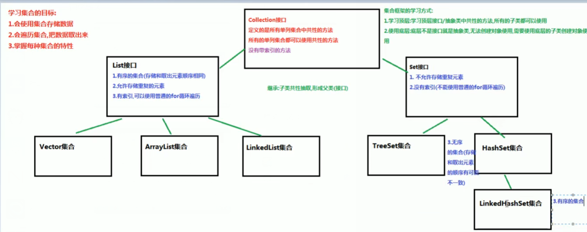

## 辨析

### Collection  和 Collections 

```jav
相同点
	Collection 和 Collections 都是位于 java.util 包下的类
不同点
	Collection
		是集合类的⽗类，它是⼀个顶级接⼝
		只定义⼀节标准⽅法⽐如
			说add、remove、set、equals 等，具体的⽅法由抽象类或者实现类去实现。
	Collections
    	集合类的⼯具类
    	Collections 不能进⾏实例化，所以 Collections 中的⽅法都是由 Collections.⽅法 直接调⽤。
```


## 待整理

```java
java 集合类都可以自动调整尺寸，
    可以将任意数量的对象放置到集合中， 不用担心饱满
```

