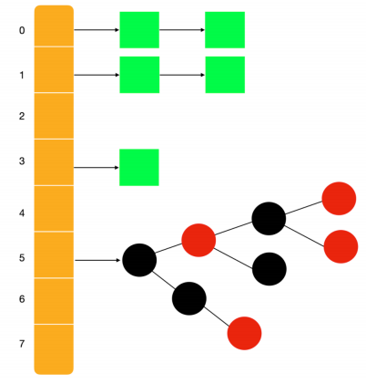

## 多线程

### 问题

```java
介绍
    HashMap 不是⼀个线程安全的容器，在⾼并发场景下，应该使⽤ ConcurrentHashMap
问题
    在多线程场景下使⽤ HashMap 会造成死循环问题（基于 JDK1.7），出现问题的位置在 rehash 处
    JDK1.8 也会造成死循环问题。
    
do {
 Entry<K,V> next = e.next; // <--假设线程⼀执⾏到这⾥就被调度挂起了
 int i = indexFor(e.hash, newCapacity);
 e.next = newTable[i];
 newTable[i] = e;
 e = next;
} while (e != null);    
```

### 安全实现

```java
介绍
    1. 并发场景下推荐使⽤ ConcurrentHashMap ，
    	效率最⾼的
    2. 使⽤线程安全的 HashMap，使⽤ Collections 包下的线程安全的容器
    	Collections.synchronizedMap(new HashMap());
    3. 可以使⽤ HashTable ，
```

## 底层实现

### 结构实现

#### jdk1.7

```java
介绍
	HashMap 采⽤ 位桶 + 链表 的实现，
    即使⽤ 链表 来处理冲突，同⼀ hash 值的链表都存储在⼀个数组中。
    但是当位于⼀个桶中的元素较多，即 hash 值相等的元素较多时，通过 key 值依次查找的效率较低。
```


#### jdk1.8

```java
 在底层结构⽅⾯做了⼀些改变，
     当每个桶中元素⼤于 8 的时候，会转变为红⿊树，⽬的就是优化查询效率。
```



### 方法实现

#### put 方法

```java
⾸先会使⽤ hash 函数来计算 key，然后执⾏真正的插⼊⽅法
    
```


## == 实现类 ==

## ConcurrentHashMap

```java
ConcurrentHashMap 是线程安全的 Map，
    它也是⾼并发场景下的⾸选数据结构，ConcurrentHashMap底层是使⽤ 分段锁 来实现的。
```

