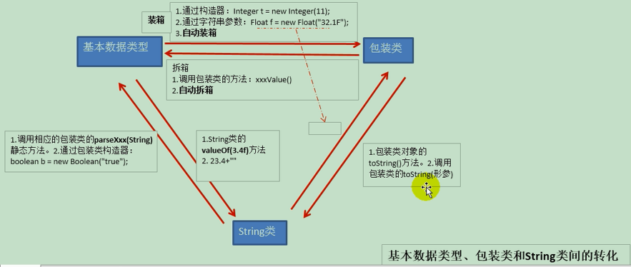

## 介绍

* 基本数据类型， 使用起来比较方便， 但是没有对应的方法来操作这些基本数据类型的数据，
* 可以使用一个类，把基本数据都包装起来， 在类中定义一些方法，这个类就叫包装类
* 我们可以使用类中的方法来操作这些基本类型的数据
* 包装类都是引用类型
* 位于 java.lang 包中

## 分类

### 基础包装类

```java
数值: 父类都是 Number
    整型
    	byte	Byte
    	short	Short
    	int		Integer [特殊]
    	long	Long
    浮点
    	float	Float
    	double	Double
    布尔
    	boolean	Boolean
// =======================    
    字符
    	char	Character [特殊]    
```

### 其他类

```java
String
```

## 装箱与拆箱



### 介绍

```java
从 jdk1.5 开始， 支持 自动装箱、自动拆箱
    自动装箱 ： 基本类型 --> 包装类型
    自动拆箱 ： 包装类型 --> 基本类型
    
基本数据类型和包装类之间，来回转换的过程称为装箱和拆箱
装箱
    从基本类型转换为包装类对象
拆箱
    从包装类对象转换为对应的基本类型    
```


### 手动装拆

#### 装箱

```java
Integer 为例
构造方法
    Integer(int value); 构造一个新分配的 Intefer 对象，它表示指定的 int 值
    Integer(String s); 构造一个新分配的 Integer 对象， 它表示 String 参数指示的 int 值
    	传递的字符串必须是基本类型的字符串，否则会抛出异常 ，100 争取， o 异常
静态方法
    static Integer valueOf(int i); 返回一个表示指定的 int 值的 Integer 实例
    Static Integer valueOf(String s); 保存指定的 String 的值的 Integer 对象
静态方法
```

#### 拆箱

```java
介绍
    从包装类中取出具体的数据
 成员方法
    int intValue(); 以 int 类型返回该 Integer 的值
```

### 自动装拆

```java
jdk 1.5 后， 基本数据类型和包装类之间可以自动相互转换
    Integer i = 1;  // 等价于 Integer i = new Integer(1)
	i = i + 2 ;  // i 是包装类，无法直接参与运算， 可以自动转换为基本数据类型 等价于  i = i.intValue + 2
```


