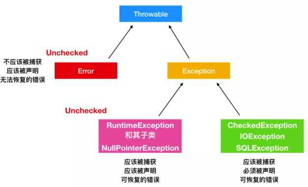
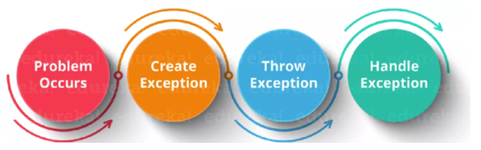

## 需要整理

```java
https://www.zhihu.com/question/25530011
```


## 异常

```java
介绍
    程序执行过程中发生的额不正常的情况
    (开发过程中的语法错误和逻辑错误不是异常)
    
// 分类    
一种是 java.lang.Error
    java 虚拟机无法解决的严重问题，
    一般不便携代码进行处理， 只能进行修改源代码
    	堆栈错误

一种是 java.lang.Exception 
    编辑错误或者偶然的一外在因素导致的一般性问题， 可以使用代码进行处理    
    分类
        运行期异常
            被抛出可以不用处理
        编译器异常
            编辑代码的时候抛出的异常： 发现错误的理想时期
            因为你不用运行程序，只是凭借着对 Java 基本理念的理解就能发现问题
    例子    
        空指针访问
        网络连接中断
        数组角标越界
```



## 处理语法格式

###  抛出 - throws系列

#### throws - 声明

```java
介绍
    写在方法声明处，指明方法运行时， 可能会抛出的异常类型
    方法执行异常，
    	会在异常处抛出一个异常类对象，满足 throws 后的异常类型，就会被抛出
    	异常代码后面的代码则不会被执行
    实质
    	将异常抛给方法的调用者， 并没有处理异常
       

语法格式
    // 捕获系统自动生成的异常
    修饰符 返回值类型 方法名(参数) throws 异常类名1, 异常类名2， ... {
    	// 可能会抛出 异常类名1， 异常类名2， 的代码块
	}
	
	// 捕获手动抛出的异常
    修饰符 返回值类型 方法名(参数) throws 异常类名1, 异常类名2， ... {
    	// xxxException 就是你指定的异常
        throw new xxxException();
	}
```

#### throw - 抛出

```java
介绍
    // 需要和 throws 搭配使用，   可以使用该关键字在指定的方法中抛出指定的异常 
    在特定位置， 手动抛出特定的异常的实例，多用于抛出自定义的错误类型的
    
    将问题标识出来， 报告给调用者， 是 java 强制执行的    
    如果方法内通过 throw 抛出了编译时的异常， 但没有捕获处理 ，
    那么必须使用 throws 声明，让调用者去处理格式    
    
语法格式     
    
   // throws 声明这个方法会抛出这种类型的异常，
   // 使它的调用者知道要捕获这个异常对象是什么对象
   static void cacheException() throws Exception { 
    	// xxxException, 
        throw new xxxException(); 
    }   
xxxException  
    可以是自定义类， 也可以是 jdk 自定义的类，
    但是都必须是 throws 抛出的异常类或者其子类
```


### 处理  -  try系列

#### 常见组合

```java
try...catch 
try...finally
try...catch...finally

```

#### 语法格式

```java

try {        
    // 可能产生异常的代码    
} catch (异常类型1 变量名1) {        
    // 异常处理逻辑，
    // 异常对象产生之后怎么处理对象       
    // 一般会把异常记录到日志文件中   
} catch(异常类型2 变量名2) {
    ...   
}finally {  
    // 无论是否出现异常，改代码块都会执行    
}
特点
    1. 处理的是编译时异常， 使得程序在编译时不会报错，但是运行时还是会出错
注意
1. try
    1. 可能抛出多个异常，就可以使用多个 catch 来捕获异常
		将出现的异常包装起来， 一旦出现异常， 就会生成对应的异常对象
	2. try 代码块中定义的变量不能在代码块外部引用，解决
        int a = 0;
		try { a = 1}
		print(a)
1. catch
    catch 就是异常处理程序的表示    对某一段代码可能抛出异常进行的捕获格式
	匹配 try 抛出的异常对象， 
        处理完成，就跳出跳出当前的 try-catch 结构：不会执行下一个catch
	获取顺序		            
		异常类型没有父子关系：则声明顺序无关系
         异常类型存在父子关系：子类要在父类之前被声明	
2. finally
     1.无论是否发生异常都要执行的代码块
     2.一般用于资源释放(资源回收)，无论程序是否出现异常，最后都要进行资源释放
    	jvm 无法进行回收的：socket 数据库等物理连接
    	文件的打开关闭，无论是否出现错误， 使用完之后都必须要关闭打开的资源
     3. return 语句    
	    不要在 finally 语句中使用 return 语句，        
		即使 try 、catch 语句中有 return 语句，也不影响 finally 的执行            
    永远只返回 finally 中的结果，应该避免该情况
```

### try-with-resources

```java
语法格式   
    // 应尽可能使用try-with-resources代替常规try-catch-finally
    参看： 使用案例-- 如何优雅关闭资源 -- jdk7+
使用
	// 就是那个类需要自动关闭，它自身就要实现 atuoCloseabke 接口
    声明的所有资源try()必须实现该AutoCloseable接口。
    这些通常是各种类型的编写器，读取器，套接字，输出或输入流等resource.close()
    
自定义的情况
    // 很少会遇到想要编写自己的资源的情况。
    需要实现AutoCloseable或Closeable
    （仅在此处保持向后兼容性，最好使用AutoCloseable）接口并重写该.close()方法：
    
    public class MyResource implements AutoCloseable {
        @Override
        public void close() throws Exception {
            // close your resource in the appropriate way
        }
    }


```


## 异常处理


### 概述

```java
处理流程 
	// 抛出异常之后
    1.  java 使用 new 在堆上开辟异常对象
    2. 当前执行路径被终止， 并且弹出异常对象的引用， 
    3. 异常处理程序接管程序，选择一个恰当的地方继续执行
    													
```


### 处理原则

#### 总原则

```java
    1. 不要捕获类似 Exception 之类的异常，而应该捕获类似特定的异常，
        比如 InterruptedException，方便排查问题，而且也能够让其他人接手你的代码时，会减少骂你的次数。
    2. 不要生吞异常。
        这是异常处理中要特别注重的事情。
        如果我们不把异常抛出来，或者也没有输出到 Logger 日志中，程序可能会在后面以不可控的方式结束。
    3. 不要在函数式编程中使用 checkedException。
```


#### 重写方法异常

```java
// 父类异常怎么样， 子类异常也要怎么样 ，子类重写父类方法    
1. 子类重写的方法抛出的异常不大于 父类被重写的方法抛出的类型

    1. 如果父类抛出多个异常，    		
	    子类要抛出和父类一样的异常 / 父类异常的子类 / 不抛出异常    
    2. 如果父类没有抛出异常，     		
    	子类不可以抛出异常，就算子类有异常，也不能声明抛出，只能捕获处理	
```


```java
总原则

多异常处理
    1. 一种异常对应一个 try - catch 语句
	2. try 捕获所有的异常， 使用 catch  语句进行单个异常捕获
        	// 注意 ：第一个抛出异常，程序就会中断，不会执行下面的代码了    	
        	可以抛出多个异常，父子异常的只用抛出父异常 ,但是要最后抛出父类异常   
    
```

### 异常处理模型

```java
1. 抛抓模型
    抛：
    	程序在正常执行过程中， 一旦出现异常，就会在代码异常处生成一个对应异常类的对象，并将此对象抛出
    	一旦抛出对象后， 后续的代码就不再执行
    抓：
    	可以理解为处理异常的方式
    	try-catch-finally
		throws            
1. 终止模型
    // Java 的模型
    假定错误时关键的，  无法返回到异常发生的地方继续执行，
2. 恢复模型
    异常处理程序的工作是修正错误，然后重新调用出问题的方法，并认为第二次能成功
```




### 自定义异常

```java
介绍    
    需要从已知的异常类中继承异常基类    
	    exception  ： 编译期异常，方法内部抛出编译器异常，就必须处理，要么throw 要么 try catch    
    	runtimeException：  运行期异常 ， 无需处理， 交给虚拟机处理(终断处理)
            
            
语法例子            
// 继承自 runtimeException 
	一般不使用
	RuntimeException 或其子类对象， 我们可以不处理，交给 JVM 处理（打印错误，中断程序）            
// 继承自 Exception             
public class xxxException extends Exception {    
    
    static final long serialVersion = .... // 参看 runtimeException 写
     // 添加一个空参数的构造方法  
	public xxxException() {};    
    
    // 添加一个带异常信息的构造方法, 获取父类信息
    public xxxException(String msg){
        supper(msg);
    }
  }

 xxxException
     自定义异常类一般以 Exception 结尾， 说明是一个异常类

// 使用
   static void cacheException() throws Exception { 
    	// xxxException, 
        throw new xxxException("异常信息"); 
    }  
```

### 异常信息处理

#### 概述

```java
1. String getMessage()
2. printStackTrace()    
```

#### 模板方法

```java
```


## 异常类 api

### 常见异常实例

```java
java.lang.Throwable
    java.lang.Error: 一般不编写针对性的代码
    java.lang.Exception : 可以进行异常处理
        // 编译时异常(checked)
        FileNotFoundException
    		ClassNotFoundException 
        // 运行时异常
        NullPointerException
        ArrayIndexOutOfBoundsException
        ClassCastException
        NumberFormatException 
        InputMi smatchException
        ArithmeticException


        
```


### ThrowAble

```java
介绍
    是 Java 语言中所有错误(errors)和异常(exceptions)的父类。
    
可被抛出    
    1. 只有继承于 Throwable 的类或者其子类才能够被抛出
    2. 带有 Java 中的 @throw 注解的类也可以抛出。

    
常用方法
    // 因为 Throwable 的父类也是 Object，
    	所以常用的方法还有继承其父类的getClass() 和 getName() 方法
    // 返回抛出异常的详细信息
    public string getMessage();
    public string getLocalizedMessage();

    //返回异常发生时的简要描述
    public public String toString()；

    // 打印异常信息到标准输出流上
    public void printStackTrace();
    public void printStackTrace(PrintStream s);
    public void printStackTrace(PrintWriter s)

    // 记录栈帧的的当前状态
    public synchronized Throwable fillInStackTrace();
    
```


### Exception


### error

#### 介绍

```java
概述
    严重的错误， 无法通过处理的错误， 只能事先避免， 
    不能处理， 是系统内部错误，运行时报错， 系统问题
    大多数错误与代码编写者执行的操作无关，而表示代码运行时 JVM（Java 虚拟机）出现的问题
    不可检查的
    // 绝大多数是程序运行时不允许出现
    例子
    	内存溢出
    	系统崩溃
发生位置
    只有程序计数器是不会发生 OutOfMemoryError 情况的区域
    虚拟机栈：
    	如果线程请求的栈深度大于虚拟机栈所允许的深度，将会出现 StackOverflowError 异常；
    	如果虚拟机动态扩展无法申请到足够的内存，将出现 OutOfMemoryError。

	本地方法栈
    	和虚拟机栈一样

	堆：
    	Java 堆可以处于物理上不连续，逻辑上连续，就像我们的磁盘空间一样，
    	如果堆中没有内存完成实例分配，并且堆无法扩展时，将会抛出 OutOfMemoryError。

	方法区：
    	方法区无法满足内存分配需求时，将抛出 OutOfMemoryError 异常。
    
```

#### 识别

```java
NoClassDefFoundError 和 ClassNotFoundException 有什么区别？
    类的加载过程中， JVM 或者 ClassLoader 无法找到对应的类时，都可能会引起这两种异常/错误，
    相同点
    	都是由 CLASSPATH 中缺少类引起的，通常是由于缺少 JAR 文件而引起的
    
    NoClassDefFoundError 
    	表示这个类在编译时期存在，但是在运行时却找不到此类, 有时静态初始化块也会出现
    	JVM 认为应用运行时找不到相应的引用，就会抛出此错误
    	是 JVM 引起的错误，是 unchecked，未经检查的。因此不会使用 try-catch 或者 finally 语句块
		是链接错误，发生在链接阶段，当解析引用找不到对应的类，就会触发            
    ClassNotFoundException 
    	与编译时期无关，当你尝试在运行时使用反射加载类时，ClassNotFoundException 就会出现。
    	代码中显示的加载类比如 Class.forName() 调用时却没有找到相应的类。会跑此错误
		是受检异常，因此需要 try-catch 语句块或者 try-finally 语句块包围，否则会导致编译错误  
		是发生在运行时的异常。            
```


#### 异常发生

```java
// 异常处理
介绍
    块中引发异常，则在该块的括号内打开的任何资源try仍将自动关闭。
    try-with-resources的工作原理与try-catch-finally相同，只是增加了一点点.
	这种增加称为抑制异常
        
场景
1. try-with-resources块中发生异常
2.  并调用.close()在中声明的所有资源try(), 其中一种.close()方法引发异常
catch块会“捕获”哪个异常 ??
    
执行顺序
    资源尝试块
    最终隐式
    捕获块（如果在[1]和/或[2]中引发了异常）
    （明确）终于  
    
注意
    1. 万一尝试关闭资源时引发资源异常，在同一try-with-resources块中打开的任何其他资源仍将关闭。
    2. 在该try块没有引发异常的情况下，并且尝试.close()使用所使用的资源时引发了多个异常，
    	第一个异常将在调用堆栈中传播，而其他异常将被抑制。
    3. 在try块内只能抛出一个异常。引发异常后，将立即退出try块代码，并且Java尝试关闭资源。
```


## 使用案例

### 优雅关闭资源

#### 介绍

```java
Java 类库中有许多资源需要通过 close 方法进行关闭。    比如 InputStream、OutputStream，数据库连接对象 Connection，MyBatis 中的 SqlSession 会话等。    作为开发人员经常会忽略掉资源的关闭方法，导致内存泄漏。
```

#### jdk7- : try-finall

```java
介绍
    需要手动关闭资源

例子    
	BufferedWriter writer = null;
    try {
        writer = new BufferedWriter(new FileWriter(fileName));
        writer.write(str);  // do something with the file we've opened
    } catch (IOException e) {
       // handle the exception
    } finally {
        // 手动选择关闭
        try {
            if (writer != null) writer.close();
        } catch (IOException e) {
           // handle the exception
        }
    }
  
问题
    即使 try - finally 能够正确关闭资源，但是它不能阻止异常的抛出，
    因为 try 和 finally 块中都可能有异常的发生。
	// 其中有多个异常， 第一个异常就会盖住所有异常，而抛出         
```

#### jdk7+: try-with-resources

```java
介绍
    // Java7 中引入了try-with-resources 语句时
    

    try(
        // 用到的需要关闭的资源，
        /*
        多个资源
        	书写：用 分号 间隔
        	打开顺序： 按照写的顺序
        	关闭顺序： 以相反的声明顺序关闭       		        
        */ 
        
        BufferedWriter writer = new BufferedWriter(new FileWriter(fileName))；
        ...
    ){
        writer.write(str); // do something with the file we've opened
    }
    catch(IOException e){
        // handle the exception
    }
理解
    在try语句之后在括号中打开的资源仅在此处和现在需要。
    .close()在try块中完成工作后，我将立即调用它们的方法。
    如果在try块中抛出异常，无论如何我都会关闭这些资源。
```

#### jdk9+

```java
    // jdk9  ===============================================    
    BufferedWriter writer = new BufferedWriter(new FileWriter(fileName));    
	try (writer) {        
        writer.write(str); 
        // do something with the file we've opened    
    }catch(IOException e) {        
        // handle the exception    
    }
```

