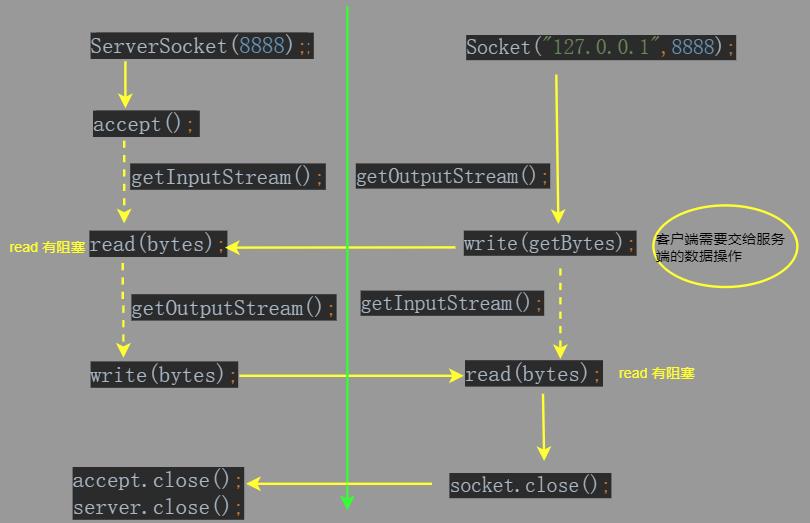

## 介绍

* tcp 中严格区分客户端和服务器端


## 相关类

```java
客户端 ：java.net.Scocket
    向服务端发送请求
服务端 ：java.net.ServerSocket
    开启服务
```

## 使用

```java
特点
    1. 多个客户端和服务器进行交互， 就需要使用多个 IO 流
    2. 服务器没有 IO 流， 但是可以获取到请求的客户端的对象 Socket
       使用每个客户端 Socket 提供的 IO 流和客户端进行交互
    3. 服务端使用客服端的流和客户端进行交互
注意
    客户端和服务端进行交互， 必须使用 socket 提供的网路流， 不能使用自己创建的流对象
    创建客户端对象的时候，就会请求服务器然后进行三次握手，建立连接
    服务器穹顶就可以进行交互
```

## Socket

```java
构造方法
    Socket()
方法
    getOutputStream  // 返回此套接字的输出流
    getInputStream
步骤
    1. 客户端对象创建， 构造方法绑定服务器的 IP 地址和端口号
    2. getOutputStream 获取网络字节输出流 outputStream
    3. write 向服务器发送数据
    4. 等待获取网络输入流 getInputStream 对象
    5. read
    6. 释放资源，关闭 socket
注意
    host 服务器主机的名称，服务器的的 IP 地址
    port 端口号
```


## ServerSocket



## 案例

### 文件上传

```java
原理分析
    客户端和服务器
        进行本地硬盘读写，需要使用自己创建的字节流对象（本地流）
        进行相互通信， 必须使用 Socket 中提供的字节流对象 （网络流）
```

