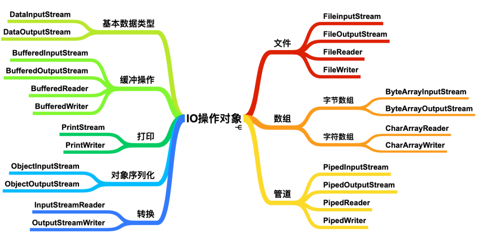

## 介绍



```java
介绍
   传统的 I/O 也称为 BIO
相关概念
    I ：input
    O : output
	流 ： 数据流（字符，字节） 1 字符 = 2 字节 = 16 个二进制位        
        
使用
  字节都要经过内存处理 ，所以操作都是针对 内存来说的
  内存中的二进制文件时无序的，java 中的类结构体是有序的(人能看的懂得)      
        
缺点
	 I/O 包的实现⽐较简单，但是容易出现性能瓶颈，传统的 I/O 是基于同步阻塞的
发展        
```

* 
* 

|            | 输入流                               | 输出流                                |
| ---------- | ------------------------------------ | ------------------------------------- |
| 相对于内存 | Input<br>读取（写入）：硬盘 --> 内存 | Output<br>输出（写出）：内存 --> 硬盘 |
| 字节流     | InputStream                          | OutputStream                          |
| 字符流     | Reader                               | Writer                                |
| 缓冲字节   | BufferedInputStream                  | BufferedOutputStream                  |
| 缓冲字符   | BufferedReader                       | BufferedWriter                        |
| 转换流     | InputStreamReader                    | OutputStreamWriter                    |
| 序列化流   |                                      | ObjectOutputStream<br>writeObject     |
| 反序列化流 | ObjectInputStream<br>readObject      |                                       |
| 打印流     |                                      |                                       |

## 发展

```java
JDK 1.4 之后
    提供了 NIO ，也就是位于 java.nio 包下，
    提供了基于 channel、Selector、Buffer的抽象，可以构建多路复⽤、同步⾮阻塞 I/O 程序。
    
JDK 1.7 之后
    对 NIO 进⾏了进⼀步改进，引⼊了 异步⾮阻塞 的⽅式，
    也被称为 AIO(Asynchronous IO) 。    
```


## 总结

```java
I/O
    字符 字节
    	缓冲 、序列、 输出
```


## 资源优雅关闭

```java
参看异常错误 -- 使用案例 -- 优雅关闭资源
```

