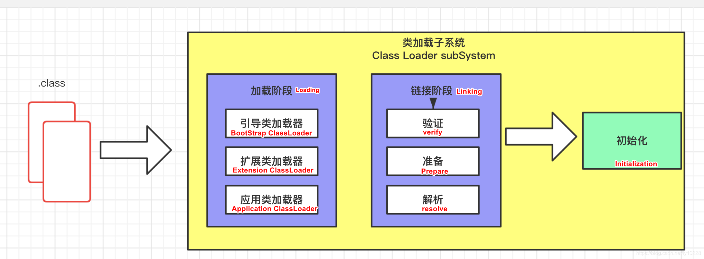
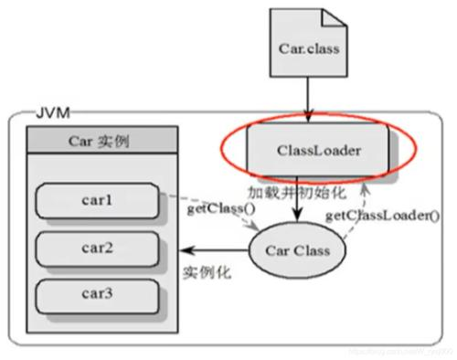

## 需要整理

```java
https://blog.csdn.net/We_Are_Onelalala/article/details/87275789
```


## 类加载器子系统	



### 作用

* 负责从文件系统或者网络中加载Class文件，class文件在文件开头有特定的文件标识
* ClassLoader只负责class文件的加载，至于它是否可以运行，则由Execution Engine决定
* 加载的类信息存放于一块称为方法区的内存空间
    * 方法区中还会存放运行时常量池信息，可能还包括字符串字面量和数字常量（这部分常量信息是Class文件中常量池部分的内存映射）

### 类加载器



* class file存在于本地硬盘上，可以理解为设计师画在纸上的模板，而最终这个模板在执行的时候是要加载到JVM当中来根据这个文件实例化出n个一模一样的实例。
* class file加载到JVM中，被称为DNA元数据模板，放在方法区。
* 在.class文件->JVM->最终成为元数据模板，此过程就要一个运输工具（类装载器Class Loader），扮演一个快递员的角色。

## 类加载过程


### 加载阶段

#### 种类

- BootStrapClassLoader：C++编写，加载核心库java.*。
- ExtClassLoader：Java编写，加载扩展库javax.*。
- AppClassLoader：Java编写，加载程序所在目录下的类库。
- 自定义ClassLoader：Java编写，定制化加载。

#### 双亲委派机制

### 连接阶段

### 初始化


