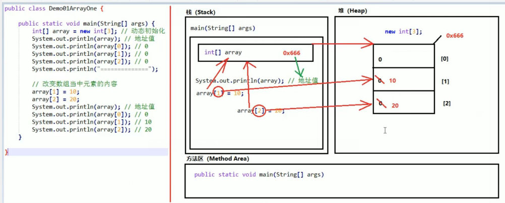
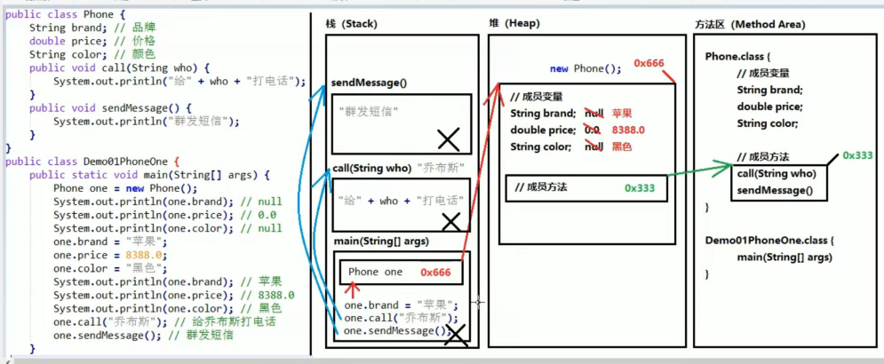
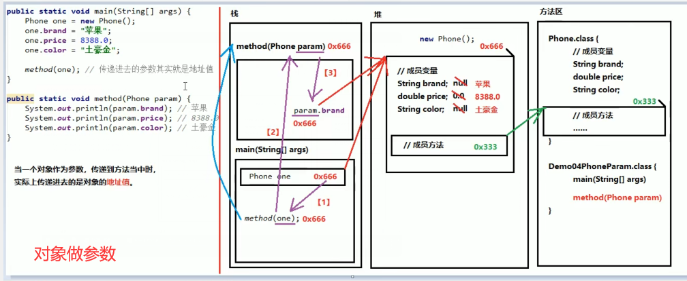
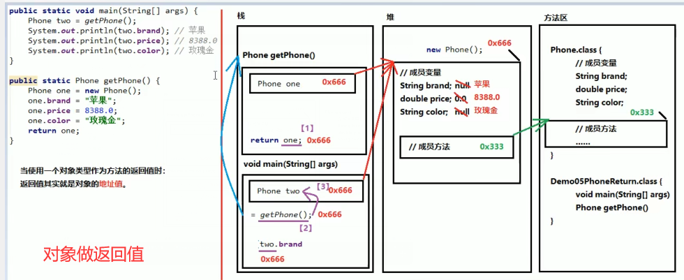
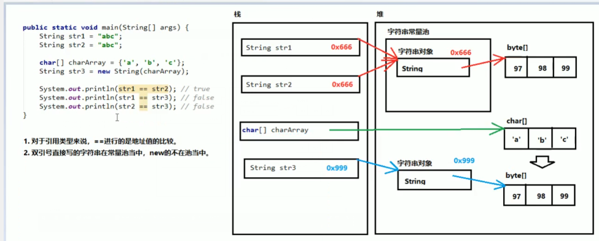
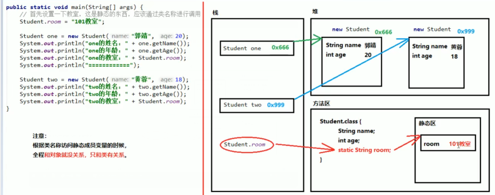
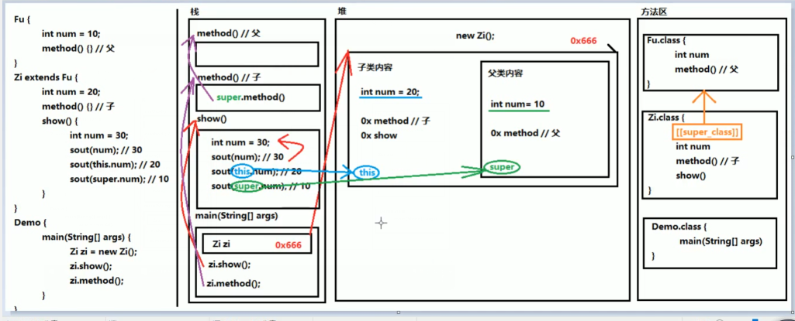

## 编译

```java
编译后会生成过个 。class 文件（一个类(class) 对应一个类，一个类对应一个 .class 文件）
```

## 内存划分

```java
介绍
    Java 内存需要划分为 5 个部分，
    
 分类
    栈内存 stack
    	局部变量 ：方法的参数、方法体内声明的变量
    	作用域 ： 一旦超出作用域， 立刻从栈内存中小时(释放)
    	执行  ：方法执行的区域
    堆内存 heap
    	地址 ：堆内存里面的东西都有一个地址值（十六进制）
    	默认值 ： 堆内存中的变量都有一个默认值，
    	new 值 ： new 出来的对象
	方法区 method area
    	存储 .class 相关信息 ， 包含方法的信息
     本地方法栈  native method stack
        与操作系统有关
      指令器 pc Register
        指令相关
```


## 数组




## 对象

### 介绍



### 对象做参数

* 1_2_1_10 使用对象类型做方法的参数



### 对象做返回值

* 1_2_1_10 使用对象类型做方法的参数




## 字符串常量池




## 静态成员




## this & super




