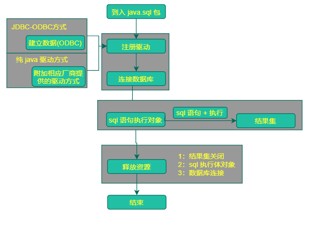

## 介绍

* java database connectiity 
* java 数据库连接 ， 操作数据库
* 一组API，定义了 操作所有关系型数据库的规则接口
* 各个数据库厂商去实现这套接口，提供数据库驱动 jar 包，我们使用这套接口编程，执行的是 jdbc 的实现类


## 结构

- **面向应用的API**：Java API，抽象接口，供应用程序开发人员使用（连接数据库，执行SQL语句，获得结果）。
- **面向数据库的API**：Java Driver API，供开发商开发数据库驱动程序用。

## 快速使用

```java
1, 导入驱动 jar 包
2. 注册驱动
	class.forName("com.mysql.jdbc.Driver");
	注意： mysql5+ 不用进行数据库注册了, 但是最好加上
3. 获取数据库连接对象 Connnection
    Connection conn = DriverManager.getConnection("jdbc:mysql://localhost:3306/db3",账号，密码)
4. 定义 sql 
        String sql = "update account set balance = 100 where id =0"
5. 获取执行 sql 语句的对象 Statement
        Statement stmt = comm.createStatement();
6. 执行 sql , 接收返回结果
    	int count = stamt.execuuteUpdate(sql);
7. 处理结果
    	
8. 释放资源
    	stmt.close();
		conn.close();
```



## 对象

```jaba
DriverManager  驱动管理对象
Connection		数据库连接对象
Statement		执行 sql 的对象
Resultset		结果集对象
PreparedStatement	执行 sql 对象
```

## 注意

```java
1. 使用 java 进行库、表的操作一般在 sql 中进行操作， 这个牵扯到数据库设计，一般都是使用现成的
```

