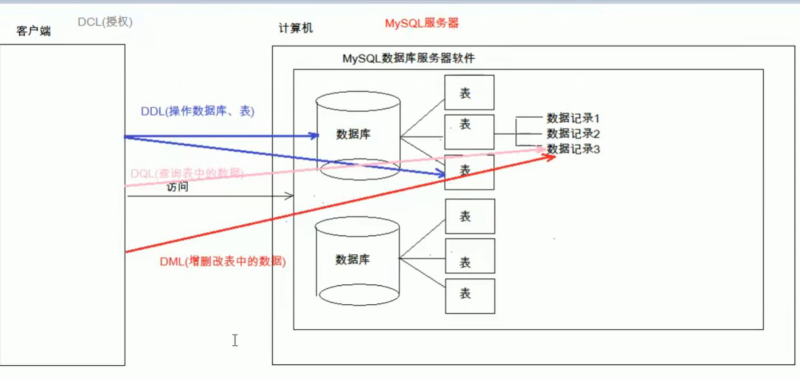

## 语句规范

*   大小写
    *   SQL 对大小写不敏感：SELECT 与 select 是相同的。
    *   建议关键字大写，表名、列名小写
*   缩进
    *   可使用空格和缩进增强语句的可读性
*   语句后的分号
    *   每个句子后面加分号

* 注释
    * 单行释： # 注释文字
    * 单行注释： -- 注释文字（注意中间有空格）
    * 多行注释： /* 注释文字 */

## 源文件层次

### 安装目录

```java
 bin
     中都是可执行文件；
 data
     mysql 的日志文件，数据存储目录
    
 include
     C 语言的头信息
 lib 
     运行需要的库文件
 share
     mysql 错误信息
     
 my.ini
     是MySQL的配置文件；

```


### 数据目录

```java
// 这个没太注意位置
// C:\Documents and Settings\All Users\Application Data\MySQL\MySQL Server 5.1\data位置。
//  data 下每一个目录就代表一个数据库
mysql
    服务器里面的核心数据库，里面是核心数据
performance_schema
    性能，对性能提升的操作
test
    测试
 information_schema
    并不是真正的库， 并不是真正的表，视图，不存在真正的物理文件
// 注意
 数据库 ：文件夹
 表     ：文件
 数据   ： 文件中的文字
    
```


## 语言结构层次

```java
// 层次
DML（data manipulation language）
    数据操作语言，如增删改
DQL（data query language）
    查询数据库中表的数据

DDL（data definition language）
    定义数据库对象

DCL（data control language）
    数据控制语言，如权限授权 

// 注意按照中间的字母去区分
m 	main  	: 数据可的核心，增删改
q 	query 	: 查询
d   define	: 定义，声明
c   control  : 控制。权限管理
    
使用
	 对数据操作 ：  DML DQL
     对库、表操作 ： DDL
     库权限管理     ： DCL
```

