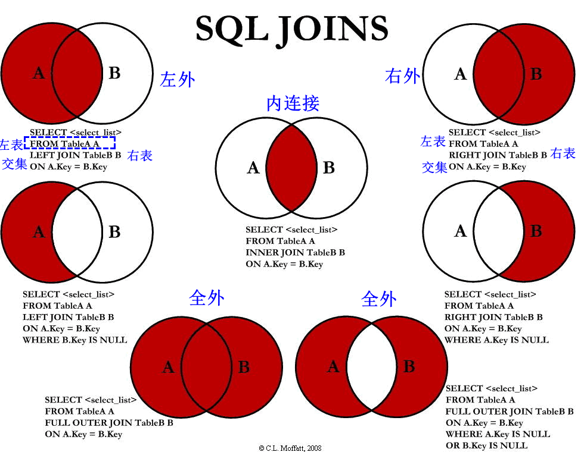

## 5.连接/多表 查询

*   查询的字段来自于多个表

### 笛卡尔

```mysql
介绍
	# 表1  有m行   表2 有n行   
	# 表1 表2 的结果随机搭配 ，结果有 m*n行
	卡尔矩阵积：
原因
	没有有效的连接条件，即两表进行数据筛选的条件
解决
	设置过滤条件
解决办法
---------------------------------------------------------------------------
# 按照年代分
sq192标准    仅支持内连接,支持部分外连接(用于oracle\aqlserver,不适用mysql)
sq199标准    推荐
# 按照功能
内连接 ：
外连接 ： 左外连接    右外连接        全外连接
交叉连接
--------------------------------------------------------------------------
内连接
	-- 隐式内连接
		通过 where 消除无用数据，即两表对应连接
		where 中的条件分为：等值连接	非等值连接	自连接
	-- 显示内连接： 
		inner on
外连接

```

### sql192标准

#### 介绍

```mysql
select 查询列表      #查询条件需要限定，因为此处在代码from后执行
from 表1 别名,表2 别名，...

where 有效的连接条件   #连接条件，就是当做桥梁连接两个表，多的见备注
[and 有效的连接条件]   #见备注
and 筛选条件
[group by 分组字段]
[having 分组后的筛选]
[order by 排序列表]

备注：
1.当连接的表超过三个的时候，连接条件超过三个，where只能连接两个，多的用and连接
2.多表最好先把各个表涉及的共同的字段列出来(好写连接条件)，然后把不相同的字段列出来
```

#### 等值连接

```mysql
有效连接为： where 表1.key = 表2.别名

多表连接

多表连接的结果为多表的交集部分
n 表连接，至少需要 n-1个连接条件，多个条件筛选，第一个用where,其余的用and
 多表的顺序无要求
一般需要非表起别名
可以搭配前面介绍的所有字句（排序，筛选，分组）
```

#### 非等值连接

```mysql
有效连接：	where 非等值的连接条件
```

#### 自连接

```mysql
有效连接
from 表1 别名1；表1 别名2   #就在一个表中
where 非等值的连接条件 
```

### sql199

#### 总结

```mysql
select 查询列表
from 表1 别名
连接类型 join 表2 别名  on   连接条件     #连接条件，就是当做桥梁连接两个表
连接类型 join 表3 别名  on   连接条件     #连接条件，就是当做桥梁连接两个表
...
[where 筛选条件]
[group by 分组条件]
[having 筛选条件]
[order by 排序类型]

连接类型：
内连接：inner(等值、非等值、自连接)
外连接：
		左连：left[outer]
		右连：right[outer]	
        全外：full[outer]
交叉连接：cross
```




#### 内连接

```mysql
介绍
	 内连接就是在连接两部分表的交集，排除掉交集的部分
# 隐式连接， 通过 where
	通过 where 中的条件达到筛选：相等、不等、自身查找
	主要是 ： from 后跟的是多个表  where  条件
# 显式连接
	inner on
	主要是 ： from 后一张表， join 一张表  on 条件

```

#### 外连接

```mysql
# 听的课有问题，再说

外连接的查询结果为主表中所有记录

    如果从表中有和它匹配的，则显示匹配的值

    如果从表中没有和它匹配的，则显示 null

    查询结果=主表所有的行，其中从表和它匹配的将显示匹配行，如果没有匹配的则显示null

    外连接查询结果=内连接结果+主表中有而从表没有的内容
```

* 应用

    *   一个查询一个表中有，另一个表中没有的记录
    *   左外和右外交换两个表的顺序，可以实现同样的效果
    *   一般用于查询除了交集部分的剩余的不匹配的行
    *   主表到子表数据的映射，如果没有与之映射的数据就用null填充，并集

* 分类

    * 左外连接

    * 右外连接

    * 全外连接

        ```mysql
        相互映射，没有的数据使用null填充，相当于合/并集
        查询的记录条数=主表和字表的并集部分，子表有的数据，主表没有也用null填充
        ```

        

    * 主要信息在哪个表，哪个就是主表

#### 交叉连接

```mysql
两个表没有顺序
select 查询列表
from 表1 别名
cross join 表2 别名；
```

### 外键设置

```java
	// 钥匙和锁
	一对一: 从钥匙的角度看： 一把钥匙只能开一把锁
	一对多： 从锁的角度看： 一把锁可以有多把钥匙
		外键在多的表： 多个人记忆一个人方便
	多对多： 学生和老师：不管从谁的角度看，都是多对多的
		中间表存储对应关系
	多对一： 从钥匙角度看： 多把钥匙可以开一把锁
```


## 6.子查询

### 介绍

* 出现在其他语句内部的select语句。子查询、内查询

    外部的语句可以是insert 、update、delete、select等

* 外面是select语句，内嵌套其他select语句的查询。主查询、外查询


### 使用

```mysql

```


### 嵌套结果

```mysql
# 根据不同嵌套位置可以得到不同的返回结果
单行单列
	# 别称：标量子查询
	# 子查询为条件， 使用运算符判断 > >= < <= == <>
	select where having 
单行多列
	# 别称：行子查询
	where having 
	
多行单列
	# 列子查询
	# 子查询为条件， 使用运算符判断 in any/some all 
多行多列
	# 别称：表子查询， 返回整个表的数据,是一张虚拟表，
	from exists
```

### where 或 having后面

#### 1.特点

* 子查询放在小括号内、放在条件的右侧

* 起始就是查询的嵌套，嵌套使用（）把子查询括起来

    ```mysql
    where  ()  and  ()  #多条件
    
    分组以后就可以使用 having  
    
    having  () and （）
    ```

#### 标量子查询

*   子查询优先于主查询

#### 列子查询

* 多行操作符

    | 操作符      | 含义                       | 取值   |
    | ----------- | -------------------------- | ------ |
    | in / not in | 等于列表中的任意一个       | 所有值 |
    | and / some  | 和子查询返回的某一个值比较 |        |
    | all         | 和子查询返回的所有值比较   |        |

    ```.
    a in （） #a 取括号中值的一个  
    ```

#### 行子查询

*   多个字段当成一个字段

```mysql
where (employees_id,salary)=(
	select min(employee_id),max(salary)
	from employees);
```


### select

```mysql
仅支持标量子查询
select d.*,(
	select count(*)
	from employees
	)
from departments d;
```

### from

```mysql
就是将子查询充当一张表，要求必须起别名
from () 别名；
```

### exists

```mysql
相关子查询
exists(完整的查询语句)    结果：1或0
可以用in代替

select department_name
from departments d
where exists(子查询)
先执行外查询，然后根据相关字段在where里面过滤
```


## 8. 联合查询

### 介绍

*   uinon 联合  合并：将多条查询语句的结果合并成一个结果
*   用于多个没有连接的表之间的查询，
    *   即：要查询的结果来自于多个表，且多个表没有直接的链接关系，单查询信息一致

### 语法

```mysql
select... #查询语句1
union
select... 查询语句2
union
select... 查询语句3
...
#其实就是将 or 的分句给拆开了
```

### 特点

* 要求多条查询的条数（列数）是一致的

* 要求多条查询的每一列的类型和顺序最好是一致的

* 就是所有语句的并集，除掉重复值。

    使用 union all可以包含重复项


