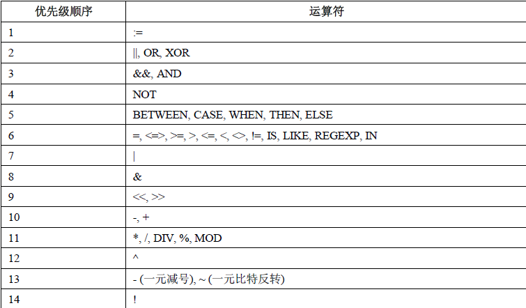

## 算术运算符

| +        | 加法 |
| -------- | ---- |
| -        | 减法 |
| *        | 乘法 |
| / 或 DIV | 除法 |
| % 或 MOD | 取余 |

## 比较运算符

### 大小

```mysql
>		大于
>=		大于等于
< 		小于
<=		小于等于
```

### 相等

```mysql
<>  !=  不等于
==		等于

<=>严格比较两个NULL值是否相等两个操作码均为NULL时，其所得值为1；而当一个操作码为NULL时，其所得值为0
```

### 判空

```mysql
IS NULL			为空
IS NOT NULL		不为空
```

### 模糊包含

```mysql
BETWEEN			在两值之间  >=min&&<=max
NOT BETWEEN		不在两值之间

IN			在集合中   # age in (12, 34)
NOT IN  	不在集合中

LIKE  			模糊匹配
REGEXP 或 RLIKE	正则式匹配
```


## 逻辑运算符

| 运算符号 | 作用     |
| -------- | -------- |
| NOT 或 ! | 逻辑非   |
| AND      | 逻辑与   |
| OR       | 逻辑或   |
| XOR      | 逻辑异或 |


## 位运算符

| 运算符号 | 作用     |
| -------- | -------- |
| &        | 按位与   |
| \|       | 按位或   |
| ^        | 按位异或 |
| !        | 取反     |
| <<       | 左移     |
| >>       | 右移     |


## 运算符优先级

