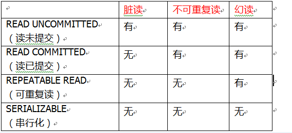
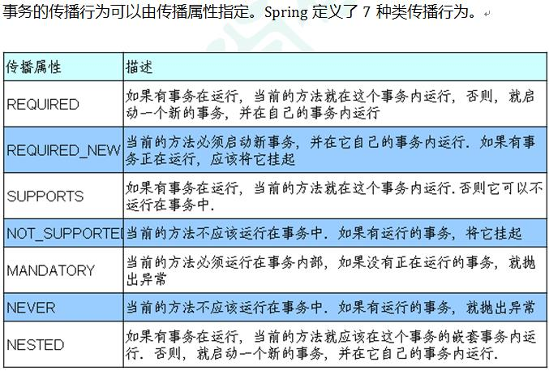

##  标识列（自增）

* 又称自增长列，

* 可以不用手动插入值，系统提供默认的序列值

    ```mysql
    1.标识列不一定必须要跟主键搭配，但是必须是一个key
    2.一个表中只能有一个标识列
    3.标识列的类型只能是数值型
    4.查看标识列：
      show variables like '%auto_increment%'
      设置步长：
      set auto_increment_increment=3
      也可以通过手动插入值，设置起始值
    
    #1.创建表时设置
    create table if exists 表名(
    	列名 类型 auto_increment)#id int unique auto_increment
    	
    #2.修改表时设置
    alter table 表名 modify column 列名 列数据类型（int） [约束类型] auto_increment
    
    #3.删除标识列（修改时）
    直接把修改表时设置标识列里面的auto_increment去掉，然后刷新就行
    
    ```

## 事务

### 介绍

```mysql
概念
	一组或者一个  sql 语句组成的一个执行单元， 就叫事务
特点
	事务中的 mysql 语句都相互依赖，要么全执行，要么全不执行，即一个出错全部回滚(撤销执行)
	innodb支持事务
```

### 四大特点(特性)

* 原子性（atomicity）

    * 原子性是事务不可分割的工作单位，事务中的操作要么都发生，要么都不发生

* 一致性(comsistency)

    * 事务必须使数据库从一个一致性状态转换到另一个一致性状态

* 隔离性(isolation)

    * 事务的隔离性是指一个事务的执行不能被其他事务干扰，
    * 即使一个事务内部的操作及使用的数据对并发的其他事务是隔离的，并发执行的各个事务之间不能相互干扰。	

* 持久性(durability)

    * 是指一个事务一旦被提交，它对于数据库中数据的改变就是永久的，接下来的其他操作和数据库故障不应该对其有任何影响

    | 特性   | 含义                                                 |
    | ------ | ---------------------------------------------------- |
    | 原子性 | 一个事务不可再被分隔，要么都执行，要么都不执行       |
    | 一致性 | 事务必须使数据从一个一致性状态转换到另一个一致性状态 |
    | 隔离性 | 一个事务的执行不受其他事务的影响                     |
    | 持久性 | 一个事务一旦被提交，则会永久改变数据库的数据         |

### 分类

*   隐式（自动）事务：事务没有明显的开启和结束标记

    *   比如：insert 、update 、delete语句

* 显示事务：事务有明显的开启和结束标记

    *   前提：必须先禁用自动提交功能

    *   设置：set autocommit=0（只对当前事务有作用，每次打开就要重新设置）

### 使用

```mysql
流程
	事务开启  --> 执行  -->  事务关闭
	开始标记                 结束标记

# 1.开启事务
    start transaction; #开启事务，可以省略
    #2.编写事务中的sql语句(即需要整体执行的语句)
    （select、insert、update、delete）#基本只支持这四个，其实select有没有都可以，没影响查看	
	语句1  
#2.设置回滚点
    savepoint 回滚点名称
#3.提交事务
	事务提交方式查看
		select @@autocommit;   # 自动提交是 1
	自动提交
		默认是自动提交
	手动提交
		 set autocommit =0  #禁用自动提交
	提交
    	commit;#提交事务，
# 4. 回滚
    rollback;#回滚事务，结束事务之前存在内存中
        rollback to 回滚点名称 #回滚到指定的地方
```

## 并发事务

### 并发问题

```mysql
介绍
	多个事务之间是相互独立的
	多个事务处理同一批数据，就会引发一些问题，
注意
	一个事务执行的顺序， 下面三步，缺一步都是一个事务没有进行完全，所以才会有并发问题
	事务开启 -->   事务执行(即各个sql语句执行)  --> 事务提交
	 		      更新/查询/出错回滚
	
	
    不可重复读：一个未提交事务读取到另一提交事务修改数据
    虚读：一个未提交事务读取到另一提交事务添加数据
        	
```

### 问题分类

#### 脏读	

*   一个事务，读取了其他事务没有提交的数据，读到的是其他事务“更新”的数据，针对一条数据
*   如果一个事务更新了数据，但是没有提交，就回滚了，在回滚之前，这些数据被另一个事务获取到

#### 不可重复读：T

*   在同一个事务中，两次读取的数据不一样
*   一个事务读取了一个字段， 但是该字段被另一个事务更新了，那先前的事务再次去读取这个数据，就会得到两个不同的数据

#### 幻读：

*   一个事务操作（curd）数据表中的数据，另一个事务添加了一个数据，第一个事务查不到自己的修改
*   mysql 中没有幻读
### 事务隔离

#### 介绍

```java
介绍
	// 设置隔离级别，可以解决事务并发产生的问题，如脏读、不可重复读和虚读
    事务隔离： 
    	即数据库设计的时候，就考虑过上面的问题，所以开发出来不同的模式，来并避免上述问题
    表示
    	事务之间的隔离程度
    作用
		隔离并发运行各个事务，使得他们不会相互影响，以避免各种并发问题
		不同的隔离级别对应不同的干扰程度，隔离级别越高，数据一致性就越好，但是并发性就越弱

```

#### 隔离级别

| 隔离级别          | 中文         | 描述                                                         | 出现的问题             |
| ----------------- | ------------ | ------------------------------------------------------------ | ---------------------- |
| read unicommitted | 读未提交数据 | 允许事务读取其他事务提交的变更                               | 脏读、幻读、不可重复读 |
| read commmited    | 读已提交     | 只允许事务读取已经被其他事务提交的变更                       | 幻读、不可重复读       |
| repeatable read   | 可重复读     | 确保事务可以多次从一个字段中读取相同的值，在这个事务持续期间，限制其他事务对这个字段进行更新 | 幻读                   |
| serializable      | 串行         | 确保事务可以从一个表中读取相同的行，在这个事务持续期间，限制其他事务对该表进行插入如、更新和删除操作 | 无问题<br>性能低下     |




#### 数据库支持

*   Oracle 支持
    *   read commited(默认)、serializable
*   mysql 
    *   支持:四种，repeatable read(默认) 

#### 隔离使用

```mysql
# 每启动一个mysql程序，就会获得一个单独的数据库连接，
# 每个数据库连接都有一个全局变量@@tx_isolation，表示当前事务隔离级别

# 查看当前的隔离级别
select @@tx_isolation;
# 设置当前mysql连接的隔离级别
set transaction isolation level 隔离级别；
# 设置数据库的隔离级别
set session|global transaction isolation level 隔离级别
```

## 事务传播行为

### 介绍

```java
传播行为
    // 事务的传播 + 事务的行为
    多个事务进行嵌套执行， 子事务是否要和大事务公用一个事务
    一个事务被另一个事务调用的时候，只要指定事务如何传播
     多事务方法直接进行调用，这个过程中事务 是如何进行管理的

```


### 传播级别

```java
例子
    问题
    	事务 c 发生错误， 事务 b 要不要回滚 ?? 
        service {
            // 事务 a
            tx_a {         
                tx_b {}; // 事务 b            
                tx_c {}; // 事务 c
            }
        }
	注意
        下面所说的已经存在一个事务：以其上一层的事务为， b 只看 a
        但是对于抛出异常的，上一层检查到，是会造成上层事务回滚的 ？？？？


required：
    // 我需要一辆新车，老王开车就使用老王的车， 老王不开车我就自己开车
    如果当前没有事务，就新建一个事务，
    如果已经存在一个事务中，加入到这个事务中。一般的选择（默认值）
        
    特点
        子事务的各种属性都是继承于父事务
    // a b c 均设置为 required ,就是默认值
	// 事务 a 运行就会开一条事务
    // 事务 b 使用 a 的事务，进行运行，
    // 事务 c 使用 a 的事务， 进行运行，若 c 出问题就会使 a b c 同时回滚
    // 无异常， 提交该事务，结束运行
        

        
    	tx_a {       // 事务 a    
            tx_b {}; // 事务 b            
            tx_c {}; // 事务 c
        }
    
       
  
    
requires_new：
    新建事务，
    如果当前在事务中，把当前事务挂起。
     // a 默认值(required) ,事务 b 设置为 requires_new ,
	// 事务 a 运行就会开一条事务, 运行，碰到另一个事务，然后挂起
    //  事务 b 运行就会开一条事务, 运行结束，该事务提交
    //  事务 c 使用默认(required), 使用 a 的事务， 开启该事务，运行 c , 运行结束则提交该事务
    	tx_a {       // 事务 a    
            tx_b {}; // 事务 b            
            tx_c {}; // 事务 c
        }
  

 supports：
    // 
    支持当前事务，
    如果当前没有事务，就以非事务方式执行（没有事务）
     
    
not_supported：
    以非事务方式执行操作，
    如果当前存在事务，就把当前事务挂起    
    
mandatory：
    使用当前的事务，
    如果当前没有事务，就抛出异常    
    


NEVER：
    以非事务方式运行，
    如果当前存在事务，抛出异常

NESTED：
    如果当前存在事务，则在嵌套事务内执行。
    如果当前没有事务，则执行 REQUIRED 类似的操作

```




### 注意

#### java

```java
介绍
    // 本类方法的嵌套调用， 就只是一个事务
    当进行的事务是同一个类的方法， 则相当于
```

