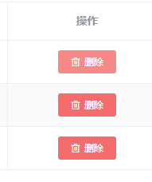

## 分页数据绑定 - 选择


### jquery - pageHelper

### element-UI

```java
页面上对于数据的增删改查，暂且不论，
    只说这五个操作，
```

### 后端传入 -- - 数据传递

### 前端接收 -- 数据展示

## 分页筛选 -- 表单


## 分页数据操作 - CURD



### jquery

### elementUI


## 问题

```java
1. 对于空表单的提交，没有处理，
```


## 