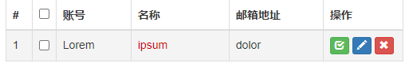

## 注意

```java
7 没有整理
```


## 表单修改

```java
介绍

    页面
    	1. 标签修改，使其能够发起请求，主要是表单修改
    	    1. form  添加 action="admin/page.html" method="post"
            2. input 添加 name="keyword" : 方便后端获取
            3. button 
                	添加 type="submit"  "reset" 
                	超链接：  内部添加 a href
    		
    	2. 需要确定请求的 url， 
         3. 确定 url 中需要携带的参数， 
          		href="admin/to/edit/page.html?
                	adminId=${admin.id }&
                	pageNum=${requestScope.pageInfo.pageNum}&
                	keyword=${param.keyword }" 
 
后端
    表格数据增删改查： 后端进行查询更改
    	前端传过来的请求、请求中数据、进行业务操作
    	1. 接收参数：
            @RequestMapping("/../{xxx}")  // 请求 url, {} 中是参数
            void xxx(
                @PathVariable("xxx")  // 函数中接收前端的参数
             ){....}

    	2. 重定向
    		// 牵扯到页面的刷新，所以都需要考虑页面重定向                
```


## 分页开启

### pageHelper

```java
// mapper.xml 
	sql 语句
// mapper: 
      接口定义，方法定义
//service: 
     			 mapper接口 
     开启分页  --  进行查询   ---  查询结果封装进 pageInfo 中返回
//handler: 
	requestMapping 方法中， 调用 service 
    有错：就抛，
	无措：将 查询到的 pageInfo(list) 装入 entityResult 返回前端        
```


## //=====================

## 增

### 业务介绍

```java
介绍
    将 表单提交的 admin 对象保存到数据库中
    1. loginAcct 不能重复
    2. 密码加密
前端
    1. 新增页面调整
    	button 
    	调整
        1. form  添加 action="admin/page.html" method="post"
        2. input 添加 name="keyword" : 方便后端获取
        3. button 添加 type="submit"  "reset" 改为超链接：  内部添加 a href
后端
    1. xml
    	view-controller: 
```

### 前端 

```java

```


### 后端

```java

```

## // ====================

## 删 -- 单条删除



#### 思路

```java
前端
    1. 按钮调整 button(非 restfull)
  
后端
   // handler
    1. 调用 service 的删除方法
    2. 页面跳转： 删除后跳回当前页面，
    	1. 直接跳转， admin.jsp 会无法显示分页数据，不可以
    	2. 转发到 admin/get/page.html , 但是刷新的时候，会再进行一次删除操作, 浪费性能
    	3. 重定向到 admin/get/page.html ，
    		为了保持原本所在页面和查询关键词再附加 pageNum 和 keyword 两个参数

    // service
    1. 直接调用 adminMapper 的删除方法 
```

#### 前端

```java
  <!-- 旧代码 -->
        <!-- <button type="button" class="btn btn-primary btn-xs">
            <i class=" glyphicon glyphicon-pencil"></i>
        </button> -->
    <!-- 新代码 -->
    <a 
	    href="admin/to/edit/page.html?adminId=${admin.id }&pageNum=${requestScope.pageInfo.pageNum}&keyword=${param.keyword }" 
	    class="btn btn-primary btn-xs"
	>   	
    	<i class=" glyphicon glyphicon-pencil"></i>
    </a>
    <a 
    	href="admin/remove/${admin.id }/${requestScope.pageInfo.pageNum }/${param.keyword }.html" 
    	class="btn btn-danger btn-xs"
    >   	
    	<i class=" glyphicon glyphicon-remove"></i>
	</a>
```


#### 后端

```java
	@RequestMapping("/admin/remove/{adminId}/{pageNum}/{keyword}.html")
	public String remove(
				@PathVariable("adminId") Integer adminId,
				@PathVariable("pageNum") Integer pageNum,
				@PathVariable("keyword") String keyword
			) {
		
		// 执行删除
		adminService.remove(adminId);
		
		// 页面跳转：回到分页页面
		
		// 尝试方案1：直接转发到admin-page.jsp会无法显示分页数据
		// return "admin-page";
		
		// 尝试方案2：转发到/admin/get/page.html地址，一旦刷新页面会重复执行删除浪费性能
		// return "forward:/admin/get/page.html";
		
		// 尝试方案3：重定向到/admin/get/page.html地址
		// 同时为了保持原本所在的页面和查询关键词再附加pageNum和keyword两个请求参数
		return "redirect:/admin/get/page.html?pageNum="+pageNum+"&keyword="+keyword;
	}
```


## 删 -- 批量删除

## //====================

## 改 -- 更新

### 业务思路

```java
介绍
    修改现有的 admin 的数据， 不修改密码， 不修改创建时间
    是根据 id 进行更改的, 
前端
    1. 调整按钮： 铅笔, 添加请求 url
        1. form  添加 action="admin/page.html" method="post"
        2. input 添加 name="keyword" : 方便后端获取
        3. button 添加 type="submit"  "reset" 改为超链接：  内部添加 a href
            
    2. 调整要修改的表单
    	因为这里要求的是，修改的时候需要跳转到一个新的页面
    	新的页面中需要显示：
        	需要修改的数据， 还是通过 requestScope.admin 显示
             表单修改
    	
后端
    1. 通过 adminID pageNum keyWord 将结果存入 modelMap, 通过 modelMap 进行回显 
```

### 前端

```html
<!-- 旧代码 -->
<!-- <button type="button" class="btn btn-primary btn-xs">
	<i class=" glyphicon glyphicon-pencil"></i>
</button> -->
<!-- 新代码 -->
<a 
	href="admin/to/edit/page.html?adminId=${admin.id }&pageNum=${requestScope.pageInfo.pageNum }&keyword=${param.keyword }"
	class="btn btn-primary btn-xs"
>
	<i class=" glyphicon glyphicon-pencil"></i>
</a>
<a 
	href="admin/remove/${admin.id }/${requestScope.pageInfo.pageNum }/${param.keyword }.html" 
	class="btn btn-danger btn-xs"
>
	<i class=" glyphicon glyphicon-remove"></i>

</a>
```

### 后端

```java
// handler
	@RequestMapping("/admin/update.html")
	public String update(Admin admin, @RequestParam("pageNum") Integer pageNum, @RequestParam("keyword") String keyword) {
		
		adminService.update(admin);
		
		return "redirect:/admin/get/page.html?pageNum="+pageNum+"&keyword="+keyword;
	}

// service
	@Override
	public void update(Admin admin) {
		
		// “Selective”表示有选择的更新，对于null值的字段不更新
		try {
			adminMapper.updateByPrimaryKeySelective(admin);
		} catch (Exception e) {
			e.printStackTrace();
			
			logger.info("异常全类名="+e.getClass().getName());
			
			if(e instanceof DuplicateKeyException) {
				throw new LoginAcctAlreadyInUseForUpdateException(CrowdConstant.MESSAGE_LOGIN_ACCT_ALREADY_IN_USE);
			}
		}
```


## //====================

## 查 -- 关键词查询


#### 业务流程

#### 前端

```java
调整
    1. form  添加 action="admin/page.html" method="post"
    2. input 添加 name="keyword" : 
    3. button 添加 type="submit" :
js 
    1. 只是在分页导航条的 js 代码上加了一个东西
    window.location.href =  "admin/page.html?pageNum="+pageNum+"&keyword=${param.keyword}";
```

#### 后端

```java
分页导航条
```


