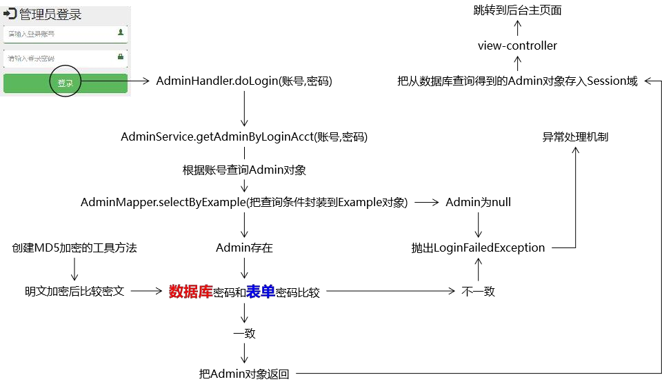
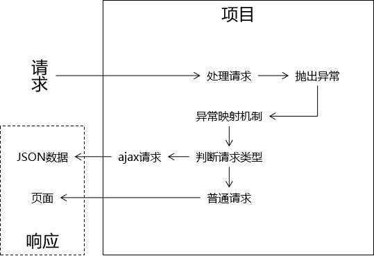

## 密码加密

### 业务流程

```java
用的密码
    前端获取： 获取到输入就需要进行加密处理
    出数据库： 需要把加密后的数据存入数据库
业务
    1. 密码检测是否有效
    	无效： 抛错
    	有效：继续 2
    2. 进行加密，获取加密的密码值
    3. 加密值转化为 字符串
    	加密值 --> bigInteger --> 16进制转为字符串
```

### md5加密

```java
	public static String md5(String source) {
		// 1. source 是否有效
		if (source == null || source.length() == 0) {
			// 空字符串抛异常
			throw new RuntimeException(CrowdConstant.MESSAGE_STRING_INVALIDATE);
		}
		

		try {
			String algorithm = "md5";
			MessageDigest messageDigest = MessageDigest.getInstance(algorithm);
			
			// 铭文字符串的字节数组
			byte[] input = source.getBytes();
			// 加密
			byte[] output = messageDigest.digest(input);
			// 转为 bitInteger
			int signum = 1;
			BigInteger bigInteger = new BigInteger(signum, output);
			
			// 按照 16 进制转换为字符串
			int radix = 16;
			String encoded = bigInteger.toString(radix).toUpperCase();
			
			return encoded;

			
		} catch (NoSuchAlgorithmException e) {
			// TODO Auto-generated catch block
			e.printStackTrace();
		}
		
		
		return null;
	}
	
```

## 登陆



### 查询用户

```java
// handler
	// 调用 service 中的方法，
	1. 查询到存在这个用户 admin , 没有抛错， 就说明存在这个账户
	2. 为了避免跳转到后台主页面再刷新浏览器导致重复提交登录表单，重定向到目 标页面
        return "redirect:/admin/to/main/page.html";
// service
1. 账号查询 admin 对象
     // 利用账号直接查询 admin 整个结构体
     // 查询条件 --》 mapper 执行  --》 对查询结构判空 --》 若为空直接抛错
      AdminExample().createCriteria().andLoginAcctEqualTo(loginAcct);

2. 加密密码对比        
    1. 前端获取的密码进行加密处理
    2. object.equals() 比较 admin 的加密密码 == 处理的密码
    3. 一直则返回 admin
        
```

### 登陆成功

```java
在 handler 中处理， 处理成功即登陆成功
```


### 登陆异常

```java
对应异常类
	只用继承 RuntimeException ， 并实现其方法即可
    public class LoginFailedException extends RuntimeException{}
异常处理器类中
    建立对应的方法，捕获异常，进行处理
 
    
    // 异常捕获
	@ExceptionHandler(value = LoginFailedException.class)
	public ModelAndView resolveLoginFailedException(
			NullPointerException exception, 
			HttpServletRequest request,
			HttpServletResponse response) throws IOException {
		
		String viewName = "admin-login";
				
		// 返回
		return commonResolve(viewName, exception, request, response);
	}    
```

### 业务代码

```java
	@Override
	public Admin getAdminByLoginAcct(String loginAcct, String userPswd) {

		// 1. 账号查询 admin 对象， 为 null 则抛异常 ， 不为 null ,铭文密码加密比较
		AdminExample adminExample = new AdminExample();   
		Criteria criteria = adminExample.createCriteria();
		
		// 封装查询条件
		criteria.andLoginAcctEqualTo(loginAcct);
		
		// 执行查询
		List<Admin> list = adminMapper.selectByExample(adminExample);
		
		// 判断是否为 null
		if (list == null || list.size() == 0) {
			throw new LoginFailedException(CrowdConstant.MESSAGE_LOGIN_FAILED);
			
		}
		if (list.size() > 1) {
			throw new RuntimeException(CrowdConstant.SYSTEM_ERROR_LOGIN_NOT_UNIQUE);
		}
		
		Admin admin = list.get(0);
		if (admin == null) {
			throw new LoginFailedException(CrowdConstant.MESSAGE_LOGIN_FAILED);
		} else {
			String userPswdDB = admin.getUserPswd();
			// 获取前端的进行加密
			String userPswdForm = CrowdUtil.md5(userPswd);
			
			// 密码比较
			if (!Objects.equals(userPswdDB, userPswdForm)) {
				throw new LoginFailedException(CrowdConstant.MESSAGE_LOGIN_FAILED);
			}
		}
		return admin;
	}

	
```

## 资源访问 - 拦截器



### 访问前拦截

#### 拦截业务

```java
因为只需要在请求发送过来之前进行拦截就行即
    1. 只需要继承LoginInterceptor extends HandlerInterceptorAdapter
    2. 需要注册到 springmvc 中
1. 检查一下 session 中是否存在 admin 即可 
    request --> 获取 session --> getAttribute得到 admin --> 判空
2. xml 配置拦截资源
    需要拦截：
    不需拦截：
    	登陆退出 、 去登陆
```

#### 业务代码

```java
public class LoginInterceptor extends HandlerInterceptorAdapter{

	@Override
	public boolean preHandle(HttpServletRequest request, HttpServletResponse response, Object handler)
			throws Exception {

		// 获取 session 对象
		HttpSession session = request.getSession();
		Admin admin = (Admin)session.getAttribute(CrowdConstant.ATTR_NAME_LOGIN_ADMIN);
		if (admin == null) {
			throw new AccessForbiddenException(CrowdConstant.MESSAGE_LOGIN_FORBIDEN);
		}
		
		// 非空返回
		return true;
	}
    
    
// xml 配置
	<!-- 配置拦截器 -->
	<mvc:interceptors>
		<mvc:interceptor>
			<!-- /* 是一层 /** 是多层 */-->
			<mvc:mapping path="/**" />
			<mvc:exclude-mapping
				path="/admin/to/login/page.html" />
			<mvc:exclude-mapping path="/admin/do/login.html" />
			<mvc:exclude-mapping path="/admin/do/logout.html" />
			<!-- 拦截器的类 -->
			<bean class="com.atguigu.crowd.mvc.interceptor.LoginInterceptor"></bean>
		</mvc:interceptor>
	</mvc:interceptors>    
```


## 退出登陆

### 退出业务

```java
介绍
	1. 直接强制 session 失效就行
     2. 需要跳转到注册页面
    
```

### 业务代码

```java
	@RequestMapping("/admin/do/logout.html")
	public String doLogout(HttpSession session) {
		
		// 强制 session 失效
		session.invalidate();
		
		return "redirect:/admin/to/login/page.html";
	}
```


## 问题

### 拦截器

```java
拦截器返回 true 有什么用？ 在标签中可以自动捕获吗？
```

