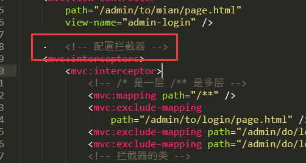
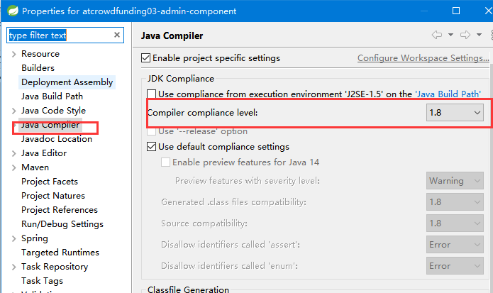
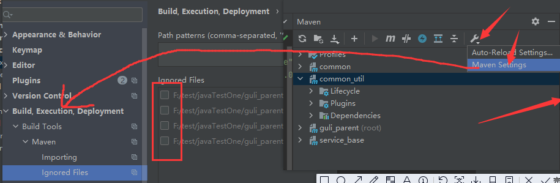
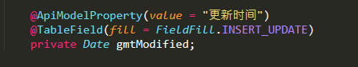
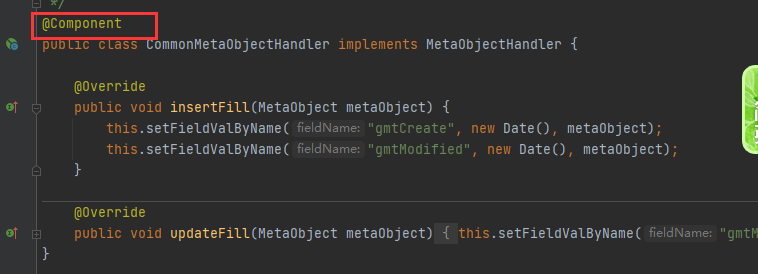
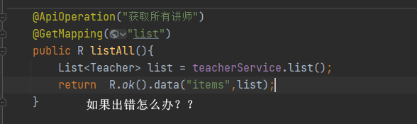
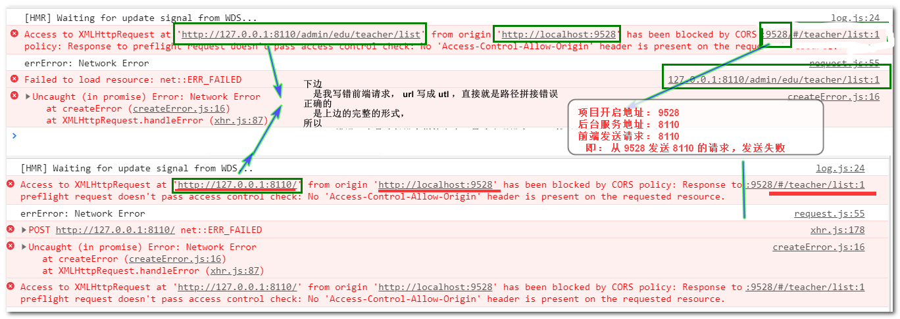

## 1. spring的配置文件报错cvc-complex-type.2.3: Element 'beans' cannot have character [children]

```java
文档是从别处（主要是网络）复制后粘贴到配置文件中的，
    和复制内容的编码有关系，
    和内容中有特殊的字符有关系，如果是手工敲入则不会有问题。
    
解决
    放到能够彩色显示 xml 的文档中，然后对比下，看是哪里出错误了 
    
    // 未尝试
    将文字复制到Notepad++等编辑工具，转为UTF-8编码格式，并用ANSI编码格式查看，
    将不在<!-   ->内的乱码全部删除，再复制进xml即可。
```




## 2. MySQL 建索引时遇到 Specified key was too long; max key length is 767 bytes

```java
// 方式一
修改索引的varchar字符，只要让字符 * 字节数 < 767即可，所以网上推荐 缩小字符数
但是有时某个字段的字符数是一定要足够大的，这时候用第二种方式。
    
// 方式二： 貌似也不行
// 查看
 
show variables like "innodb_large_prefix";
 
show variables like "innodb_file_format";
 
//修改最大索引长度限制
set global innodb_large_prefix=on;
 
set global innodb_file_format=BARRACUDA;
  
```

## 3.方法上有@Override，

```java
然后报错“The method modifyTime(RepairInfo) of type RepairServiceImpl must override a superclass method”。
    
   files-properties-java compiler把右边的版本改成jdk5以上的
```



## 4. this compilation unit is not on the build path of a java project”

```java
// 项目中找到隐藏文件 .project 文件， 添加以下组件
<natures>
    <nature>org.eclipse.jdt.core.javanature</nature>
    <nature>org.eclipse.m2e.core.maven2Nature</nature>
</natures>

```

## 5. No grammar constraints (DTD or XML Schema) referenced in the document

```java
// 方法一
修改 XML “No grammar specified” 警告为“忽略”
如图将 “Warning” 修改为 “Ignore” 即可。

// 方法二
在第一行的（如下）XML 定义下添加 DOCTYPE

<?xml version="1.0" encoding="UTF-8"?>
<!DOCTYPE xml>
```


## 删除模块重建，pom 文件是灰色




## xxx包不存在

```java
1、（推荐） 不要将此插件放到顶级父工程中，在需要打成可执行jar的地方添加就好了，如果是需要被依赖的，就不要添加此插件

***我项目的解决办法：SpringBoot项目运行引导类时候出现此类问题一般删除此依赖，在maven中clear一下项目再install一下就能解决，注意上面所说，如果是需要被依赖的不要添加此插件！！
————————————————
版权声明：本文为CSDN博主「Code1667」的原创文章，遵循CC 4.0 BY-SA版权协议，转载请附上原文出处链接及本声明。
```


## controller类 --  Field injection is not recommended

```java
介绍
    https://blog.csdn.net/Li_Ya_Fei/article/details/104448398
介绍
    有三种主要的方式：构造器注入、Setter(方法)和Field 注入。
    应尽量避免Field注入。推荐使用构造函数或方法来注入依赖项。两者各有利弊，其用法取决于具体情况
    这不是非必须选择一种，可以将setter和构造函数注入合并到一个类中。
    构造函数更适合于强制依赖项和以不变性为目标的情况。对于可选的依赖项，setter更好。
```


## @mybatis 注解

```jav
insert_update 改为了 update , 导致插入的时候出现问题
问题
	为啥需要insert_update , 而不是简单实用 inset 或者date
	// 这个不需要人手动设置，在插入、更新的时候都会改变，所以简写代码
```



## 自动注入一直出问题

```java
### Error updating database.  Cause: java.sql.SQLIntegrityConstraintViolationException: Column 'gmt_create' cannot be null
    
自己的自动注入代码上面，没有写组件
    // 需要了解一下这个组件是干嘛的，有什么作用，怎么使用
```



## // 疑问

```java
自己当时没有注意代码。
    看看这个 api 把，貌似这个没必要处理，这个地方是不会错的，即使是空的
    一般对于操作不到的， 都会返回 boolean 数据
   
    Teacher teacher = teacherService.getById(id);
        if (teacher != null) {
            return R.ok().data("item", teacher);
        } else {
            return  R.error().message("数据不存在");
        }
    }
```





## 问题

```java
自己将 url 写成了 utl ，然后一直找不到错误
```




```java
Access to XMLHttpRequest at 'http://127.0.0.1:8110/admin/edu/teacher/list' 
    from origin 'http://localhost:9528' has been blocked by CORS policy: 
	Response to preflight request doesn't pass access control check: 
    No 'Access-Control-Allow-Origin' header is present on the requested resource.
```

