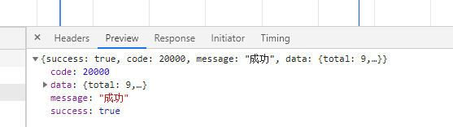
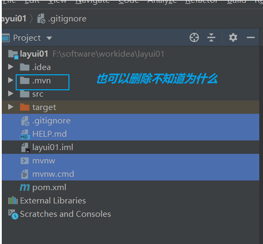

## 需要补充

### 快捷键

```java
1.  从 interface 调到 实现 class
    class 对应的类 interface
        
2. 什么类需要进行日志打印        
```

### 2

```java

@Service
public class TeacherServiceImpl extends ServiceImpl<TeacherMapper, Teacher> implements TeacherService {

    @Override
    public IPage<Teacher> selectPage(Page<Teacher> pageParam, TeacherQueryVo teacherQueryVo) {

        // 显示分页显示列表
        // 排序， 按照 sort 排序，
        // 啥意思?????
        QueryWrapper<Teacher> queryWrapper = new QueryWrapper<>();
        queryWrapper.orderByAsc("sort");
```

## 3

```java
1. api 
    前端：api 层  login   info
    后端： controller 层， 
    	写了 路由 /user/login  登陆补上
    	需要写了 ： /user/info 才能登陆正行
    	疑问： 登陆的时候，需要调用 info 登陆接口吗？ 
    		调用时候，我在后台怎么查看,怎么确定登陆都需要我重写那些信息？
    		还是有文档，供我们参考使用？？？

2. 退出为啥使用 post 接口，使用 get 通知一下退出不就行了？
4. 总结下到底应该改啥，都要改什么地方
    就是说，以后我要使用这个框架， 都需要改什么地方
    还有就是怎么给业务话， 可以简单记忆
    
    
5. @ 配置是在 webpack 中的  
6. 请求、响应要结合 拦截器进行理解   
    
7. 应该怎么总结代码模板
	ajax api ，貌似可以总结

8. 自己在 ajax 中使用 模板字符串的时候，没有使用 `` ，使用的是 ''  
    导致出现解析错误
9. 自己再使用查询条件进行查询的时候，
    level != null 错炒成  level == null , 导致查询出现错误，看了好长时间， 最后对比代码才发现
    这里还是业务不通， 不知道具体的业务怎么处理
    
SELECT  id,name,intro,career,level,avatar,sort,join_date,is_deleted AS deleted,gmt_create,gmt_modified  
FROM edu_teacher 
WHERE  is_deleted=0 AND (level = ?) 
ORDER BY sort ASC
==>  Preparing: SELECT COUNT(1) FROM edu_teacher WHERE is_deleted = 0 AND (level = ?) 
==> Parameters: null	// 参数没有传递进去，即 level = ? 没有填充
<==    Columns: COUNT(1)
<==        Row: 0

    
path: "create/:id"     id 占位符，是个什么意思？可以动态？？
    
    
1. 再一次将 created 写成 create 导致自己半天都在出错！！！！！    
```

## 4

```java
1. 对于页面作业流程，该如何总结
    1. 后端
    	怎么接收前端请求：
    		怎么拿到前端传过来的参数 {} 
    	怎么返回前端请求：
    2. 前端
    	怎么接收后端请求：
    		后端传过来的数据怎么处理， 到底是包裹在哪个对象中
    	怎么发送请求
            使用 ajax 的话， 模板字符串是怎么个执行流程，需要总结一下，
            需要总结从前端到后端的所有流程，总结出来一套流程
            // 不管是 jquery 还是  elementUI 进行分页的流程都是一样的，需要提炼出来一个框架
            
		页面处理
            数据传过来，处理过后的业务操作，需要怎么处理
      3. 数据操作以后
            数据回显，可以这样分区业务
            前端
            	操作（接收、处理数据
	     		   操作提示：弹窗、遮罩等
            	数据回显 
            		重新刷新数据
            
需要
	需要自己总结一下，从前端到后端的请求过程，
    对于浏览器的所做的操作，可以忽略为
       浏览器封装了一个对象，这个对象藏在报文之中，
	  这个需要自己抽象一下， 不需要特别纠结到底在报文中是个什么样的形式
	 只需要直到像这样的就行，
            response.data.data 这个你可以把它理解成一个 response 结构体，
            专门用来进行数据交流的就行，直到是个什么机构就行
	http 的报文信息，要不要在复习一下？？？？？
		总结的时候再看吧，这个主要看看数据在哪里            
```



## 注解框架

### 概述

```java
1. entity 
    	类 
    
    	字段，都要加 @日志字段
```


### 普通

```java
@日志 apiModel
@mybatis数据库 表名  
// ==============
    spring
    springboot
// ==============    
public class A {
    @日志 Apixxx
    @lombok getter/setter
	@mybatis数据库 字段名 
	@spring 注入
	@        
    private int sum;
}


public interface A {
    
}
```

### 框架注解整理

```java
parent
    common
    	common-util
    	service-base
    service
    	service-edu
    		controller / handler  // 增删改查的 请求处理
    			// RestController  @GetMapping("list")  
    		entity
    		mapper
    		service
    		serviceEduApplication.java
    
    
    
    
```


### 未知注解

```java
controller
    @RestController
    @RequestMapping
    @ @DeleteMapping("remove/{id}")
    @PathVariable String id  // 进行路径拼接的注解
    
    
明确区分一下：
    到底 springBoot 对 spring 那些方面做了增强，
    不然糊里糊涂的，总是会把 spring 和 springBoot 能混，但是不知道怎么用   
```


## spring initializr

```java
.gitignore： 
    用git做版本控制时，用这个文件控制那些文件或文件夹 不被提交（不用git的话可删除 没影响）。
HELP.md md： 
    是一种文档格式 这个就是你项目的帮助文档（可删除 没影响）。
mvnw： 
    linux上处理maven版本兼容问题的脚本（可删除 没影响）。
mvnw.cmd：
    windows上处理maven版本兼容问题的脚本（可删除 没影响）。
xxx.iml： 
    是IDEA特有的文件每个导入IDEA的项目都会生成一个项目同名的 .iml文件 
    用于保存你对这个项目的配置 （删了程序重新导入后还会生成 但由于配置丢失可能会造成程序异常。
```



## 谷粒框架

```java
parent
    common
    	common-util
    	service-base
    service
    	service-edu
    		controller / handler
    		entity
    		mapper
    		service
    		serviceEduApplication.java
    
    
    
    
```


## 众筹架构

### admin-parent

```java
01-admin-parent
02-admin-webui
    	component： mapper mvc service
03-admin-component
    	entity
    	util
04-admin-entity
05-common-util
06-common-reverse   
```

### admin-webui

### admin-component

```java
mapper
    AdminMapper
mvc.config
    CrowdExceptionResolver
mvc.handler
service.api/impl
    AdminService
```


### admin-entity

```JAVA

```


### common-util

```java
constant
    CrowdConstant
util
    CrowdUtil	ajax请求判断
    ResultEntity
```


### common-reverse


