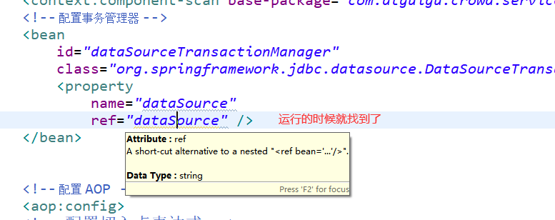

## mybtis

```xml
<!-- 依赖 MyBatis 核心包 --> 
<dependencies> 
    <dependency> 
        <groupId>org.mybatis</groupId> 
        <artifactId>mybatis</artifactId> 
        <version>3.2.8</version> 
    </dependency> 
</dependencies> 
<!-- 控制 Maven 在构建过程中相关配置 --> 
<build>
    <!-- 构建过程中用到的插件 --> 
    <plugins> 
        <!-- 具体插件，逆向工程的操作是以构建过程中插件形式出现的 --> 
        <plugin> 
            <groupId>org.mybatis.generator</groupId> 
            <artifactId>mybatis-generator-maven-plugin</artifactId> 
            <version>1.3.0</version> 
            <!-- 插件的依赖 --> 
            <dependencies> 
                <!-- 逆向工程的核心依赖 --> 
                <dependency> 
                    <groupId>org.mybatis.generator</groupId> 
                    <artifactId>mybatis-generator-core</artifactId> 
                    <version>1.3.2</version> 
                </dependency> 
                <!-- 数据库连接池 --> 
                <dependency> 
                    <groupId>com.mchange</groupId>
                    <artifactId>c3p0</artifactId>
                    <version>0.9.2</version> 
                </dependency>
                <!-- MySQL 驱动 --> 
                <dependency> 
                    <groupId>mysql</groupId> 
                    <artifactId>mysql-connector-java</artifactId> 
                    <version>5.1.8</version> 
                </dependency> 
            </dependencies> 
        </plugin> 
    </plugins> 
</build>
```

## generator.xml

```xml
<!DOCTYPE generatorConfiguration 
PUBLIC "-//mybatis.org//DTD MyBatis Generator Configuration 1.0//EN" 
"http://mybatis.org/dtd/mybatis-generator-config_1_0.dtd"> 
<generatorConfiguration> 
    <!-- mybatis-generator:generate --> 
    <context id="atguiguTables" targetRuntime="MyBatis3"> 
        <commentGenerator> 
            <!-- 是否去除自动生成的注释 true:是;false:否 --> 
            <property name="suppressAllComments" value="true" /> 
        </commentGenerator> 
        <!--数据库连接的信息：驱动类、连接地址、用户名、密码 --> 
        <jdbcConnection 
            driverClass="com.mysql.jdbc.Driver" 
            connectionURL="jdbc:mysql://localhost:3306/project_crowd" 
            userId="root" 
            password="root"> 
        </jdbcConnection>
        <!-- 默认 false，把 JDBC DECIMAL 和 NUMERIC 类型解析为 Integer，
        为 true 时把 JDBC DECIMAL和 NUMERIC 类型解析为 java.math.BigDecimal --> 
        <javaTypeResolver> 
            <property name="forceBigDecimals" value="false" /> 
        </javaTypeResolver> 
        <!-- targetProject:生成 Entity 类的路径 --> 
        <javaModelGenerator targetProject=".\src\main\java"
          targetPackage="com.atguigu.crowd.entity"> 
            <!-- enableSubPackages:是否让 schema 作为包的后缀 
            --> 
            <property name="enableSubPackages" value="false" /> 
            <!-- 从数据库返回的值被清理前后的空格 --> 
            <property name="trimStrings" value="true" /> 
        </javaModelGenerator> 
        <!-- targetProject:XxxMapper.xml 映射文件生成的路径 --> 
        <sqlMapGenerator targetProject=".\src\main\java" 
            targetPackage="com.atguigu.crowd.mapper"> 
            <!-- enableSubPackages:是否让 schema 作为包的后缀 
            --> 
            <property name="enableSubPackages" value="false" /> 
        </sqlMapGenerator> 
        <!-- targetPackage：Mapper 接口生成的位置 --> 
        <javaClientGenerator type="XMLMAPPER" 
            targetProject=".\src\main\java" 
            targetPackage="com.atguigu.crowd.mapper"> 
        <!-- enableSubPackages:是否让 schema 作为包的后缀 
        --> 
            <property name="enableSubPackages" value="false" /> 
        </javaClientGenerator> 
        <!-- 数据库表名字和我们的 entity 类对应的映射指定 --> 
        <table tableName="t_admin" domainObjectName="Admin" /> 
    </context> 
</generatorConfiguration> 

```


## 父工程配置

```xml
<properties> 
    <!-- 声明属性，对 Spring 的版本进行统一管理 --> 
    <atguigu.spring.version>4.3.20.RELEASE</atguigu.spring.version> 
    <!-- 声明属性，对 SpringSecurity 的版本进行统一管理 --> 
    <atguigu.spring.security.version>4.2.10.RELEASE</atguigu.spring.security.version> 
</properties>


<dependencyManagement> 
    <dependencies> 
        <!-- Spring 依赖 --> 
        <!-- https://mvnrepository.com/artifact/org.springframework/spring-orm --> 
        <dependency> 
            <groupId>org.springframework</groupId> 
            <artifactId>spring-orm</artifactId> 
            <version>${atguigu.spring.version}</version> 
        </dependency> 
        <!-- https://mvnrepository.com/artifact/org.springframework/spring-webmvc --> 
        <dependency> 
            <groupId>org.springframework</groupId> 
            <artifactId>spring-webmvc</artifactId> 
            <version>${atguigu.spring.version}</version> 
        </dependency> 
        <dependency> 
            <groupId>org.springframework</groupId> 
            <artifactId>spring-test</artifactId> 
            <version>${atguigu.spring.version}</version> 
        </dependency> 
        <!-- https://mvnrepository.com/artifact/org.aspectj/aspectjweaver --> 
        <dependency> 
            <groupId>org.aspectj</groupId> 
            <artifactId>aspectjweaver</artifactId> 
            <version>1.9.2</version> 
        </dependency> 
        <!-- https://mvnrepository.com/artifact/cglib/cglib -->
        <dependency> 
            <groupId>cglib</groupId> 
            <artifactId>cglib</artifactId> 
            <version>2.2</version> 
        </dependency> 
        <!-- 数据库依赖 --> 
        <!-- MySQL 驱动 --> 
        <dependency> 
            <groupId>mysql</groupId> 
            <artifactId>mysql-connector-java</artifactId> 
            <version>5.1.3</version> 
        </dependency> 
        <!-- 数据源 --> 
        <dependency> 
            <groupId>com.alibaba</groupId> 
            <artifactId>druid</artifactId> 
            <version>1.0.31</version> 
        </dependency> 
        <!-- MyBatis --> 
        <dependency> 
            <groupId>org.mybatis</groupId> 
            <artifactId>mybatis</artifactId> 
            <version>3.2.8</version> 
        </dependency> 
        <!-- MyBatis 与 Spring 整合 --> 
        <dependency> 
            <groupId>org.mybatis</groupId> 
            <artifactId>mybatis-spring</artifactId> 
            <version>1.2.2</version> 
        </dependency> 
        <!-- MyBatis 分页插件 --> 
        <dependency> 
            <groupId>com.github.pagehelper</groupId> 
            <artifactId>pagehelper</artifactId> 
            <version>4.0.0</version> 
        </dependency>

        <!-- 日志 --> 
        <dependency> 
            <groupId>org.slf4j</groupId> 
            <artifactId>slf4j-api</artifactId> 
            <version>1.7.7</version> 
        </dependency> 
        <dependency> 
            <groupId>ch.qos.logback</groupId> 
            <artifactId>logback-classic</artifactId> 
            <version>1.2.3</version> 
        </dependency> 
        <!-- 其他日志框架的中间转换包 --> 
        <dependency> 
            <groupId>org.slf4j</groupId> 
            <artifactId>jcl-over-slf4j</artifactId> 
            <version>1.7.25</version> 
        </dependency> 
        <dependency> 
            <groupId>org.slf4j</groupId> 
            <artifactId>jul-to-slf4j</artifactId> 
            <version>1.7.25</version> 
        </dependency> 
        <!-- Spring 进行 JSON 数据转换依赖 --> 
        <dependency> 
            <groupId>com.fasterxml.jackson.core</groupId> 
            <artifactId>jackson-core</artifactId> 
            <version>2.9.8</version> 
        </dependency> 
        <dependency> 
            <groupId>com.fasterxml.jackson.core</groupId> 
            <artifactId>jackson-databind</artifactId> 
            <version>2.9.8</version> 
        </dependency> 
        <!-- JSTL 标签库 --> 
        <dependency> 
            <groupId>jstl</groupId> 
            <artifactId>jstl</artifactId> 
            <version>1.2</version> 
        </dependency>
        <!-- junit 测试 --> 
        <dependency> 
            <groupId>junit</groupId> 
            <artifactId>junit</artifactId> 
            <version>4.12</version> 
            <scope>test</scope> 
        </dependency> 
        <!-- 引入 Servlet 容器中相关依赖 --> 
        <dependency> 
            <groupId>javax.servlet</groupId> 
            <artifactId>servlet-api</artifactId> 
            <version>2.5</version> 
            <scope>provided</scope> 
        </dependency> 
        <!-- JSP 页面使用的依赖 --> 
        <dependency> 
            <groupId>javax.servlet.jsp</groupId> 
            <artifactId>jsp-api</artifactId> 
            <version>2.1.3-b06</version> 
            <scope>provided</scope> 
        </dependency> 
        <!-- https://mvnrepository.com/artifact/com.google.code.gson/gson --> 
        <dependency> 
            <groupId>com.google.code.gson</groupId> 
            <artifactId>gson</artifactId> 
            <version>2.8.5</version> 
        </dependency> 
        <!-- SpringSecurity 对 Web 应用进行权限管理 --> 
        <dependency> 
            <groupId>org.springframework.security</groupId> 
            <artifactId>spring-security-web</artifactId> 
            <version>4.2.10.RELEASE</version> 
        </dependency> 
        <!-- SpringSecurity 配置 --> 
        <dependency> 
            <groupId>org.springframework.security</groupId>
            <artifactId>spring-security-config</artifactId> 
            <version>4.2.10.RELEASE</version> 
        </dependency> 
        <!-- SpringSecurity 标签库 --> 
        <dependency> 
            <groupId>org.springframework.security</groupId> 
            <artifactId>spring-security-taglibs</artifactId> 
            <version>4.2.10.RELEASE</version> 
        </dependency> 
    </dependencies> 
</dependencyManagement>


```

## 配置出现问题

