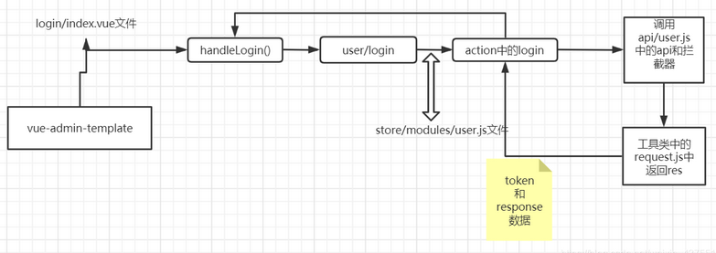

## 登陆分析



```java
// 运行流程
1. login页面进行表单验证，（login/index.vue）
2. 成功则： 将数据发送到vuex，有actions的方法(store/modules/user.js) 
3. 发送请求login,
	发送请求时会进行一个请求拦截，会在请求头header里加入X-Token 
	permission.js是作为路由拦截用的，判断是否有token是否需要登录页面，以及顶部的加载条        
4. (utils/request.js)返回res以及其他数据如权限等并存储在vuex和cookie，
        login会返回一个Promise对象，方便login页面调用then或catch操作。        
// 验证流程
1. 首先经过permission.js路由钩子函数进行权限拦截判断是否有token
        没有： 定向登录页面进行登录，

通过handleLogin()函数，去store中的action找login()函数此函数返回一个permission
然后调用api。
api进行request,response拦截，进行判断返回状态码和数据
store中的action中login()拿到数据设置token和返回数据
登录界面handleLogin（）中的.then()进行回调进行路由跳转

        
src/router (index.js) ----> 
src/views/login (index.vue) ----> 
src/stroe (user.js)    
scr/api (alert.js)
    
    

   
```

### router (index.js)

```java
// src/router (index.js)
export const constantRouterMap = [
  { path: '/login', component: () => import('@/views/login/index'), hidden: true },
   ...
]  
    
```

### views/login (index.vue)

```java
// src/views/login (index.vue)
methods: {
   handleLogin() {
      this.$refs.loginForm.validate(valid => {
        if (valid) {
          this.loading = true
          this.$store.dispatch('Login', this.loginForm).then(() => {
            this.loading = false
            this.$router.push({ path: this.redirect || '/' })
          }).catch(() => {
            this.loading = false
          })
        } else {
          console.log('error submit!!')
          return false
        }
      })
    }
} 
```

### stroe (user.js)

```java
  // user login
  login({ commit }, userInfo) {
    const { username, password } = userInfo
    return new Promise((resolve, reject) => {
      // 调用了api/user.js
      login({ username: username.trim(), password: password }).then(response => {
        const { data } = response
        commit('SET_TOKEN', data.token)
        setToken(data.token)
        resolve()
      }).catch(error => {
        reject(error)
      })
    })
  },

```

### api (user.js)

```java
import request from '@/utils/request'
export function login(data) {
  return request({
    // 使用默认前缀
    url: '/user/login',
    method: 'post',
    data
  })
}

//=============================================================================
// src/utils/request.js
// create an axios instance
const service = axios.create({
  // 使用了默认前缀
  baseURL: process.env.VUE_APP_BASE_API, // url = base url + request url
  timeout: 5000 // request timeout
})

//=============================================================================    
//1.  .env.development .env.production .env.staging
    VUE_APP_BASE_API = 'http://127.0.0.1:9093/api/v1'    
// 2. config/dev.env.js
    module.exports = merge(prodEnv, {
      NODE_ENV: '"development"',
      BASE_API: '"https://easy-mock.com/mock/5950a2419adc231f356a6636/vue-admin"',
    })

```

### 实现接口登陆

```java
curl -XPOST  http://127.0.0.1:9093/api/v1/user/login 
{"code":200,"status":"success","data":{"token":"test-token"}}

curl -XPOST  http://127.0.0.1:9093/api/v1/user/info?token=xxx 
{"code":200,"status":"success","data":{"roles":"Admin"}}

curl -XPOST  http://127.0.0.1:9093/api/v1/user/logout
{"code":200,"status":"success","data":"sucess"}

```


## 拆除登陆模块

## 拆除验证登陆