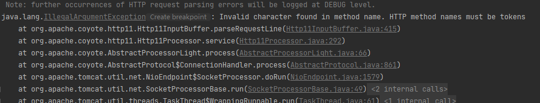
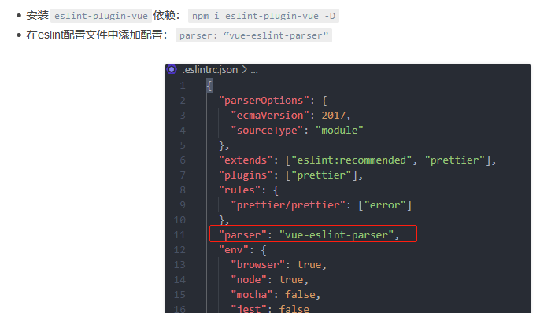
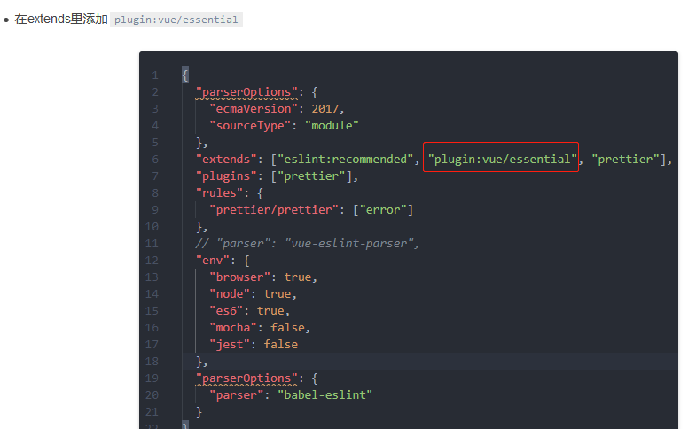

```java
// Invalid character found in method name. HTTP method names must be tokens

注意你的请求地址是 http  还是 https
```




```java
error: Parsing error: Unexpected token
// 最好重启一下编辑器  

vscode    
在插件中设置，不是在配置文件中 
selint.js 文件中设置    
module.exports = {
    "extends": "plugin:vue/base",
    parserOptions: {
        ecmaVersion: 2017,
        parser: 'babel-eslint',
        sourceType: 'module'		
    },
    
hbuilder 插件中设置
        "parserOptions": {
            "ecmaVersion": 2018,
            "sourceType": "module",
            "parser": "babel-eslint",
        }
```






## 整合 security

```java
https://blog.csdn.net/qq_42449963/article/details/109780205
```

