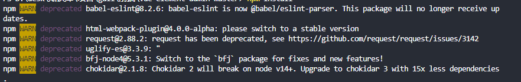

## npm warn



```java
这种并不影响程序的运行，只是说这个 npm 职责所在，提示你而已
只要不是出现红色的，都不影响程序的运行。
    
eslint
    
```

## 安装三方

```java
eslint
    进行设置
    config 
    	port 端口
    	useEslint  启用语法检查
    .eslintrc.js
    	rules  规则{
    		semi分号
                'semi': [2, 'never'], 不使用分号 0 不检测，1 警告， 2 报错
		}
webpack
    
```


## 项目架构

```java
├── build                      // 构建相关  
├── config                     // 配置相关,环境配置
├── src                        // 源代码
│   ├── api                    // 所有请求
│   ├── assets                 // 主题 字体等静态资源
│   ├── components             // 全局公用组件
│   ├── directive              // 全局指令
│   ├── filtres                // 全局 filter
│   ├── icons                  // 项目所有 svg icons
│   ├── lang                   // 国际化 language
│   ├── mock                   // 项目mock 模拟数据
│   ├── router                 // 路由
│   ├── store                  // 全局 store管理
│   ├── styles                 // 全局样式
│   ├── utils                  // 全局公用方法
│   ├── vendor                 // 公用vendor
│   ├── views                   // view
│   ├── App.vue                // 入口页面
│   ├── main.js                // 入口 加载组件 初始化等
│   └── permission.js          // 权限管理
├── static                     // 第三方不打包资源
│   └── Tinymce                // 富文本
├── .babelrc                   // babel-loader 配置
├── .eslintrc.js                // eslint 配置项
├── .gitignore                 // git 忽略项
├── favicon.ico                // favicon图标
├── index.html                 // html模板
└── package.json               // package.json
    
    
    
zh-CN
    
```

## elementUI

```java
    <!-- 分页组件 --> 
       <el-pagination
         layout="prev, pager, next"
         :total="total"
         :page-size="limit"
         :page-size="[5, 10, 20]"
         :current-page="page"
         // 注意方法引用、 方法调用
         // 方法引用： 
             UI 设计好的，你自己写一个函数名，UI会给一个默认的参数
             都是你写的方法，但是会方法会组合上框架的 +  你设计的
         // 方法调用： 纯粹调用你自己的方法， 后面带括号
         // 组件内部的定义的事件，不要写括号，否则默认的回调参数传不进来
         @current-change="changeCurrentPage">
       </el-pagination>
```

