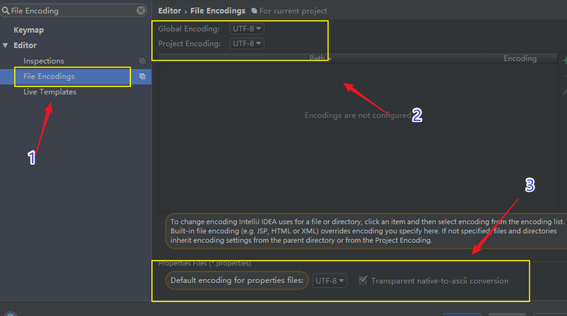

## 教程

```java
spirngboot整合mybatis
    
https://blog.csdn.net/iku5200/article/details/82856621

// SpringBoot整合Mybatis完整详细版二：注册、登录、拦截器配置
https://blog.csdn.net/iku5200/article/details/82878893
```


## 介绍

```java
介绍
    其实SpringBoot底层会把application.yml文件解析为application.properties   
```

## 多环境配置

### 介绍

```java
    介绍
    	一个项目有好多环境，开发环境，测试环境，准生产环境，生产环境，每个环境的参数不同，
    	所以我们就可以把每个环境的参数配置到yml文件中，
    	这样在想用哪个环境的时候只需要在主配置文件中将用的配置文件写上就行如application.yml
    场景
   		在项目中配置多套环境
    使用
    	在Spring Boot中多环境配置文件名需要满足application-{profile}.yml的格式
    	// 其中{profile}对应你的环境标识
    	application-dev.yml：开发环境
        application-test.yml：测试环境
        application-prod.yml：生产环境
    确认加载
    	至于哪个具体的配置文件会被加载，
    	需要在application.yml文件中通过spring.profiles.active属性来设置，其值对应{profile}值。
```


### 多环境 -- application.yml

```yml
spring:
    profiles:
    	active: dev
```

### 多环境 -- application-dev.yml

```yml
server:
  port: 8080
 
spring:
  datasource:
    username: root
    password: 1234
    url: jdbc:mysql://localhost:3306/springboot?useUnicode=true&characterEncoding=utf-8&useSSL=true&serverTimezone=UTC
    driver-class-name: com.mysql.jdbc.Driver

# 如果你使用 mapperscan 的话，就不用进行这个 mapper 包配置了
mybatis:
  mapper-locations: classpath:mapping/*Mapper.xml
  type-aliases-package: com.example.entity
 
#showSql
logging:
  level:
    com:
      example:
        mapper : debug
```

## 问题

### idea 中 yml 文件报错

```java
// 更改下字符集试试
```



