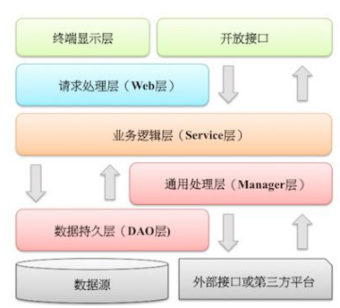

## 应用分层

### 介绍



```java
图解
    上层依赖于下层，箭头关系表示可直接依赖，
    如：开放接口层可以依赖于Web 层，也可以直接依赖于 Service 层，依此类推
```

## 方案一

### 概述

```java
调用流程
     Controller-->service接口-->serviceImpl-->dao接口-->daoImpl-->mapper-->db
概述
    Controller层调用Service层的方法，
    Service层调用Dao层中的方法，其中调用的参数是使用Entity层进行传递的。
    总的来说这样每层做什么的分类只是为了使业务逻辑更加清晰，写代码更加方便，所以有时候也需要根据具体情况来
```

### 各层介绍

```java
Controller层：
    控制层 控制业务逻辑
    负责具体的业务模块流程的控制，
    负责前后端交互，接受前端请求，
    调用service层，接收service层返回的数据，最后返回具体的页面和数据到客户端
    
Service层：
    // 业务层 控制业务    
    主要负责业务模块的逻辑应用设计。
    先设计放接口的类，再创建实现的类，然后在配置文件中进行配置其实现的关联。
    service层调用dao层接口，接收dao层返回的数据，完成项目的基本功能设计。
    
DAO层(mapper)   
    // 用Mybatis逆向工程生成的mapper层，其实就是dao层。
    DAO层会调用entity层，DAO中会定义实际使用到的方法，比如增删改查。
    DAO 层的数据源和数据库连接的参数都是在配置文件中进行配置的，配置文件一般在同层的XML文件夹中。
    数据持久化操作
    	数据放到持久化的介质中，同时提供增删改查操作。
Entity层：
    // 实体层 数据库在项目中的类
    实体层，也就是所谓的model，也称为pojo层，
    是数据库在项目中的类，该文件包含实体类的属性和对应属性的set、get方法；

```


