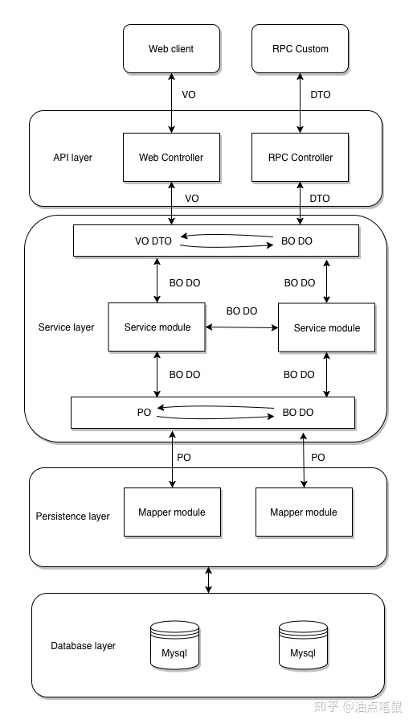

## 领域模型



### 概述  pojo 类型

```java
javaBean
    
pojo
    // 是一个统称：  表示一个简单 java 对象
    用来传递数据（在各个层之间传递）的类，没有继承、依赖
    属性 private , 有 get set 方法, 没有其他操作方法
  


    	
    
// ============================================================    

    

AO（Application Object）：
    应用对象，在 Web 层与 Service 层之间抽象的复用对象模型，
    极为贴近展示层，复用度不高。 

    
            

```

### 概述 非 pojo 类型

```java
 而 DAO、BO 一般都不是 POJO，只提供一些调用方法。

```

### 应用


```java
场景
    有一个面试系统，数据库中存储了很多面试题，通过 web 和 API 提供服务
数据表
    表中的面试题包括编号、题目、选项、答案、创建时间、修改时间；
领域分裂
    PO：包括题目、选项、答案、创建时间、修改时间；

    VO：题目、选项、答案、上一题URL、下一题URL；

    DTO：编号、题目、选项、答案、上一题编号、下一题编号；

    DAO：数据库增删改查方法；

    BO：业务基本操作。
    
优势
    1. 进行 POJO 划分后，我们得到了一个设计良好的架构，各层数据对象的修改完全可以控制在有限的范围内
    2. 如果没有 VO 和 PO 的区别，
    	那么数据库表结构的所有字段就一览无余地展示到了前端，给后台安全带来很大的隐患，
    	并且无法在网络传输中剥离冗余信息提高了用户的带宽成本
```

## 领域类型

## == pojo 类 ==

## 类型转换

```java
/*
	对象究竟是什么O要看具体环境，在不同的层、不同的应用场合，对象的身份也不一样，而且对象身份的转化也是很自然的
	不要陷入过度设计，大可不必为了设计而设计一定要在代码中区分各个对象。一句话技术是为应用服务的。
*/
一个POJO持久化以后就是PO
直接用它传递、传递过程中就是DTO
直接用来对应表示层就是VO

数据库中的一张表对应一个类，这个类就是 DO    
```

## 命名规范

```java
数据对象：xxxDO，xxx即为数据表名
数据传输对象：xxxDTO，xxx为业务领域相关的名称。
展示对象：xxxVO，xxx一般为网页名称。
POJO是DO/DTO/BO/VO的统称，禁止命名成xxxPOJO。
```


## pojo

```java
英文
    Plain Ordinary Java Object / Pure Old Java Object
    纯洁老式的Java对象
含义
    有一些private的参数作为对象的属性，然后针对每一个参数定义get和set方法访问的接口
    那些没有从任何类继承、也没有实现任何接口，更没有被其它框架侵入的java对象。
    理想地讲，一个POJO是一个不受任何限制的Java对象（除了Java语言规范）。
作用
    用于数据的临时传递，它只能装在数据，作为数据存储的载体，而不具有业务逻辑处理的能力
```

## VO

```java
VO（View Object）：
    // 含界面所有值的对象
    显示层对象，通常是 Web 向模板渲染引擎层传输的对象。
    这里的 VO 只包含前端需要展示的数据即可，对于前端不需要的数据，就不体现了
    比如
    	数据创建和修改的时间等字段，出于减少传输数据量大小和保护数据库结构不外泄的目的，
    	不应该在 VO 中体现出来
    
例子一：
    对于一个WEB页面，或者SWT、SWING的一个界面，用一个VO对象对应整个界面的值。
例子一：
    前端有一个表单，这个表单需要一些数据进行展示，前端就向后端要这个数据
    后端接收到这个数据(前端将表单中的数据封装为一个对象)，封装为一个类，进行查询返回
    这个类的属性 和 前端这个表单的属性一一对应    
```


## DTO

```java
介绍
	Data Transfer Object数据传输对象
    要用于远程调用等需要大量传输对象的地方
例子
    我们一张表有100个字段，那么对应的PO就有100个属性,但是我们界面上只要显示10个字段
    
    客户端用WEB service来获取数据，没有必要把整个PO对象传递到客户端，
    
	此时我们就可以用只有这10个属性的DTO来传递结果到客户端，这样也不会暴露服务端表结构.
    到达客户端以后，
    	如果用这个对象来对应界面显示，那此时它的身份就转为VO
   
// 微服务应用    
	// 倾向于微服务之间传递数据            
    数据传输对象，Service 或 Manager 向外传输的对象。 
	通常用于不同服务或服务不同分层之间的数据传输。
    通常遵守 Java Bean 的规范，拥有 getter/setter 方法。       
```

## QO

```java

QO(query object)
	数据查询对象，各层接收上层的查询请求。
	注意超过 2 个参数的查询封装，禁止使用 Map 类来传输。
```


## PO

```java
PO
    Persistant Object 
    // 数据库中一条记录映射
    用于表示数据库中的一条记录映射成的 java 对象。
    PO 仅仅用于表示数据，没有任何数据操作
    通常遵守 Java Bean 的规范，拥有 getter/setter 方法
    例子
    	数据库中有一个班级的好多个学生,
		你要查询其中兴趣是围棋的学生，就将关于围棋的学生封装为一个类
```


## == 非 pojo 类 ==

## BO

```java
BO ( Business Object )
	用于表示一个业务对象，由 Service 层输出的封装业务逻辑的对象。
     BO 包括了业务逻辑，常常封装了对 DAO、RPC 等的调用，可以进行 PO 与 VO/DTO 之间的转换。
     BO 通常位于业务层，
         要区别于直接对外提供服务的服务层：
            	BO 提供了基本业务单元的基本业务操作，
            	在设计上属于被服务层业务流程调用的对象，
            	一个业务流程可能需要调用多个 BO 来完成。 
    
介绍
    把业务逻辑封装为一个对象。这个对象可以包括一个或多个其它的对象
    BO其实就是把其他对象给封装起来了，其本身可能在数据库里没对应的字段，但是BO包含的类会在数据库有对应的表，
例子
    // 一个简历，有教育经历、工作经历、社会关系等等
    可以把教育经历对应一个PO，工作经历对应一个PO，社会关系对应一个PO。
	建立一个对应简历的BO对象处理简历，每个BO包含这些PO。
	这样处理业务逻辑时，我们就可以针对BO去处理。
```

## DO(DAO)

```java
DO（Data Object）：
    // 也叫 DAO ：Data Access Object
    此对象与数据库表结构一一对应，通过 DAO 层向上传输数据源对象。
    例子
    	数据库中有一张表
    	后端建立一个类， 这个类的属性和表的字段相同
     	后端一些框架会提供关于这个类的操作方法
    
```


## javaBean

```java
含义
    对 Java Bean 并没有严格的规范，理论上讲，任何一个 Java 类都可以是一个 Bean 
    是一种JAVA语言写成的可重用组件，方法命名，构造及行为必须符合特定的约定
  
    
约定
    1.这个类必须有一个公共的缺省构造函数。
	2.这个类的属性使用getter和setter来访问，其他方法遵从标准命名规范。
	3.这个类应是可序列化的。实现serializable接口。
    
注意
    // 简而言之，当一个Pojo可序列化，
    // 有一个无参的构造函数，使用getter和setter方法来访问属性时，他就是一个JavaBean。
    许多开发者把JavaBean看作遵从特定命名约定的POJO。
```


