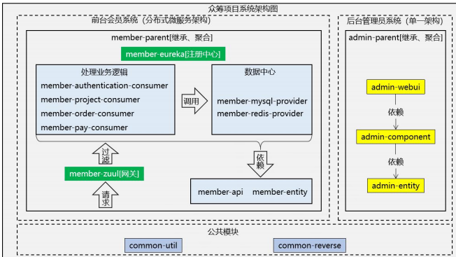

## 项目架构



## 搭建目标


## 搭建架构


## maven 工程

### 创建

```java
父子项目
	创建 parent project 后，在 parent 工程上点右键，new→ Maven module
平行项目
    // 父项目平行项目
    创建 project 项目， 然后把路径改到和 父项目一致就行了
    // 子项目平行项目
    在父项目的 parent 工程上点右键，new→ Maven module
    更改继承的父项目即可
    
    
注意
    1. 打包方式
    	父项目： pom
    	web项目： war
    	其他项目： jar
    
    2. 模块依赖
    	eclipse 中是可以进行图形化操作模块依赖的，
    	模块依赖是在：<dependencies> ... </dependencies> 中
    	模块继承是在：<parent> ... </parent>
  
坐标
    // 创建模块的时候，需要确定各个模块的这几个模块的坐标
    atcrowdfunding01-admin-parent 
    	groupId：com.atguigu.crowd 	// 项目名
    	artifactId：atcrowdfunding01-admin-parent  // 包名
    	packaging：pom  // 打包方式
```

