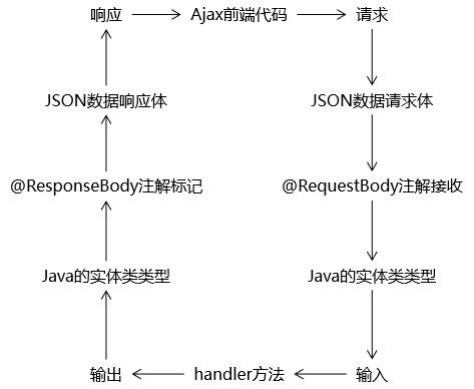

## 介绍



```java
前端发送过来，后端要处理的请求有两种： 
    普通请求：
    	后端处理完成后返回页面，浏览器使用使用页面替换整个窗口中的 内容
    Ajax 请求：
    	后端处理完成后通常返回 JSON 数据，jQuery 代码使用 JSON 数据 对页面局部更新
```


## 坐标依赖

```xml
spring-webmvc

// JSON 转换
jackson-core
jackson-databind
servlet-api
jsp-api
```

## == 非前后端分离 ==

```java
开启 SpringMVC 的注解驱动 <mvc:annotation-driven/> 
    必须有 jackson 依赖 jackson-core jackson-databind 
    扩展名需要和实际返回的数据格式一致 
    响应体返回 JSON 请求扩展名*.json web.xml 中 
    DispatcherServlet 必须映射*.json 扩展名
```

