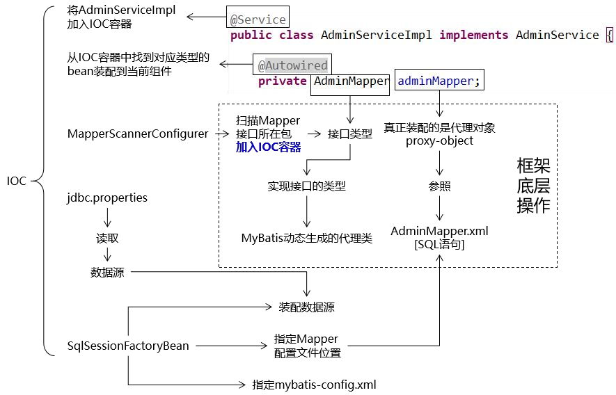
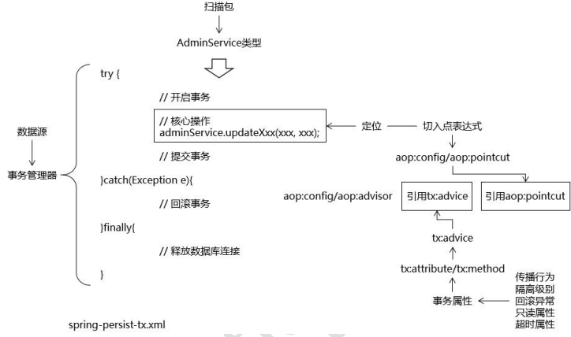

## 思路

```java
adminMapper 通过 IOC 容器装配到当前组件中后，就可以直接调用它的方法，享受 到框架给我们提供的方便
```



## 操作

```java
在子工程中加入搭建环境所需要的具体依赖 
	准备 jdbc.properties 
    创建 Spring 配置文件专门配置 
    Spring 和 MyBatis 整合相关 
    在 Spring 的配置文件中加载 jdbc.properties 属性文件
    配置数据源 
   	测试从数据源中获取数据库连接 
    配置 SqlSessionFactoryBean
    	装配数据源 
    	指定 XxxMapper.xml 配置文件的位置 
    	指定 MyBatis 全局配置文件的位置（可选） 
    配置 MapperScannerConfigurer 
    测试是否可以装配 XxxMapper 接口并通过这个接口操作数据库
```

## 配置依赖 - pom

```xml
<groupId>org.springframework</groupId> <artifactId>spring-webmvc</artifactId>

<groupId>org.aspectj</groupId> <artifactId>aspectjweaver</artifactId>

<groupId>cglib</groupId> <artifactId>cglib</artifactId>

<groupId>mysql</groupId> 
<artifactId>mysql-connector-java</artifactId>

<groupId>com.alibaba</groupId> <artifactId>druid</artifactId>

<groupId>org.mybatis</groupId> <artifactId>mybatis</artifactId>

<!-- spring 整合 mybatis -->
<groupId>org.mybatis</groupId> 
<artifactId>mybatis-spring</artifactId>

<!--分页插件-->
<groupId>com.github.pagehelper</groupId> 
<artifactId>pagehelper</artifactId>
<!-- json 转换-->
<groupId>com.fasterxml.jackson.core</groupId> <artifactId>jackson-core</artifactId>

<groupId>com.fasterxml.jackson.core</groupId> <artifactId>jackson-databind</artifactId>

<groupId>jstl</groupId> 
<artifactId>jstl</artifactId>

<groupId>com.google.code.gson</groupId> <artifactId>gson</artifactId>


```


## 配置文件 -- properties

```properties
jdbc.user=root jdbc.password=root jdbc.url=jdbc:mysql://localhost:3306/project_crowd?useUnicode=true&characterEncoding=UTF-8 jdbc.driver=com.mysql.jdbc.Driver
```

## mybatis 配置

```xml
<?xml version="1.0" encoding="UTF-8"?>
<!DOCTYPE configuration PUBLIC "-//mybatis.org//DTD Config 3.0//EN" "http://mybatis.org/dtd/mybatis-3-config.dtd">
<configuration>

</configuration>
```

## spring-mybatis 配置

### 概述

```java
<!-- 加载外部属性文件 -->
<!-- 配置数据源 -->   
<!-- 配置SqlSessionFactoryBean整合MyBatis -->
<!-- 配置MapperScannerConfigurer来扫描Mapper接口所在的包 -->    
```


### xml 文件

```xml
<!--
    spring-persist-mybatis
    
    -->
<?xml version="1.0" encoding="UTF-8"?>
<beans xmlns="http://www.springframework.org/schema/beans"
	xmlns:xsi="http://www.w3.org/2001/XMLSchema-instance"
	xmlns:context="http://www.springframework.org/schema/context"
	xsi:schemaLocation="http://www.springframework.org/schema/beans http://www.springframework.org/schema/beans/spring-beans.xsd
		http://www.springframework.org/schema/context http://www.springframework.org/schema/context/spring-context-4.3.xsd">

	<!-- 加载外部属性文件 -->
	<context:property-placeholder location="classpath:jdbc.properties"/>
	
	<!-- 配置数据源 -->
	<bean id="dataSource" class="com.alibaba.druid.pool.DruidDataSource">
		<property name="username" value="${jdbc.user}"/>
		<property name="password" value="${jdbc.password}"/>
		<property name="url" value="${jdbc.url}"/>
		<property name="driverClassName" value="${jdbc.driver}"/>
	</bean>
	
	<!-- 配置SqlSessionFactoryBean整合MyBatis -->
	<bean id="sqlSessionFactoryBean" class="org.mybatis.spring.SqlSessionFactoryBean">
		<!-- 指定MyBatis全局配置文件位置 -->
		<property name="configLocation" value="classpath:mybatis-config.xml"/>
		
		<!-- 指定Mapper.xml配置文件位置 -->
		<property name="mapperLocations" value="classpath:mybatis/mapper/*Mapper.xml"/>
		
		<!-- 装配数据源 -->
		<property name="dataSource" ref="dataSource"/>
		
		<!-- 配置插件 -->
		<property name="plugins">
			<array>
				<!-- 配置PageHelper插件 -->
				<bean class="com.github.pagehelper.PageHelper">
					<property name="properties">
						<props>
							<!-- 配置数据库方言，告诉PageHelper当前使用的数据库 -->
							<prop key="dialect">mysql</prop>
							
							<!-- 配置页码的合理化修正，在1~总页数之间修正页码 -->
							<prop key="reasonable">true</prop>
						</props>
					</property>
				</bean>
			</array>
		</property>
	</bean>
	
	<!-- 配置MapperScannerConfigurer来扫描Mapper接口所在的包 -->
	<bean id="mapperScannerConfigurer" class="org.mybatis.spring.mapper.MapperScannerConfigurer">
		<property name="basePackage" value="com.atguigu.crowd.mapper"/>
	</bean>

</beans>

```

## 声明式事务



### 坐标依赖 -- pom

```xml
<!--
	声明式事务是根据切面编程来的，所以导包需要导入这个 
-->
    <!-- AOP 所需依赖 --> 
    <dependency> 
        <groupId>org.aspectj</groupId>
        <artifactId>aspectjweaver</artifactId> 
    </dependency> 
    <!-- AOP 所需依赖 --> 
    <dependency> 
        <groupId>cglib</groupId> 
        <artifactId>cglib</artifactId>
    </dependency>
```


### 配置 - spring-persist-tx 

#### 介绍

```java
<!-- 配置事务管理器 -->
<!-- 配置 AOP -->
<!-- 配置事务通知 -->
	<!-- 增删改方法另外配置 -->    
```


#### 配置

```xml
<!--
	spring-persist-tx    
-->
<?xml version="1.0" encoding="UTF-8"?>
<beans xmlns="http://www.springframework.org/schema/beans"
	xmlns:xsi="http://www.w3.org/2001/XMLSchema-instance"
	xmlns:context="http://www.springframework.org/schema/context"
	xmlns:tx="http://www.springframework.org/schema/tx"
	xmlns:aop="http://www.springframework.org/schema/aop"
	xsi:schemaLocation="http://www.springframework.org/schema/beans http://www.springframework.org/schema/beans/spring-beans.xsd
		http://www.springframework.org/schema/context http://www.springframework.org/schema/context/spring-context-4.3.xsd
		http://www.springframework.org/schema/aop http://www.springframework.org/schema/aop/spring-aop-4.3.xsd
		http://www.springframework.org/schema/tx http://www.springframework.org/schema/tx/spring-tx-4.3.xsd">

	<!-- 配置自动扫描的包：主要是为了把Service扫描到IOC容器中 -->
	<context:component-scan base-package="com.atguigu.crowd.service"/>
	
	<!-- 配置事务管理器 -->
	<bean id="txManager" class="org.springframework.jdbc.datasource.DataSourceTransactionManager">
		<!-- 装配数据源 -->
		<property name="dataSource" ref="dataSource"/>
		
	</bean>
	
	<!-- 配置事务切面 -->
	<aop:config>
		<!-- 考虑到后面我们整合SpringSecurity，避免把UserDetailsService加入事务控制，让切入点表达式定位到ServiceImpl -->
		<aop:pointcut expression="execution(* *..*ServiceImpl.*(..))" id="txPointcut"/>
		
		<!-- 将切入点表达式和事务通知关联起来 -->
		<aop:advisor advice-ref="txAdvice" pointcut-ref="txPointcut"/>
	</aop:config>
	
	<!-- 配置事务通知 -->
	<tx:advice id="txAdvice" transaction-manager="txManager">
	
		<!-- 配置事务属性 -->
		<tx:attributes>
			
			<!-- 查询方法：配置只读属性，让数据库知道这是一个查询操作，能够进行一定优化 -->
			<tx:method name="get*" read-only="true"/>
			<tx:method name="find*" read-only="true"/>
			<tx:method name="query*" read-only="true"/>
			<tx:method name="count*" read-only="true"/>
			
			<!-- 增删改方法：配置事务传播行为、回滚异常 -->
			<!-- 
				propagation属性：
					REQUIRED：默认值，表示当前方法必须工作在事务中，如果当前线程上没有已经开启的事务，则自己开新事务。如果已经有了，那么就使用这个已有的事务。
						顾虑：用别人的事务有可能“被”回滚。
					REQUIRES_NEW：建议使用的值，表示不管当前线程上有没有事务，都要自己开事务，在自己的事务中运行。
						好处：不会受到其他事务回滚的影响。
			 -->
			<!-- 
				rollback-for属性：配置事务方法针对什么样的异常回滚
					默认：运行时异常回滚
					建议：编译时异常和运行时异常都回滚
			 -->
			<tx:method name="save*" propagation="REQUIRES_NEW" rollback-for="java.lang.Exception"/>
			<tx:method name="update*" propagation="REQUIRES_NEW" rollback-for="java.lang.Exception"/>
			<tx:method name="remove*" propagation="REQUIRES_NEW" rollback-for="java.lang.Exception"/>
			<tx:method name="batch*" propagation="REQUIRES_NEW" rollback-for="java.lang.Exception"/>
			
		</tx:attributes>
	
	</tx:advice>

</beans>

```

