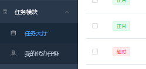

## 介绍

```java
数据维护说白了就是
    数据的增、删、改、查、分页
    
分页使用不同的工具是不同的效果的，所以这个很麻烦    
```

## 管理员维护

### 任务

```java
 分页显示
    Admin 数据 
        不带关键词分页 
        带关键词分页 
    新增 Admin 
    更新 Admin 
    单条删除 Admin
```

## 分页业务

### 前端



```java
这个是在侧边栏的对应的标签处，这是一个可以向后端发送请求的超链接
后端获取倒着超链接，然后进行数据查询，进行页面跳转
    将数据返回到 model 中，供前端页面进行渲染


// ==========================
这个在程序进入分页的主界面，在加载完页面以后，开始(自动)加载 js 代码，然后就加载了分页的请求
    这个是在加载 js 代码的时候，自动加载的
    
    这个是利用分页导航条的加载的时候，进行向后端进行分页数据的请求
    因为你写了分页的导航，所在在页面加载的时候加载
    
例子
// 例子一
    前端进行分页导航条加载的时候，绑定一个
```


### 后端

```java
controller
    url: keyWord  pageNUm  pageSize
    
	1. 调取 service 得到 pageInfo 
	2. 将 pageInfo 存入模型，(放在分页的上下文中， )        
	3. 转发 分页        
        
	注意
        参数没有的话，使用默认值
        @RequestParam(value="keyword", defaultValue="") String keyword,
        
        
service
    pageHelper
    	limit 交给 pageHelper 进行操作了 
    1. 开启分页
	2. 查询到 admin（根据关键词）
	3. 将查询到的数据， 封装入 PageInfo ， 返回给 controller
        
mapper    
    List<Admin> selectAdminListByKeyword(String keyword);
```

## 导航条

### 介绍

```java
这个就是纯前端的操作，没有涉及到
```

