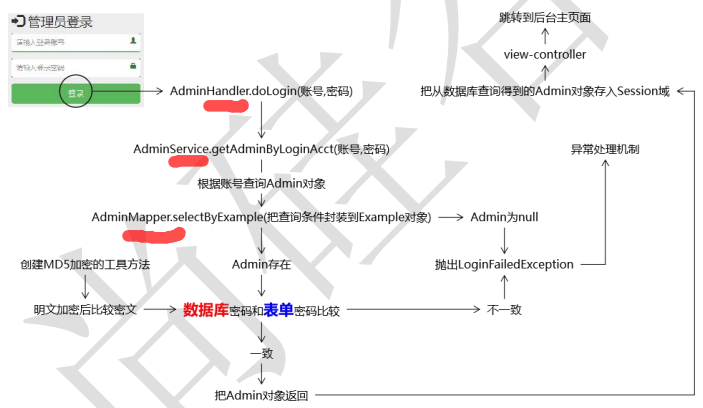

## 业务描述



### 前端

```java
前端
    用户在表单中填写登陆数据(账号、密码、验证码)，然后提交
    一个 url 请求就发给了后端
```


### 后端

#### 概述

```java
后端
    1. 获取请求参数，根据账号在数据库查询
    2. 数据库查询该对象
    	查不到
    		抛出错误
    	查到：
    		将参数传递过来的密码进行加密 
    		与 查询到的密码比较
                不同： 抛出错误，
                相同： 返回查询到的对象
```


#### 分离

```java


    // 分层逻辑

    controller
        1. 获取请求参数
        2. 参数传入对应的 serviceImpl 的方法
            根据账号查询 admin 对象                
        3. 登陆成功
            将 admin 存入 session 域， 
            视图跳转：
                重复提交： 重定向到新的页面                   

    service
        1. 查询 admin 对象（根据账号）
            admin 为 null
                    抛出自定义异常
            admin 不为 null
                    1.数据库密码 从 admin 中取出
                    2.表单密码 ==>  加密  ==》 加密密码
                    3.admin密码  === 加密秘密
                        不一致： 跑异常
                        一致：  返回 admin 对象


    mapper   
        //                
```


## == 非前后端分离 ==

## 前端

```java
```


## 后端

### controller

```java
	@RequestMapping("/admin/do/login.html")
	public String doLogin(
				@RequestParam("loginAcct") String loginAcct,
				@RequestParam("userPswd") String userPswd,
				HttpSession session
			) {
		
		// 调用Service方法执行登录检查
		// 这个方法如果能够返回admin对象说明登录成功，如果账号、密码不正确则会抛出异常
		Admin admin = adminService.getAdminByLoginAcct(loginAcct, userPswd);
		
		// 将登录成功返回的admin对象存入Session域
		session.setAttribute(CrowdConstant.ATTR_NAME_LOGIN_ADMIN, admin);
		
		return "redirect:/admin/to/main/page.html";
        // 为了避免跳转到后台主页面再刷新浏览器导致重复提交登录表单，重定向到目 标页面
        // 需要配置 <mvc:view-controller path="/admin/to/main/page.html" view-name="admin-main"/>
	}


// 退出
@RequestMapping("/admin/do/logout.html") 
public String doLogout(HttpSession session) { 
    // 强制 Session 失效 session.invalidate(); 
    return "redirect:/admin/to/login/page.html"; 
}
```

### service

```java
	@Override
	public Admin getAdminByLoginAcct(String loginAcct, String userPswd) {
		
		// 1.根据登录账号查询Admin对象
		// ①创建AdminExample对象
		AdminExample adminExample = new AdminExample();
		
		// ②创建Criteria对象
		Criteria criteria = adminExample.createCriteria();
		
		// ③在Criteria对象中封装查询条件
		criteria.andLoginAcctEqualTo(loginAcct);
		
		// ④调用AdminMapper的方法执行查询
		List<Admin> list = adminMapper.selectByExample(adminExample);
		
		// 2.判断Admin对象是否为null
		if(list == null || list.size() == 0) {
			throw new LoginFailedException(CrowdConstant.MESSAGE_LOGIN_FAILED);
		}
		
		if(list.size() > 1) {
			throw new RuntimeException(CrowdConstant.MESSAGE_SYSTEM_ERROR_LOGIN_NOT_UNIQUE);
		}
		
		Admin admin = list.get(0);
		
		// 3.如果Admin对象为null则抛出异常
		if(admin == null) {
			throw new LoginFailedException(CrowdConstant.MESSAGE_LOGIN_FAILED);
		}
		
		// 4.如果Admin对象不为null则将数据库密码从Admin对象中取出
		String userPswdDB = admin.getUserPswd();
		
		// 5.将表单提交的明文密码进行加密
		String userPswdForm = CrowdUtil.md5(userPswd);
		
		// 6.对密码进行比较
		if(!Objects.equals(userPswdDB, userPswdForm)) {
			// 7.如果比较结果是不一致则抛出异常
			throw new LoginFailedException(CrowdConstant.MESSAGE_LOGIN_FAILED);
		}
		
		// 8.如果一致则返回Admin对象
		return admin;
	}
```


## 数据库

```java
```


## == 前后端分离 == 