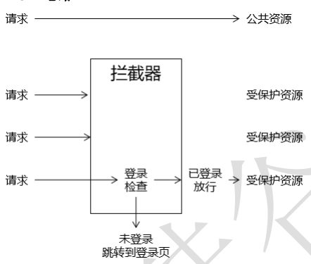

## == 后端拦截器



## 使用自定义拦截器

### java类

```java
public class LoginInterceptor extends HandlerInterceptorAdapter {

	@Override
	public boolean preHandle(
        HttpServletRequest request, 
        HttpServletResponse response, 
        Object handler
    ) throws Exception {
		
		// 1.通过request对象获取Session对象
		HttpSession session = request.getSession();
		
		// 2.尝试从Session域中获取Admin对象
		Admin admin = (Admin) session.getAttribute(CrowdConstant.ATTR_NAME_LOGIN_ADMIN);
		
		// 3.判断admin对象是否为空
		if(admin == null) {
			
			// 4.抛出异常
			throw new AccessForbiddenException(CrowdConstant.MESSAGE_ACCESS_FORBIDEN);
			
		}
		
		// 5.如果Admin对象不为null，则返回true放行
		return true;
	}

}

```

### java xml

```xml
<!--
	spring - web - mvc.xml
-->
	<!-- 注册拦截器 -->
	<mvc:interceptors>
		<mvc:interceptor>
			<!-- mvc:mapping配置要拦截的资源 -->
			<!-- /*对应一层路径，比如：/aaa -->
			<!-- /**对应多层路径，比如：/aaa/bbb或/aaa/bbb/ccc或/aaa/bbb/ccc/ddd -->
			<mvc:mapping path="/**"/>
			
			<!-- mvc:exclude-mapping配置不拦截的资源 -->
			<mvc:exclude-mapping path="/admin/to/login/page.html"/>
			<mvc:exclude-mapping path="/admin/do/login.html"/>
			<mvc:exclude-mapping path="/admin/do/logout.html"/>
			
			<!-- 配置拦截器类 -->
			<bean class="com.atguigu.crowd.mvc.interceptor.LoginInterceptor"/>
		</mvc:interceptor>
	</mvc:interceptors>
```

## 使用 springSecurity

```java
介绍
    使用 springSecurity 后当前自定义的登陆拦截器不再使用
    
```


## == 前端拦截器 ==

