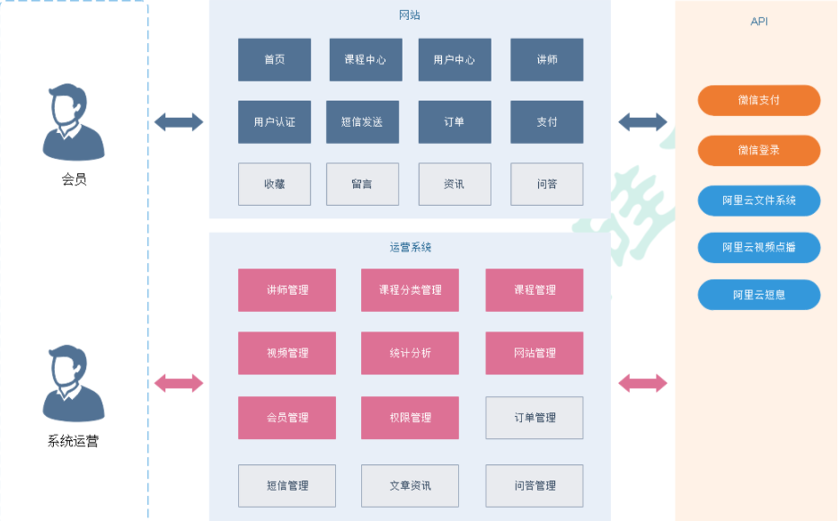
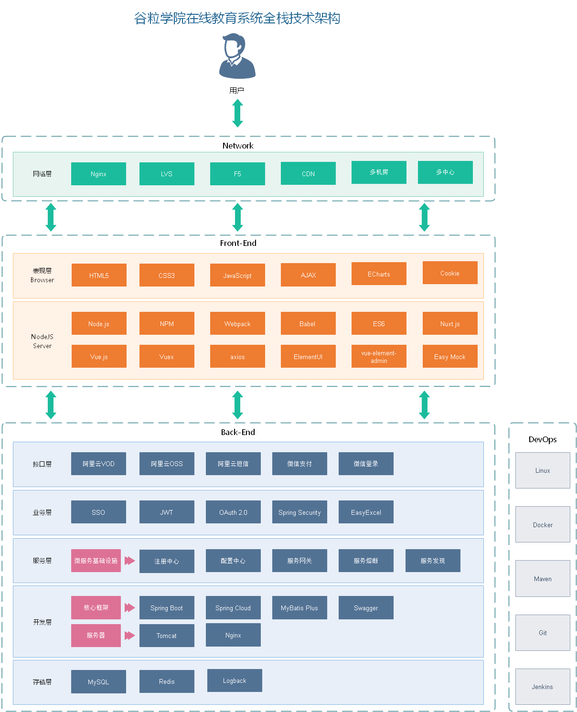

## 业务模块



## 技术架构



## 项目结构

```java
guli_parent：根目录（父工程），管理四个子模块：
canal_client：canal数据库表同步模块（统计同步数据）
common：公共模块父节点
common_util：工具类模块，所有模块都可以依赖于它
service_base：service服务的base包，包含service服务的公共配置类，所有service模块依赖于它
spring_security：认证与授权模块，需要认证授权的service服务依赖于它
infrastructure：基础服务模块父节点
api_gateway：api网关服务
service：api接口服务父节点
service_edu：教学相关api接口服务
service_oss：阿里云oss api接口服务
service_acl：用户权限管理api接口服务（用户管理、角色管理和权限管理等）
service_cms：cms api接口服务
service_sms：短信api接口服务
service_trade：订单和支付相关api接口服务
service_statistics：统计报表api接口服务
service_ucenter：会员api接口服务
service_vod：视频点播api接口服务
```

## 搭建步骤

```java
父子项目
    父项目
    	使用 Spring Initializr 快速初始化一个 Spring Boot 项目
    	删除 src 文件夹(因为父项目不放代码)
    父模块
    	在父项目中创建 maven moudule, 继承 父项目
    	删除 src 文件夹(因为父模块不放代码)
    子模块
    	在父模块中创建 maven moudule 继承父模块
    
平行项目
    父项目
    	直接创建 project , 然后更改文件路径、父项目进行创建
```

