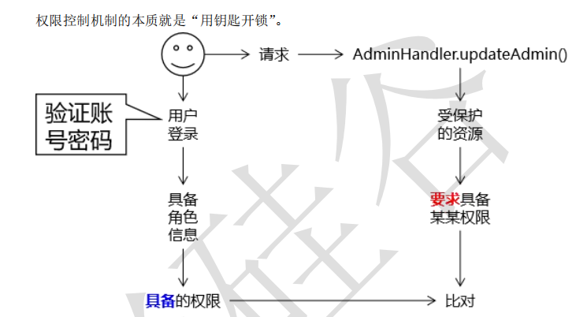
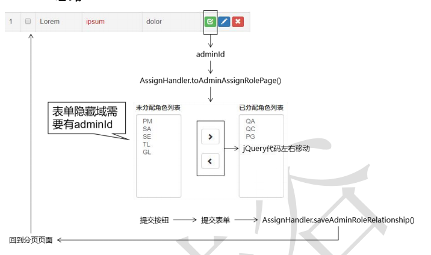
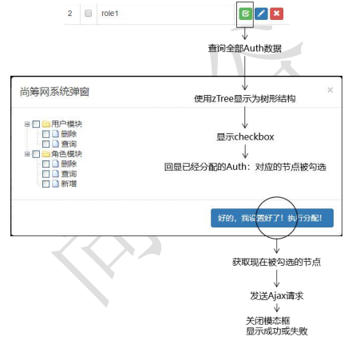
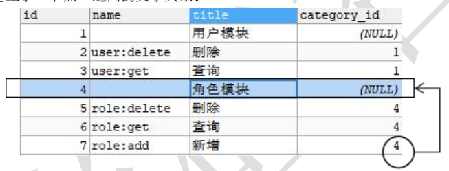

```java
admin 分配 role
role 分配 auth
menu 分配 auth    
```





## // 两表联查

## admin 分配 role



```java
通过页面操作把 Admin 和 Role 之间的关联关系保存到数据库。
    
思路
    创建保存 Admin-Role 关联关系的数据库表
    这个表并不对应现实生活中或项目业务功能中的一个具体实体，所以没有对应 的实体类，也不通过逆向工程做逆向生成
    
    
    
```

### 后端

```java
controller
    adminService    RoleService
    1. 查询已分配的角色、 未分配的角色
    	查到的数据，放入 请求域 中， 进行回显
    	// 放模型，就是放到了request 域
   
service
    adminService  -- 调用 mapper 获取分配的、未分配的方法
    RoleService
    
 // ===============================
执行分配的 controller
controller
    通过提交的参数，获取 id 页码 关键词 角色列表：就是前端表单的提交的数据的name
    角色可以空的，就像你权限被限制了，不能有其他的操作，传递的数据可以是空的
    
    
service
    关联关系的保存
    	对应数据，因为有部分删除、部分新增， 但是传递过来的是所有的数据，所以
    	直接把旧的数据干掉就行，直接用新的数据补充上去
    	
    空的
    非空  进行 mapper 调用
    
mapper.xml
    
    
    
    
    
    
    
    
    
// 3.存入模型（本质上其实是：request.setAttribute("attrName",attrValue); 
modelMap.addAttribute("assignedRoleList", assignedRoleList); 
modelMap.addAttribute("unAssignedRoleList", unAssignedRoleList);    
```

### 前端

```java
// url
1. 给具体的 admin 分配角色
    请求中要带上 admin_id 
    admin 所在的页面信息： 所在页、 关键词
    
    
显示角色数据
    从请求域中找到数据，进行遍历，每次得到一个对象，就是 role
调整表单,提交数据
    在表单上设置一个 name=roleList 提交到后端的时候，就是提交的这个名字， 可以获取多个值
    进行数据库存储
    
jQuery 代码    
    进行左右移动， 将选中的 option 追加到另外一边的 select 中，
    多个选中，选中以后，通过箭头进行移动添加
    
    通过 jQuery 确定选择的子元素，确定后，将选择的标签添加到具体的标签后面
    两边都是一个 select 标签，都有自己的名字， 都是可以确定的
    
    数据提交
		用户确定提交了，在进行提交，不要用户点击就进行提交了
         
    // 注意提交
     没哟设置，可能回导致出现，只有选择了的框才会被提交，没有被选择的就不会被提交
    	但是我们要的是全部的 selection ,

	所以提交的时候，需要把已分配的全部按钮都给提交了
        使用 jQuery 进行全部选中的操作，然后提交的时候， 就能全部提交了
    
    
    
    
    后端处理
```

### 补充

```java
<option value="a">b</option>
a 提交给服务器的
b 在浏览器上用户看到的    
```

## role 分配权限 auth



### 思路介绍

```java
1. 先把树形结构的数据查出来，生成事件
```


### auth 数据库 -- role 与 权限关联

```java
name 字段：
    给资源分配权限或给角色分配权限时使用的具体值，
    将来做权限验证 也是使用 name 字段的值来进行比对。建议使用英文。 
    
 title 字段：
    在页面上显示，让用户便于查看的值。
    建议使用中文。
    
category_id 字段：
    关联到当前权限所属的分类。
    这个关联不是到其他表关联
    ，而是 就在当前表内部进行关联，关联其他记录。
    
    所以说，t_auth 表中是依靠 category_id 字 段建立了“节点”之间的父子关系。
    
    role:delete 是角色模块的功能！
```



### 前端

#### role.js

```java
1. auth 树形结构的数据查出来
2. 从向应数据中拿到数据，生成数据结构
3. 生成数据结构
4. 查询已经分配的 auth 的id 组成的数组， 根据
    
   
5. 查询 auth 的 id 组成的数组，
    
总的来说，就是从响应结果中拿到数据， 然后对数据进行处理，
对于一些需要连续操作的，需要提取出来，然后根据框架，进行
    
    
// 多级操作，是为了避免选择不该选择的
对于选择的，选上了就发送给服务器    
```

