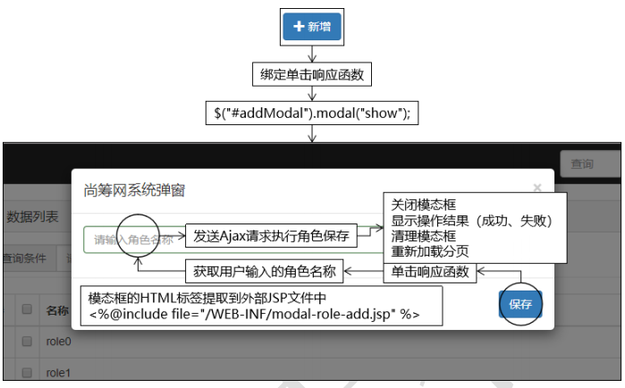
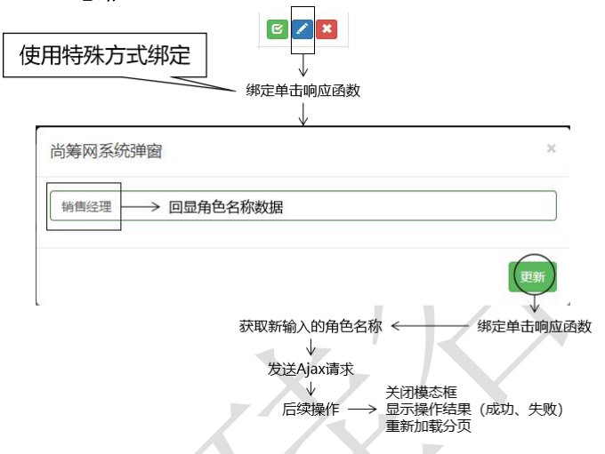
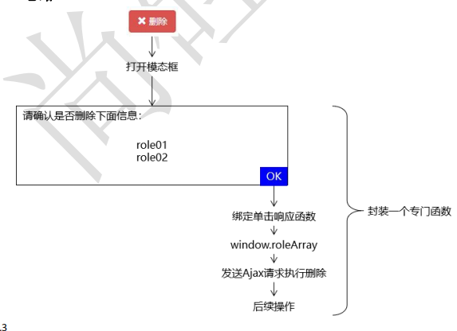
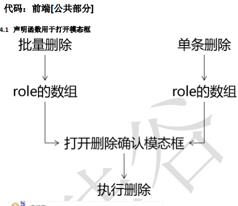

# 后续总结

```java
后端的业务大致力理顺了，后续总结的时候， 需要重点理顺前端的业务
```


# 分页操作


## 后端

### 依赖

```xml
前面引过了
```

### 业务

```java
    
controller
    url: keyWord  pageNUm  pageSize
    
	1. 调取 service 得到 pageInfo 
	2. 将 pageInfo 装入 resultEntity 的 data 中返回 ajax 的 json
	3. 返回的是 json（转发 分页 ）
        
	注意
        参数没有的话，使用默认值
        @RequestParam(value="keyword", defaultValue="") String keyword,
        
        
service
    pageHelper
    	limit 交给 pageHelper 进行操作了 
    1. 开启分页
	2. 查询到 admin（根据关键词）
	3. 将查询到的数据， 封装入 PageInfo ， 返回给 controller
        
mapper    
    List<Admin> selectAdminListByKeyword(String keyword);
```

## 前端

```js
<mvc:view-controller path="/role/to/page.html" view-name="role-page"/>

<!--发起请求的位置-->
<li style="height: 30px;"><a href="role/to/page.html">
    <i class="glyphicon glyphicon-king"></i> 
	角色维护</a>
</li>

<!-- role-page -->
<script type="text/javascript" src="crowd/my-role.js"></script>
//  Pagination 环境
<script type="text/javascript" src="jquery/jquery.pagination.js"></script>
<script type="text/javascript" src="crowd/my-role.js"></script>

$(function(){
    // 1.为分页操作准备初始化数据
    window.pageNum = 1;
    window.pageSize = 5;
    window.keyword = "";
    // 2.调用执行分页的函数，显示分页效果
    generatePage();
});

// --------------------------------------------
js 抽离  myrole.js

```


## == 模板整理 == 

## mapper.xml

```java
adminMapper.xml
    
<select id="selectRoleByKeyword" resultMap="BaseResultMap">
select id, name from t_role
where name like concat("%",#{keyword},"%")
</select>
```


## mapper

```java
 List<Role> selectRoleByKeyword(String keyword);
```


## service

```java
@Override
public PageInfo<Role> getPageInfo(Integer pageNum, Integer pageSize, String keyword) {
    // 1.开启分页功能
    PageHelper.startPage(pageNum, pageSize);
    // 2.执行查询
    List<Role> roleList = roleMapper.selectRoleByKeyword(keyword);
    // 3.封装为 PageInfo 对象返回
    return new PageInfo<>(roleList);
}
```


## controller

```java
@ResponseBody
@RequestMapping("/role/get/page/info.json")
public ResultEntity<PageInfo<Role>> getPageInfo(
    
    // requestParam 就是 ajax 中的 data 的键名
    @RequestParam(value="pageNum", defaultValue="1") Integer pageNum,
    @RequestParam(value="pageSize", defaultValue="5") Integer pageSize,
    @RequestParam(value="keyword", defaultValue="") String keyword
){
    // 调用 Service 方法获取分页数据
    PageInfo<Role> pageInfo = roleService.getPageInfo(pageNum, pageSize, keyword);
    // 封装到 ResultEntity 对象中返回（如果上面的操作抛出异常，交给异常映射机制处理）
    return ResultEntity.successWithData(pageInfo);
}
```


## 抽离的js

### 生成分页

```java
// 执行分页，生成页面效果，任何时候调用这个函数都会重新加载页面
function generatePage() {
    // 1.获取分页数据
    var pageInfo = getPageInfoRemote();
    // 2.填充表格
    fillTableBody(pageInfo);
}

```


### 获取 pageInfo 数据

```js

// 远程访问服务器端程序获取 pageInfo 数据
function getPageInfoRemote() {
	// 调用$.ajax()函数发送请求并接受$.ajax()函数的返回值
	var ajaxResult = $.ajax({
        "url": "role/get/page/info.json",
        "type":"post",
        "data": {
            "pageNum": window.pageNum,
            "pageSize": window.pageSize,
            "keyword": window.keyword
        },
        "async":false,
        "dataType":"json"
        });
    
    // 注意这个 ajaxRest 这个结构体
    // 有很多的属性，是需要我们注意的
    console.log(ajaxResult);
    responseJSON.data 就是服务器返回的数据
    respinseText
    
    
    
    // 判断当前响应状态码是否为 200
    var statusCode = ajaxResult.status;
    
    // 如果当前响应状态码不是 200，
    // 说明发生了错误或其他意外情况，显示提示消息，让当前函数停止执行
    if(statusCode != 200) {
        layer.msg("失败！响应状态码="+statusCode+" 说明信息="+ajaxResult.statusText);
        return null;
    }
    
    if (statusCode == 200) {
        
    }
    // 如果响应状态码是 200，说明请求处理成功，获取 pageInfo
    var resultEntity = ajaxResult.responseJSON;
    // 从 resultEntity 中获取 result 属性
    var result = resultEntity.result;
    // 判断 result 是否成功
    if(result == "FAILED") {
        layer.msg(resultEntity.message);
        return null;
    }
    // 确认 result 为成功后获取 pageInfo
    var pageInfo = resultEntity.data;
    // 返回 pageInfo 
    return pageInfo;
}    


```

### 填充表格

```js

// 填充表格
function fillTableBody(pageInfo) {
    // 清除 tbody 中的旧的内容
    $("#rolePageBody").empty();
    
    // 这里清空是为了让没有搜索结果时不显示页码导航条
    $("#Pagination").empty();
    
    
    // 判断 pageInfo 对象是否有效
    if( pageInfo == null || 
       pageInfo == undefined || 
       pageInfo.list == null ||
       pageInfo.list.length == 0
      ) {
        // 给 tbody 额外添加的内容
        $("#rolePageBody").append("<tr><td colspan='4' align='center'>抱歉！没有查询到您搜
        索的数据！</td></tr>");
        return ;
    }
	// 使用 pageInfo 的 list 属性填充 tbody
    for(var i = 0; i < pageInfo.list.length; i++) {
        var role = pageInfo.list[i];
        var roleId = role.id;
        var roleName = role.name;
        var numberTd = "<td>"+(i+1)+"</td>";
        var checkboxTd = "<td><input type='checkbox'></td>";
        var roleNameTd = "<td>"+roleName+"</td>";
        
        // 页面的几个 id 
        var checkBtn = "<button type='button' class='btn btn-success btn-xs'><i class=' 
        glyphicon glyphicon-check'></i></button>";
        var pencilBtn = "<button type='button' class='btn btn-primary btn-xs'><i class=' 
        glyphicon glyphicon-pencil'></i></button>";
        var removeBtn = "<button type='button' class='btn btn-danger btn-xs'><i class=' 
        glyphicon glyphicon-remove'></i></button>";
        var buttonTd = "<td>"+checkBtn+" "+pencilBtn+" "+removeBtn+"</td>";
        var tr = "<tr>"+numberTd+checkboxTd+roleNameTd+buttonTd+"</tr>";
        $("#rolePageBody").append(tr);
    }
    // 生成分页导航条
    generateNavigator(pageInfo);
}

```


### 分页页码导航

```java

// 生成分页页码导航条
function generateNavigator(pageInfo) {
    // 获取总记录数
    var totalRecord = pageInfo.total;
    // 声明相关属性
    var properties = {
        "num_edge_entries": 3,
        "num_display_entries": 5,
        "callback": paginationCallBack,
        "items_per_page": pageInfo.pageSize,
        "current_page": pageInfo.pageNum - 1,
        "prev_text": "上一页",
        "next_text": "下一页" 
    }
    // 调用 pagination()函数
    $("#Pagination").pagination(totalRecord, properties);
}
```


### 翻页回调

```java
// 翻页时的回调函数
function paginationCallBack(pageIndex, jQuery) {
    // 修改 window 对象的 pageNum 属性
    window.pageNum = pageIndex + 1;
    // 调用分页函数
    generatePage();
    // 取消页码超链接的默认行为
    return false;
}
```


# 关键词搜索

## 后端

```java
把页面上的“查询”表单和已经封装好的执行分页的函数连起来即可。
```


## 前端

### html

```java
<form class="form-inline" role="form" style="float: left;">
    <div class="form-group has-feedback">
        <div class="input-group">
            <div class="input-group-addon">查询条件</div>
            <input id="keywordInput" class="form-control has-success" type="text"
            placeholder="请输入查询条件">
        </div>
    </div>
    <button id="searchBtn" type="button" class="btn btn-warning">
    	<i class="glyphicon glyphicon-search"></i> 查询
    </button>
</form>                
```

### js

```js
// 3.给查询按钮绑定单击响应函数
$("#searchBtn").click(function(){
// ①获取关键词数据赋值给对应的全局变量
window.keyword = $("#keywordInput").val();
// ②调用分页函数刷新页面
generatePage();
});
```


# 保存/新增

*   通过模态框，来实现新增的时候，需要引入的新页面



## 后端

```java
controller
    1. 调用 service 的保存方法，返回成功的  ResultEntity.successWithoutData();

service    
	mapper.insert    
    

// handler 代码 
    @ResponseBody 
    @RequestMapping("/role/save.json") 
    // 表单自动映射
    public ResultEntity<String> saveRole(Role role) { 
        roleService.saveRole(role); 
        return ResultEntity.successWithoutData();
	}// ser    
```


## 前端

```java
1. 引入模态框
    新增的时候，需要弹跳出一个页面，
```

### 引入模态框

```java
<%@ page language="java" contentType="text/html; charset=UTF-8"pageEncoding="UTF-8"%>
<div id="addModal" class="modal fade" tabindex="-1" role="dialog">
<div class="modal-dialog" role="document">
<div class="modal-content">
<div class="modal-header">
    
<button type="button" class="close" data-dismiss="modal"aria-label="Close">
<span aria-hidden="true">&times;</span>
</button>
    
<h4 class="modal-title">尚筹网系统弹窗</h4>
</div>
<div class="modal-body">
    
    <form class="form-signin" role="form">
        <div class="form-group has-success has-feedback">
        <input  type="text" name="roleName"
            class="form-control" id="inputSuccess4" 
                placeholder="请输入角色名称" autofocus>
        </div>
    </form>
            
</div>
<div class="modal-footer">
    // 去掉了原来的 onclick 属性 ？？？？ 直接使用 jqeury 进行操作？？？？
    <button type="button" id="showAddModalBtn" > 新增
</button>
	// 模态框默认情况下是隐藏的，
    // 为了页面整洁，统一放在最后的位置。
    <button id="saveRoleBtn" type="button" class="btn btn-primary"> 保 存
    </button>
</div>
</div>
</div>
</div>  
        
// 给新增按钮绑定单击响应函数        
// 4.点击新增按钮打开模态框
$("#showAddModalBtn").click(function(){
    $("#addModal").modal("show");
});  

// 5.给新增模态框中的保存按钮绑定单击响应函数
$("#saveRoleBtn").click(function(){
    // ①获取用户在文本框中输入的角色名称
    // #addModal 表示找到整个模态框
    // 空格表示在后代元素中继续查找
    // [name=roleName]表示匹配 name 属性等于 roleName 的元素
    var roleName = $.trim($("#addModal [name=roleName]").val());
    // ②发送 Ajax 请求
    $.ajax({
        "url": "role/save.json",
        "type":"post",
        "data": {
        "name": roleName
        },
        "dataType": "json",
        "success":function(response){
            var result = response.result;
            if(result == "SUCCESS") {
                layer.msg("操作成功！");
                // 将页码定位到最后一页
                window.pageNum = 99999999;
                // 重新加载分页数据 ！！！！！！！！
                generatePage();
			}
			if(result == "FAILED") {
        		layer.msg("操作失败！"+response.message);
        	}
        },
        "error":function(response){
       	 layer.msg(response.status+" "+response.statusText);
        }
    });            
    
    // 关闭模态框
    $("#addModal").modal("hide");
    // 清理模态框
    $("#addModal [name=roleName]").val("");
```

# 更新

、

```java
介绍
    进行跟新操作的，是需要跳转的新的页面的的，所以牵扯到两个操作
    
    // 模态框进行操作
    进入新页面的： 
    	表单回显，当前页面的数据也要显示在新的页面 
    新页面的操作： 
    	代码更新，数据库同步进行更新,
	新数据更新到页面
        强制刷新，更新表单！！！！！
        

    

    
controller
    url:  id  pageNum  keyword
        ModelMap 进行回显
        
        
	1. 先查询， 然后存入模型： 转发到页面即可
        将查询到的数据回显到 修改页面，
        修改界面，在 requestScope 中获取数据，
	2.  执行更新
        z
        更新的时候，需要有选择的更新， 对于 null 值不更新
        
    
    
service
    一个查询：原先存在的数据
	一个存入： 更新后的数据        
    
    
mapper    
    
    
    
```

## 前端

```java
<div class="modal-body"> 
    <form class="form-signin" role="form"> 
        <div class="form-group has-success has-feedback"> 
            <input type="text" name="roleName" 
            	class="form-control" placeholder="请输入角色名称" autofocus> 
        </div>
    </form> 
    </div> 
       <div class="modal-footer">
       <button id="updateRoleBtn" type="button" class="btn btn-success"> 更 新 
       </button> 
    </di>
```

## 前端 -- 回显

```java
// 通过 button 标签的 id 属性（别的属性其实也可以）把 roleId 值传递到 button 按钮的单击 响应函数中，
// 在单击响应函数中使用 this.id 
	var pencilBtn = "<button id='"+roleId+"' type='button' class='btn btn-primary btn-xs pencilBtn'>					</button>";


// 6.给页面上的“铅笔”按钮绑定单击响应函数，目的是打开模态框 
// 传统的事件绑定方式只能在第一个页面有效，翻页后失效了 
// $(".pencilBtn").click(function(){ 
// alert("aaaa..."); 
// }); 

// 使用 jQuery 对象的 on()函数可以解决上面问题 
// ①首先找到所有“动态生成”的元素所附着的“静态”元素 
// ②on()函数的第一个参数是事件类型 
// ③on()函数的第二个参数是找到真正要绑定事件的元素的选择器 
// ③on()函数的第三个参数是事件的响应函数 

$("#rolePageBody").on("click",".pencilBtn",function(){ 
    // 打开模态框 
    $("#editModal").modal("show"); 
    // 获取表格中当前行中的角色名称 
    var roleName = $(this).parent().prev().text();
    // 获取当前角色的 id 
    // 依据是：var pencilBtn = "<button id='"+roleId+"' ……这段代码中我们把 roleId 设置到 id 属性了
    // 为了让执行更新的按钮能够获取到 roleId 的值，把它放在全局变量上 
    window.roleId = this.id; 
    // 使用 roleName 的值设置模态框中的文本框 
    $("#editModal [name=roleName]").val(roleName); });


// 7.给更新模态框中的更新按钮绑定单击响应函数 
$("#updateRoleBtn").click(function(){
// ①从文本框中获取新的角色名称
    var roleName = $("#editModal [name=roleName]").val(); 
    // ②发送 Ajax 请求执行更新 
    $.ajax({ 
        "url":"role/update.json", 
        "type":"post",
        "data":{ 
            "id":window.roleId,
            "name":roleName 
        },
        "dataType":"json",
        "success":function(response){
            var result = response.result;
            if(result == "SUCCESS") {
                layer.msg("操作成功！");    
	// 重新加载分页数据 
                generatePage(); 
            }
            if(result == "FAILED") { 
                layer.msg("操作失败！"+response.message); } },
        "error":function(response){ 
            layer.msg(response.status+" "+response.statusText); } }); 
    // ③关闭模态框 
    $("#editModal").modal("hide"); });                
```


## 后端

```java
// handler 代码 
@ResponseBody 
@RequestMapping("/role/update.json")
// 还是表单自动映射......
public ResultEntity<String> updateRole(Role role) {
    roleService.updateRole(role); 
    return ResultEntity.successWithoutData(); 
}

service
    roleMapper.updateByPrimaryKey(role)
```


# 删除

*   批量和单条删除是可以合并的
*   一个值就是多个值的特殊情况， 所以用一个数组存放删除的 id 就可以进行批量删除了
*   前端的删除也可以合并到一起===， 专门封装一个函数



## 后端

```java
controller
    @ResponseBody
    @RequestMapping("/role/remove/by/role/id/array.json")
    public ResultEntity<String> removeByRoleIdAarry(
        // json 转为 java 对象
        @RequestBody List<Integer> roleIdList
    ) {
    roleService.removeRole(roleIdList);
    return ResultEntity.successWithoutData();
    }    

// service
@Override
public void removeRole(List<Integer> roleIdList) {
    RoleExample example = new RoleExample();
    Criteria criteria = example.createCriteria();
    //delete from t_role where id in (5,8,12)
    criteria.andIdIn(roleIdList);
    roleMapper.deleteByExample(example);
}
```

## 前端



## 前端 -- 公共

```java
// 声明专门的函数显示确认模态框
function showConfirmModal(roleArray) {
    // 打开模态框
    $("#confirmModal").modal("show");
    // 清除旧的数据
    $("#roleNameDiv").empty();

    // 在全局变量范围创建数组用来存放角色 id
    window.roleIdArray = [];
    // 遍历 roleArray 数组
    for(var i = 0; i < roleArray.length; i++) {
    var role = roleArray[i];
    var roleName = role.roleName;
    $("#roleNameDiv").append(roleName+"<br/>");
    var roleId = role.roleId;
    // 调用数组对象的 push()方法存入新元素
    window.roleIdArray.push(roleId);
} }
```

## 删除 单条

```java
// 8.点击确认模态框中的确认删除按钮执行删除
$("#removeRoleBtn").click(function(){
// 从全局变量范围获取 roleIdArray，转换为 JSON 字符串
var requestBody = JSON.stringify(window.roleIdArray);
$.ajax({
"url":"role/remove/by/role/id/array.json",
"type":"post",
"data":requestBody,
"contentType":"application/json;charset=UTF-8",
"dataType":"json",
"success":function(response){
    var result = response.result;
    if(result == "SUCCESS") {
    layer.msg("操作成功！");
    // 重新加载分页数据 !!!!!!!!!!!!!!!
    generatePage();
}
if(result == "FAILED") {
layer.msg("操作失败！"+response.message);
}
},
"error":function(response){
layer.msg(response.status+" "+response.statusText);
}
});
// 关闭模态框
$("#confirmModal").modal("hide");
});    
```

## 单条删除 批量

```java
// 10.给总的 checkbox 绑定单击响应函数
$("#summaryBox").click(function(){
// ①获取当前多选框自身的状态
var currentStatus = this.checked;
// ②用当前多选框的状态设置其他多选框
$(".itemBox").prop("checked", currentStatus);
});
// 11.全选、全不选的反向操作
$("#rolePageBody").on("click",".itemBox",function(){
// 获取当前已经选中的.itemBox 的数量
var checkedBoxCount = $(".itemBox:checked").length;
// 获取全部.itemBox 的数量
var totalBoxCount = $(".itemBox").length;
// 使用二者的比较结果设置总的 checkbox
$("#summaryBox").prop("checked", checkedBoxCount == totalBoxCount);
});


// 给批量删除的按钮绑定单击响应函数
<button id="batchRemoveBtn" type="button" class="btn btn-danger"
    style="float: right; margin-left: 10px;">
    <i class=" glyphicon glyphicon-remove"></i> 删除
</button>
        
// 12.给批量删除的按钮绑定单击响应函数
$("#batchRemoveBtn").click(function(){
    // 创建一个数组对象用来存放后面获取到的角色对象
    var roleArray = [];
    // 遍历当前选中的多选框
    $(".itemBox:checked").each(function(){
        // 使用 this 引用当前遍历得到的多选框
        var roleId = this.id;	        
        // 通过 DOM 操作获取角色名称
        var roleName = $(this).parent().next().text();
        roleArray.push({
            "roleId":roleId,
            "roleName":roleName
 	   });
    });
    // 检查 roleArray 的长度是否为 0
    if(roleArray.length == 0) {
        layer.msg("请至少选择一个执行删除");
        return ;
    }
        // 调用专门的函数打开模态框
        showConfirmModal(roleArray);
    });        
```

