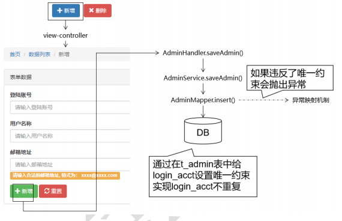
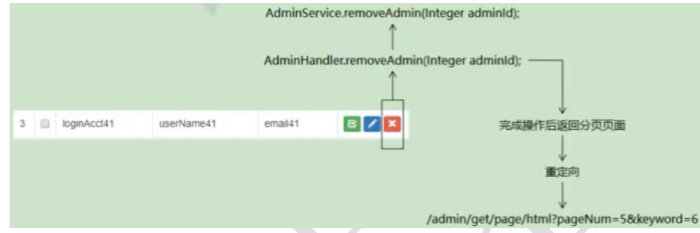
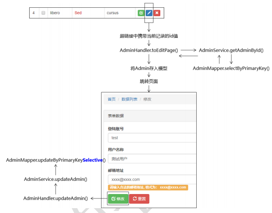

# 新增




## 后端

```java
controller
    密码加密等都放到 adminService 中做
    这个是根据 admin pojo 类，的参数直接映射过来的，所有没有那么多东西
    
service
    1. 密码加密： 
    	admin 取出来密码，进行加密， 然后把加密后的
    2. 设置其他属性，存入 admin
    3.执行插入数据库的操作
    	mapper.insert(admin)
    		要判断账户是否被占用：
    			现在一把都是用的 UUID 把，应该没有会重复的
    			不需要判断重复了把
    	
    
mapper
   
// <mvc:view-controller path="/admin/to/add/page.html" view-name="admin-add"/> 
    有异常，直接回到添加界面
```


## 前端

```java
<button type="button" class="btn btn-primary"
style="float: right;" onclick="window.location.href='add.html'">
<i class="glyphicon glyphicon-plus"></i> 新增
</button>

// 修改为    
<a 
    href="admin/to/add/page.html" 
    class="btn btn-primary"> 新增</a> 
        
// admin-add.jsp      登陆的界面   
       
<form action="admin/save.html" method="post" role="form">

	<div class="form-group">
		<label for="exampleInputPassword1">登录账号</label>
		<input
			name="loginAcct"
			type="text" 
			placeholder="请输入登录账号">
	</div>
	<div class="form-group">
		<label for="exampleInputPassword1">登录密码</label>
		<input
			name="userPswd"
			type="text" 
			placeholder="请输入登录密码">
	</div>
	<div class="form-group">
		<label for="exampleInputPassword1">用户昵称</label>
		<input
			name="userName"
			type="text" 
			placeholder="请输入用户名称">
	</div>
	<div class="form-group">
		<label for="exampleInputEmail1">邮箱地址</label>
		<input type="email"
			name="email"
			
			placeholder="请输入邮箱地址">
		<p class="help-block label label-warning">请输入合法的邮箱地址, 格式为：
			xxxx@xxxx.com</p>
	</div>
	<button type="submit" class="btn btn-success">
		<i class="glyphicon glyphicon-plus"></i> 新增
	</button>
	<button type="reset" class="btn btn-danger">
		<i class="glyphicon glyphicon-refresh"></i> 重置
	</button>
</form>        
```


# 单条删除



## 后端

```java
controller/ handler
   1. service 执行删除，
   2. 页面跳转
    	// 尝试方案 1：直接转发到 admin-page.jsp 会无法显示分页数据
    	// 没有携带分页数据，所以没有分页数据
        // return "admin-page";
    
    	// 尝试方案 2：转发到/admin/get/page.html 地址，
    	// 一旦刷新页面会重复执行删除浪费性能
		// return "forward:/admin/get/page.html";
    
    	// 尝试方案 3：重定向到/admin/get/page.html 地址
		// 同时为了保持原本所在的页面和查询关键词再附加 pageNum 和 keyword 两个请求参数
		return "redirect:/admin/get/page.html?pageNum="+pageNum+"&keyword="+keyword;
    
service
    
    
mapper    
```


## 前端

```java
<!-- 旧代码 -->
<button type="button" class="btn btn-danger btn-xs">
<i class=" glyphicon glyphicon-remove"></i>
</button>
    
    
<!-- 新代码 -->
<a 
	href="admin/remove/
    	${admin.id }/
    	${requestScope.pageInfo.pageNum }/
    	${param.keyword }.html"
    class="btn btn-danger btn-xs">   
        
        
你前端的代码渲染数据，本来就需要后端发过来数据，
  所以你显示的数据，他本来就自身就保存有自身的数据，所可以得到的
  在渲染的时候，这个标签中数据就已经存在了，所以是可以拿得到的     
        
        
        
<c:if test="${!empty requestScope.pageInfo.list }">
	<c:forEach items="${requestScope.pageInfo.list }" var="admin" varStatus="myStatus">
		<tr>
			<td>${myStatus.count }</td>
			<td><input type="checkbox"></td>
			<td>${admin.loginAcct }</td>
			<td>${admin.userName }</td>
			<td>${admin.email }</td>
			<td>
				<a href="admin/remove/
                        ${admin.id }/
                        ${requestScope.pageInfo.pageNum }/
                        ${param.keyword }.html" 
                        >
			</td>
		</tr>
	</c:forEach>
</c:if>        
```

## 考虑

```java
1. 人员删除是不是删除了自己，这个是逻辑不自洽的，会导致之后的操作出现错误
2. 逻辑删除，
3. 删除需要弹出删除的确认    
```


# 编辑更新（没看太懂）




## 后端

```java
介绍
    进行跟新操作的，是需要跳转的新的页面的的，所以牵扯到两个操作
    
    
    进入新页面的： 
    	表单回显，当前页面的数据也要显示在新的页面 
    新页面的操作： 
    	代码更新，数据库同步进行更新,
	新数据更新到页面
        强制刷新，更新表单！！！！！
        

    

    
controller
    url:  id  pageNum  keyword
        ModelMap 进行回显
        
        
	1. 先查询， 然后存入模型： 转发到页面即可
        将查询到的数据回显到 修改页面，
        修改界面，在 requestScope 中获取数据，
	2.  执行更新
        z
        更新的时候，需要有选择的更新， 对于 null 值不更新
        
    
    
service
    一个查询：原先存在的数据
	一个存入： 更新后的数据        
    
    
mapper    
    
    
    
```


## 前端 -- 表单回显

```java
<!-- 旧代码 -->
<button type="button" class="btn btn-danger btn-xs">
<i class=" glyphicon glyphicon-remove"></i>
</button>
    
    
<!-- 新代码 -->
<a 
	href=
    	"admin/remove/
    	${admin.id }/
    	${requestScope.pageInfo.pageNum }/
    	${param.keyword }.html"
 />   
        
        
你前端的代码渲染数据，本来就需要后端发过来数据，
  所以你显示的数据，
  他本来就自身就保存有自身的数据，所可以得到的
        
        
        
        
<c:if test="${!empty requestScope.pageInfo.list }">
	<c:forEach items="${requestScope.pageInfo.list }" var="admin" varStatus="myStatus">
		<tr>
			<td>${myStatus.count }</td>
			<td><input type="checkbox"></td>
			<td>${admin.loginAcct }</td>
			<td>${admin.userName }</td>
			<td>${admin.email }</td>
			<td>

				<!-- 新代码 -->
				<a href="admin/to/edit/page.html?
                    adminId=${admin.id }&
                    pageNum=${requestScope.pageInfo.pageNum }&
                    keyword=${param.keyword }"</a>


			</td>
		</tr>
	</c:forEach>
</c:if>        
```

### jsp

```jsp
<form action="admin/update.html" method="post" role="form">
    <!-- 原数据回显到新页面 -->
    <!-- 查询到的封存在 model 中的数据-->
	<input type="hidden" name="id" value="${requestScope.admin.id }" />
	<input type="hidden" name="pageNum" value="${param.pageNum }" />
	<input type="hidden" name="keyword" value="${param.keyword }" />
    
	<p>${requestScope.exception.message }</p>
	
    <div class="form-group">
        
		<label for="exampleInputPassword1">登录账号</label>
		
        <input
			name="loginAcct" 
			value="${requestScope.admin.loginAcct }"
			type="text" class="form-control"
			id="exampleInputPassword1" placeholder="请输入登录账号">
	</div>
    
	<div class="form-group">
		<label for="exampleInputPassword1">用户昵称</label>
		<input
			name="userName"
			value="${requestScope.admin.userName }" 
			type="text" class="form-control"
			id="exampleInputPassword1" placeholder="请输入用户名称">
	</div>
	
    <div class="form-group">
		<label for="exampleInputEmail1">邮箱地址</label>
		<input type="email"
			name="email" 
			value="${requestScope.admin.email }" class="form-control" id="exampleInputEmail1"
			placeholder="请输入邮箱地址">
		<p class="help-block label label-warning">请输入合法的邮箱地址, 格式为：
			xxxx@xxxx.com</p>	
    </div>
    
	<button type="submit" class="btn btn-success">
		<i class="glyphicon glyphicon-edit"></i> 更新
	</button>
	<button type="reset" class="btn btn-danger">
		<i class="glyphicon glyphicon-refresh"></i> 重置
	</button>
</form>
```


# 模板

## 新增

```java
// 执行保存，如果账户被占用会抛出异常
try {
	adminMapper.insert(admin);
} catch (Exception e) {
	e.printStackTrace();
	// 检测当前捕获的异常对象，如果是 DuplicateKeyException 类型说明是账号重复导致的
	if(e instanceof DuplicateKeyException) {
		// 抛出自定义的 LoginAcctAlreadyInUseException 异常
		throw new LoginAcctAlreadyInUseException(CrowdConstant.MESSAGE_LOGIN_ACCT_ALREADY_IN_USE);
	}
    // 为了不掩盖问题，如果当前捕获到的不是 DuplicateKeyException 类型的异常，则
    把当前捕获到的异常对象继续向上抛出
    throw e;
	} 
}
```

