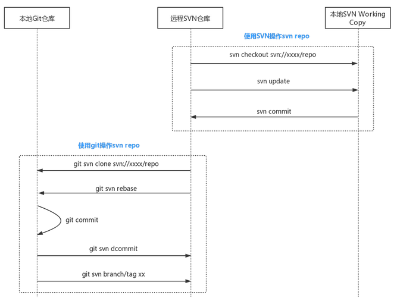

## git操作svn repo的基本工作流



```java
首次新建分支会记录和svn远程对应分支的追踪关系，之后你的所有commit都是在本地的；
并且和纯git管理的项目没有区别，只是在git svn rebase和git svn dcommit的时候才会和svn仓库发生关系
```

## 工作流程

```java

    1. 新建分支git checkout -b <本地分支名称> <远程分支名称>
    	示例：git checkout -b a svn/a
    	说明：此处新建了一个本地分支a，与svn的a分支对应。
    2. 在本地工作，commit到对应分支上
    3. git svn rebase 从svn上更新代码, 相当于svn的update。
    4. git svn dcommit 提交你的commit到svn远程仓库，建议提交前都先运行下git svn rebase。

```


## 远程库

### 克隆

```java
// 克隆远程库
命令： git svn clone <svn项目地址，要包含具体分支路径> [本地文件夹名] [其他参数]
例子： git svn clone file:///d/Projects/svn_repo2/dev proj2_svn
 
// 只下载指定版本之后的历史
git svn clone -r<开始版本号>:<结束版本号> <svn项目地址> [其他参数]
// git svn clone -r2:HEAD file:///d/Projects/svn_repo proj1_git -s
// 其中2为svn版本号，HEAD代表最新版本号，就是只下载svn服务器上版本2到最新的版本的代码.
    
    
    
参数
    
    -s 告诉 Git 该 Subversion 仓库遵循了基本的分支和标签命名法则，也就是标准布局。
    如果你的主干(trunk，相当于非分布式版本控制里的master分支，代表开发的主线），分支(branches)或者标签(tags)以不同的方式命名，则应做出相应改变。
    -s参数其实是-T trunk -b branches -t tags的缩写，这些参数告诉git这些文件夹与git分支、tag、master的对应关系。
    --prefix=svn/ 给svn的所有remote名称增加了一个前缀svn，这样比较统一，而且可以防止warning: refname 'xxx' is ambiguous.


// git的分支情况是与svn文件夹对应的。   
* master
  remotes/svn/a
  remotes/svn/b
  remotes/svn/tags/v1.0
  remotes/svn/trunk
```

### 远程库信息

```java
// 添加远程库信息
// 建议都给他们增加svn/前缀，这样svn的所有分支显示起来会比较一致，与上面clone时的--prefix=svn/类似。
 git config --add svn-remote.<远程分支名称>.url <svn地址，要包含具体分支路径
 // git config --add svn-remote.svn/branch1.url file:///d/Projects/svn_repo2/branch1        
 git config --add svn-remote.<远程分支名称>.fetch :refs/remotes/<远程分支名称
 // git config --add svn-remote.svn/branch1.fetch :refs/remotes/svn/bran    
```


### 分支拉取

```java

    git svn fetch <远程分支名称> 获取svn仓库该分支的代码
	// git svn fetch svn/branch1
        
    git checkout -b <本地分支名> <远程分支名称>
	// git chechout -b a svn/a 
    // 此处新建了一个本地分支a，与svn的a分支对应。
	
    git checkout -b feature1 
    // 在a分支的基础上，开一个本地feture1分支   
	// feture1分支上进行git svn rebase 和 git svn dcommit，这样feature1的commit也会提交到svn的a分支上。
	// feture1是从哪个分支checkout的，它的svn远程分支就与哪个相同。
    // 比如此处是a分支，那么svn分支就是svn/a，commit就会提交到svn的a分支。        
```

## 本地库

### 分支

#### 远程对应

```java
```


#### 创建

```java
命令：git svn branch <分支名称>
示例：git svn branch c_by_gi  // 在svn仓库上建了了一个c_by_git分支
    
    
备注：
    // --destination-branche 添加后报错，需要配置
    $cat .git/config
    [core]
        repositoryformatversion = 0
        filemode = true
        bare = false 
        logallrefupdates = true
        ignorecase = true
        precomposeunicode = true
    [svn-remote "svn"]
        url = svn:// svnbucket.com/bigwhite/test-git-svn
        fetch = :refs/remotes/git- svn
        branches = branches/* :refs/remotes/* 
        tags = tags/* :refs/remotes/*

```

#### 删除

```java
svn rm <svn分支路径> -m <commit信息>
// svn rm file:///d/Projects/svn_repo/branches/c_by_git -m 'rm branch'
    
git branch -D -r <远程分支名称>  
// 删除远程跟踪分支:git branch -D -r svn/c_by_git    
```


### 推送远程库

```java
1. 提交到 git 本地库
    $git commit -m "提交信息"
    
2. 提交
    $git svn dcommit
	// dcommit会将git repo当前branch与远程svn repo中的差异的git commit都提交到svn repo，
    // 并为每个git commit生成一个对应的svn revision。这和”git push”很类似。
```

### tag 管理

#### 新建

```java
$git svn tag v1.0.0 -n -m '[git svn]: tag v1.0.0" --destination=tags

git svn tag <tag名称>
// 在svn仓库上建了一个v1.1tag : git svn tag v1.1    
```

#### 删除

```java
svn rm <svntag路径> -m <commit信息>
// 删除svn目录: svn rm file:///d/Projects/svn_repo/tags/v1.1 -m 'rm tag'
    
git branch -D -r <远程分支名称>
// 删除远程跟踪分支: git branch -D -r svn/tags/v1.1
// svn的tag和分支在git看来是一样的，所以此处还是用的git branch    
```

### 冲突解决

```java
如果本地和svn都进行了修改，则不能快速前进，git svn rebase 会出现错误。
这时应该按以下步骤操作：

    手动修改冲突文件，修改完成后git add

    git rebase --continue

    git svn dcommit

```


## 配置

### 新建分支出现错误

```java
```


## // == 非标准 svn 库

## 操作

```java
主要就是 每个步骤基本都要添加svn的具体路径。
```

## 添加远程分支信息

```java
git config --add svn-remote.<远程分支名称>.url <svn地址，要包含具体分支路径>
git config --add svn-remote.<远程分支名称>.fetch :refs/remotes/<远程分支名称>
```

