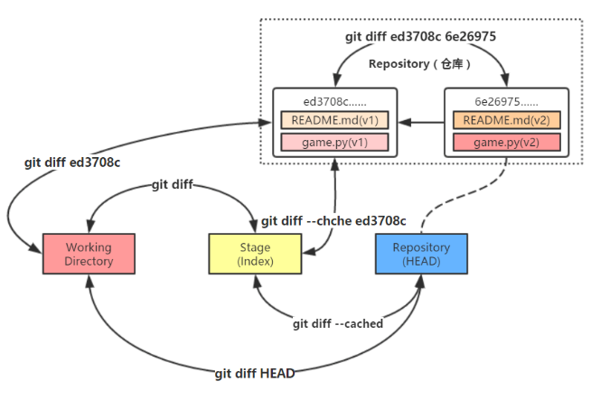

gitgithttps://blog.csdn.net/chengyu_whu/article/details/80048038

## git

### 配置

```go
// 显示当前 git 配置信息
    git config --list

// 编辑 git 配置文件
    git config -e    // 针对当期那仓库
    git config -e --global //针对系统上所有的仓库
```

## 仓库

```go
1. git 命令需要在 git 仓库中才能运行
    执行命令前，需要切换到 git 仓库中，切换到项目文件夹目录下
2. Git 只在仓库的根目录生成 .git 目录
```

### 1. 创建仓库

#### 本地初始化

```go
git init [filename]

1. 省略 filename
    当前目录作为仓库
2. 不省略
    指定文件作为仓库

3. 一般只初始化一次

// 刚创建远程库的时候，里面貌似就有，直接 pull 下来，貌似就是有 .git 文件了
```

#### 远程库克隆

```go
// 克隆下来的文件中，自带 .git 文件
git clone <协议> [别名]

// <协议> ：http ssh 等
git clone  https://gitee.com/slsun00/test.git
    当前目录下创建一个 test 文件，改文件中有一个 .git文件

// [别名] 自定义要新建的项目目录名称，可以在上面的命令末尾指定新的名字：
git clone https://gitee.com/slsun00/test.git mytest
git clone https://gitee.com/slsun00/test mytest
```

#### .git 文件

```go
// 产生 .git 文件
// .git目录中存放的是本地库相关的子目录和文件，不要删除，也不要胡乱修改。
```

### 2. 用户邮箱

* 作用

    * 区分不同开发人员的身份,和登录远程库(代码托管中心)的账号、密码没有任何关系。

* 项目级别/仓库级别

    * 仅在当前本地库范围内有效

        ```go
        //  信息保存位置  ./.git/config 文件
            git config user.name 666
            git config user.amil 123@qq.com
        ```

* 系统用户级别

    * 登录当前操作系统的用户范围

        ```go
        // 信息保存位置 ~/.gitconfig 文件
        // 一般设置这个就行了
        
            git config -globle user.name  666
            git config -globle user.email 123@qq.com
        ```

* 优先级

    * 两者必须有一个，一般设置系统用户级别就行
    * 就近原则 ：项目级别大于系统用户级别

### 3. 分支管理

#### 创建分支

```go
// 创建分支，但是未切换到该分支下
git branch (branchname)

// 创建新分支并立即切换到该分支下
git checkout -b (branchname) 
```

##### 查看分支

```go
git branch  // 没有参数时，git branch 会列出你在本地的分支。
```

##### 删除分支

* 合并完分支就可以删除分支了
* 尽量保存，先别删除

```go
//删除 develop 分支
git branch -d develop
```

#### 切换分支

```go
// 切换到 develop 分支
git checkout develop
```

#### 合并分支

```go
// 将 develop 分支合并到 master 分支，
// 1. 切换到 master 分支
// 2. 执行该命令
// 将 develop 分支最后一次提交的快照合并入当前的 master 分支
git merge develop
```

#### 合并冲突

### 4.  提交文件

#### 提交暂存区

```go
// 添加指定文件
git add [filename]

// 添加当前文件
git add .

1. 将工作区的 新建/修改 添加到暂存区
2. 表示追踪改文件
```

#### 提交本地库

```go
// 将暂存区的内容提交到本地库

// 全部文件
git commit -m [message] 

// 指定文件
git commit [file1] [file2] ... -m [mesage]

// 修改文件后不需要执行 git add 命令，直接来提交
git commit -a 
```

#### 提交远程库

```go
查看远程库操作
```

## 库操作

### 查看状态

* 显示你上次提交更新后的更改或者写入缓存的改动，

```go
// 查看工作区 、暂存区状态
// 看仓库当前的状态，显示有变更的文件。
git status 
git status -s // 简短输出

AM 状态的意思是这个文件在我们将它添加到缓存之后又有改动。
```

### 忽略跟踪

```go
创建 .gitignore
将 *.txt 写入改文件，就可忽略所有后缀为 txt 的文件
```

### 比较

* 比较文件在暂存区和工作区的差异
* 一行一行地显示这些 git status 中改动具体是啥
* 显示已写入暂存区和已经被修改但尚未写入暂存区文件对区别

```go
git diff [filename]
    // 显示暂时去和工作区差异
参数
-cached 或 -staged
    查看已缓存的改动
-stat
    显示摘要而非整个
git diff [first-branch]...[second-branch]
    显示两次提交之间的差异
git diff ed3708c
    比较之前版本的快照与当前工作目录内容
git diff HEAD
    比较当前版本快照与当前工作目录内容
```



### 查看历史记录

* git log

    ```go
    git log  // 查看所有的历史记录
    --pretty==oneline   // 一行显示
    -- oneline          // 一行显示，精简哈希索引,只显示过去的
    --graph             // 查看历史中什么时候出现了分支、合并
    --reverse             // 逆向显示所有日志
    --author=lili       // 查找指定用户的提交日志
    --before={3.weeks.ago}  // 三周前所有提交
    --after={2010-04-18}     // 在2010年四月十八日之后的所有提交
    --since 
    --before
    --until 
    --decorate            // 查看标签信息
    
    git reflog   // 显示所有的日志
    ```

* git blame 

    ```go
    git blame <file>
    列表形式显示修改记录
    ```

### 版本前进后退

```go
git reset [参数] [HEAD] 
```

* --mixed

    * 用于重置暂存区的文件与上一次的提交(commit)保持一致，工作区文件内容保持不变。

    ```go
    // 默认值，可省略
    
    git reset [HEAD]
    
    // head 表示最新快照
    git reset HEAD^           // 回退所有内容到上一个版本
    git reset HEAD^ hello.go  // 回退 hello.go 文件的版本到上一个版本
    git reset 7305cd8         // 回退到指定版本
    ```

* --hard

    ```go
    // 注意搭配 git reflog 使用
    
    // 基于索引值操作[推荐]
    git reset --hard [局部索引值]
    
    // 使用 ^ 符号 ，只能后退
    git reset --hard HEAD^
        1. 一个 ^ 表示后退一步 ， n 个表示后退 n 步
    
    // 使用 ~ 符号 ，只能后退
    git reset --hard HEAD~n // 表示后退 n 步
    ```

* --soft

    ```go
    git reset --soft HEAD
    ```

### 重命名

```go
// git mv [-v] [-f] [-n] [-k] <source> <destination>

git mv <file> <newfile>

参数
    <file>     : 必须存在，并且是文件，符号链接或目录 ，
    <newfile>: 文件新名字


效果
    1.创建一个和之前文件内容一样的文件，文件名为新的文件名
    2.将原来的文件删除
    3.将删除的文件添加到暂存区
    4.将新建的文件添加到暂存区
```

### 移动文件

```go
// git mv [-v] [-f] [-n] [-k] <source> ... <destination directory>
git mv <file> <destination directory>
    destination directory : 是个存在的目录，
    将 file 移动到 文件夹（destination directory）
```

### 标签

* 达到一个重要的阶段，并希望永远记住那个特别的提交快照，你可以使用 git tag 给它打上标签

    ```go
    // 查看标签 
    git tag
    
    // 打标签
    git tag -a v1.0 
    
    // 追加标签
     git tag -a v1.0 85fc7e7
    
    // 指定标签信息命令：
    git tag -a <tagname> -m "runoob.com标签"
    
    //PGP签名标签命令
    git tag -s <tagname> -m "runoob.com标签"
    ```

## 操作远程库

### 远程库

```css
上游版本库
    1. 广义上来说，当前版本库之外的版本库都是远程版本库，
    2. 上游版本库指的是通过git clone 或 git remote add 所指向的那个版本库。
    总述
        上游版本库是远程版本库的一个子集。
        实际工作中，几乎所有的版本库都是通过git clone而来，所以一般情况下远程版本库和上游版本库是同一个意思。
远程版本库
	1. Git版本库来说，从广义上来讲，除了本身以外，其他的版本库都是远程版本库。
	2. 每个版本库都是平等的，无非是有的版本库处于同一个本地磁盘，有的在网络上。根据所处的位置不同，Git会采用不用的通信协议来进行交互。在本地就用本地协议，在网络上就用 SSH ,GIT,HTTP(S),FTP(S)等网络协议。不同的协议对使用来讲具体来说就是URL不同，其他的原理和使用方式没有任何不同。


远程中央版本库
	各版本库之间没有主次之分，是平等的，但是很难做到，所以就一定要在这个团队中固定一个人的版本库 ， 我们需要找一个空闲的单独的稳定的服务器来做这个版本库，大家都从这里更新，向这个提交。这个版本库就是实际工作中的“远程版本库
```


### 参看远程库

```go
git remote 
git remote -v  // (推荐) 到每个别名的实际链接地址

git remote show [remote] // 显示某个远程仓库的信息
```

### 添加远程库

* 设置远程库本地别名

```go
git remote add 别名(origin)  https
// git remote add origin https://github.com/slsun00/learn-code.git
```

### 库短名修改

* 修改远程库在贝本地的别名

```go
git remote rename 旧名称 新名称

//  git remote rename pd paul  将远程库本地名称 pd 修改成 paul
// 其对应的分支名称也变了  pd/master  改成 paul/master
```

### 克隆远程库

```css
克隆方法
    用法1 : git clone <repository> <directory>
        clone一个对等的版本库 A ,对等版本库A 和 git-demo有着同样的工作区，同时也有.git目录


    用法2 : git clone --bare <repository> <directory>
        clone一个裸的版本库 B , 裸版本库B里面直接就是.git目录里面的内容


    用法3 : git clone --mirror <repository> <directory>
        clone一个裸的镜像版本库 C , 裸版本库B里面直接就是.git目录里面的内容


    方法1
        克隆一个 <repository>指向的版本库到 <directory> 目录，
        相当于copy了一个 repository的副本，里面有着一样的工作区，一样的 .git目录。
        差别是新克隆出来的这个版本库里的.git/config文件会记录上游版本库repository的位置。
    方法2
        克隆出来的版本库不包括工作区，直接就是版本库的内容，也就是不包括.git目录而是直接就是.git目录里面的内容。
        这样的版本库称为裸版本库。(通过bare名字就可以看出)
    方法3
        法2类似，也是克隆出一个裸版本库。不过是可以通过git fetch命令与上游版本库repository持续同步。
------------------------------------------------------------------------------------------------
注意
	/* 远程版本库的后缀是'.git',根据前面介绍的约定 '.git'后缀的版本库是裸版本库。*/
	$git clone git@github.com:christian-tl/git-demo.git
        
	1. 远程版本库服务器上面的版本库都是裸版本库 
	2. 克隆下来的版本库会默认把他所克隆的这个版本库注册为上游版本库,并且起名为 origin
    3. 游版本库可以叫任何名字，只不过origin是git默认的上游版本库的名字，当需要写这个名字的地方却省略时，git默认认为是origin
    4. git 做了一个本地master分支和远程版本库master分支的映射。
		本地master分支上执行git pull origin master等价于 git pull
        			  执行git push origin master等价于 git push
    5.  git clone之后版本库默认只有一个master分支，master分支指向了origin/master分支相同的提交号
    6. git clone 命令会把远程版本库的git对象下载下来到 .git/objects目录里，把分支引用保存到.git/packed-refs文件中。得到了引用和git对象，就得到了整个版本库了
```

### 提取远程库更新

```go
git fetch origin master ...
    从名为 origin 的远程上拉取名为 master 的分支到本地分支 origin/master 中
    ... 意思为 ： 拉起多个分支的代码
    拉取代码，当然需要同时指定远程名与分支名，所以分开写
git merge origin/master ...
    合并名为 origin/master 的分支到当前所在分支
    ... 意思为 ： 合并多个分支的代码
    既然是分支的合并，当然就与远程名没有直接的关系，所以没有出现远程名。需要指定的是被合并的分支。

// -----------------------------------------------------------------------------
// 合体 
git pull <远程主机名> <远程分支名>:<本地分支名>

git pull origin master:brantest
    远程主机 origin 的 master 分支拉取过来，与本地的 brantest 分支合并。
git pull origin master
    取回 origin/master 分支，再与当前所在分支合并

// 注意


//  当拉取远程库的项目
    1. 当你本地有仓库(列入你之前 clone 的有)
        使用 git pull  
     2. 当你本地无仓库
        使用 git clone

注意：
    pull push 是要交替着来的，不能一直 push 不 pull
```

### 推送到远程库

```css
git push <远程主机名> <本地分支名>:<远程分支名>
    将本地的分支版本上传到远程并合并


git push [远程 alias] [本地 branch]
    将你的本地 [branch] 分支推送到 [alias] 远程仓库上
    本地分支名与远程分支名相同，则可以省略冒号：

git push -u origin <本地分支名>

第一次推送master分支时，加上了 –u参数，Git不但会把本地的master分支内容推送的远程新的master分支，还会把本地的master分支和远程的master分支关联起来，在以后的推送或者拉取时就可以简化命令。

push
	理论上只要能定位到一个版本库就可以push/pull ， 并不一定需要clone来建立关联 ，但是必须满足三个条件：
    1: 必需是裸版本库
    2: 有这个版本库push和pull的权限
    3: 满足快进式Fast-forward模式,否则无法push成功，pull只会把代码fetch下来，但不会merge
模式
   1.  快进式push
    一般情况下，只允许快进式push.所谓快进式推送，就是要推送的本地版本库的提交是建立在远程版本库相应分支的现有提交基础上的，即远程版本库相应分支的最新提交是本地版本库最新提交的祖先提交。
   2.  非快进式（non-fast-forward）
    非快进式提交是不被允许的，因为这样每个人都随便提交的话会互相覆盖，会弄乱版本库，版本库无法保证一个完整的提交链。

注意
	在push操作时，必需要指定一个远程的分支，也就是要把提交推送到一个明确的分支。 所以在push之前，我们要先取得这个远程分支的提交并作为我们本地提交的祖先提交。
	在这个祖先提交之后所有提交就是最新提交。push就是把这些提交对应的git对象上传到远程版本库。
	所以，在push之前，一定要先pull ，同步一下远程版本库的最新信息 。
	git pull会取得最新提交并和当前分支merge,merge之后最新提交就是本地提交的祖先提交了。


```

### 远程库分支

```css
push不光可以推送到远程已经存在的分支，也可以推送到不存在的分支，当推送到不存在分支时，就创建了这个远程分支。
```


## 版本库初始化

### 基础 

```css
分类
	版本库
        工作区的版本库主要用于日常工作
        先把代码提交到本地的版本库中，然后通过本地库推送到服务器上的版本库中。
    裸版本
        主要存在于服务器上，作为集中式的版本仓库存在。
        因为没有人会在服务器上修改代码并提交，所以这类版本库不需要工作区。
		当然其创建方式也略微不同与带工作区的版本库
```

### 裸版本库

```css

初始化
	$ git init --bare
	/* 为了方便查看，一般会把裸版本库的目录名称中加上 .git 后缀 */
	$ git init –bare hello.git 
版本库 ---> 裸版本库
	裸版本库没有工作区，所以无法直接把代码提交到裸版本库中。
	通用的做法是先克隆裸版本库，在本地库中提交，然后推送到裸版本库中。

	方法 1，从现有库克隆出来一个裸版本库：

        $ git clone –bare hello hellobare.git

        用 git log 命令查看版本库 hellobare.git，它的历史记录和版本库 hello 是一样的。

    方法 2，把已有库推送到裸版本库：

        $ git push –all hellobare2.git

        用 git log 命令查看 hellobare2.git 库，它的历史记录和版本库 hello 也是一样的。
```


## Git 服务器搭建

## 参考

```go
https://www.runoob.com/git/git-server.html
```