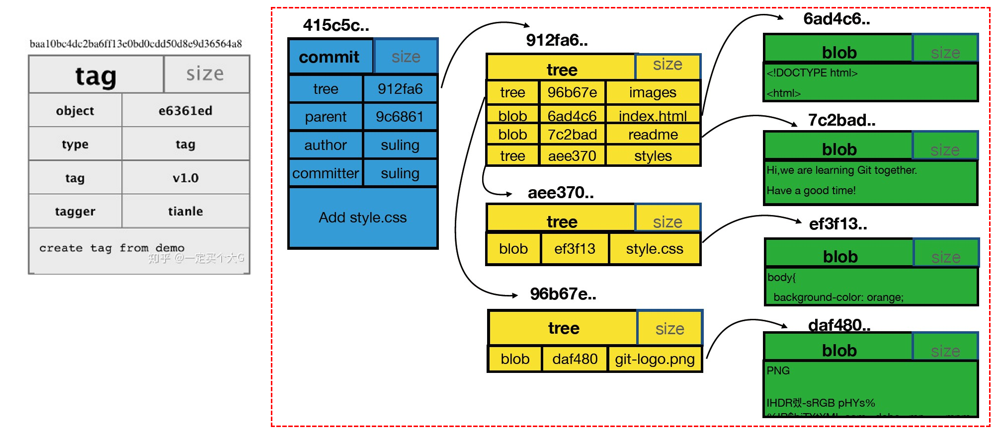
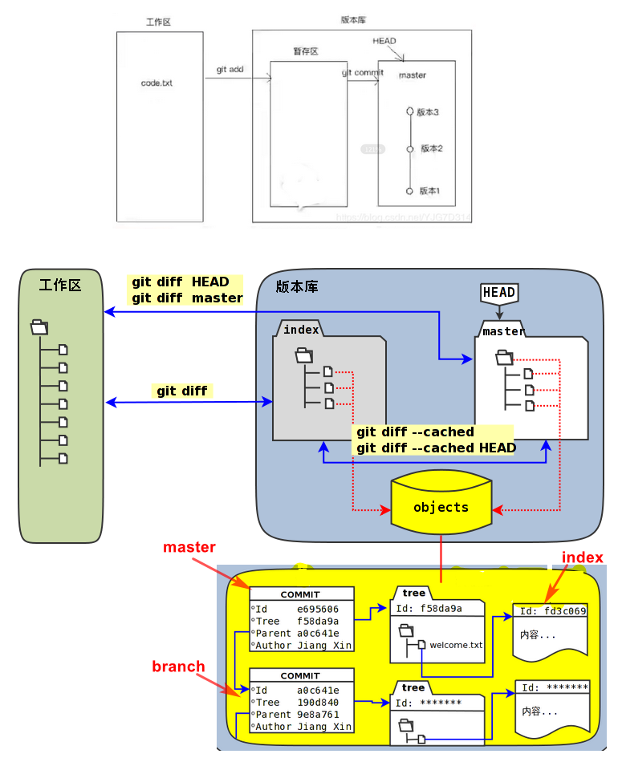

## git 文件夹 - 工作区

```css
在一个目录中执行 git init 就会生成一个 .git 的隐藏目录
demo			/* 项目目录 */
	|- .git		/* git目录 */
	|- code 	/*工作目录，就是除了 .git 目录以外的文件 */
```

## .git 目录

### 介绍

```css
项目存储所有历史和元信息的目录 - 包括所有的对象(commits,trees,blobs,tags)
Git目录是项目的根目录下的一个名为 .git 的隐藏目录
```

### index 文件 - 暂存区

```css
/* git暂存区存放index文件中，所以我们把暂存区有时也叫作索引（index） */
是一个二进制格式的文件，里面存放了与当前暂存内容相关的信息，包括暂存的文件名、文件内容的SHA1哈希串值和文件访问权限。（基本不会看）
```

### objects 目录- 本地仓库

```css
|-- objects/ # Git本地仓库的所有对象 (commits, trees, blobs, tags)
介绍
	我们的工作目录里的所有文件，代码、库文件、图片等都会变成git对象存在这个objects目录下。每个文件都是一个二进制文件
特点
	是以SHA值的前2位作为目录，后38位作为这个目录下的文件名。
	哈希值一共40位，前 2 位作为文件夹名称，后 38 位作为对象文件名。
```


### HEAD 文件

```css
HEAD文件就是一个只有一行信息的纯文本文件。
这行内容记录的是当前头指针的引用，通常是指向一个分支的引用 ，有时也是一个提交(commit)的SHA值

通常的HEAD指针
指向当前分支，分支指向提交
```

### config文件

```css
|-- config # 项目的配置信息，git config命令会改动它
[core]		基本配置	
[remote "origin"]	上游版本库
[branch "master"]    本地分支与上游版本库分支的映射
[alias]		当前仓库 git 命令别名
/*项目在不同情况下，配置信息是不同的
 * 仅仅是git init之后的一个本地仓库，那么只有[core]配置项 
 */
```

### hooks目录

```css
|-- hooks/ # 系统默认钩子脚本目录 , 存放一些 shell 脚本
当git init命令被 调用后, 一些非常有用的示例钩子脚本被拷到新仓库的hooks目录中; 但是在默认情况下它们是不生效的。 把这些钩 子文件的".sample"文件名后缀去掉就可以使它们生效。（一般不用）
```

### logs目录

```css
|-- logs/ # 各个refs的历史信息 , 保存所有更新的引用记录

	logs目录的结构和refs几乎一样，只不过每个纯文本文件记录的HEAD文件和分支文件内容的变化日志,也就是SHA哈希值的变更日志(由于HEAD文件和refs文件的内容就是SHA值)


heads
	存放本地分支对象，
	每个对象的文件名就是本地的一个分支名

remotes
	存放远程库所有分支对象
	每个对象的文件名称就是远程的一个分支名称
	这些分支文件中保存了远程仓库对应分支所有操作
head文件夹
    保存的是所有的操作记录
    使用git reflog查询的结果就是从这个文件来的。

```

### refs目录

```css
|-- refs/ # 标识每个分支指向了哪个提交(commit) ， 就是引用
refs目录下面是一些纯文本文件，分别记录着本地分支和远程分支的SHA哈希值。
文件的数量取决于分支的数量。

工作
    HEAD文件
        内容记录了当前处于哪个分支，值是 ref: refs/heads/master 。
		保存当前最新一次提交的哈希值
    refs/heads/master文件 
        记录了master分支的最新提交的SHA哈希值 
    Git就是通过HEAD文件和refs/heads下面的文件来判断当前分支及分支最新提交的。

    —tags 
        叫做里程碑,或者版本发布用等记录重要版本。
    —remotes
        远程仓库信息
        其中\refs\remotes\origin\HEAD:指向远程仓库当前分支。


示例
	$tree refs
    refs
    ├── heads
    │ ├── develop # 记录本地develop分支的SHA哈希值
    │ └── master # 记录本地master分支的SHA哈希值
    ├── remotes
    │ └── origin
    │ ├── develop # 记录远程版本库develop分支的SHA哈希值
    │ └── master # 记录远程版本库master分支的SHA哈希值
    └── tags
    └── v1.0 # 记录里程碑V1.0的SHA哈希值
```


```css
|-- HEAD # 记录当前处在哪个分支里

|-- description # 项目的描述信息

|-- index # 索引文件

info   存放仓库信息
```


*   commit_editmsg

    *   最新提交的一次 commit message 
    *   git 系统不会用到，给用户一个参考

*   description

    *   仓库的描述信息
    *   主要给 gitweb 等 git 托管系统使用

*   orig_Head

    *   HEAD指针的前一个状态

*   packed-refd

    ```go
    当更新一个引用时，git不会packed-refs，而是会在refs/heads下写入一个新文件。当查找一个引用时，git首先在refs目录下查找，如果未找到则到packed-refs文件中去查找。
    ```


## git 对象存储管理

### SHA-对象名

```css
对象名
	类似： dd981999876726a1d31110479807e71bba979c44
产生
	git生成SHA哈希值用的就是SHA1算法。
作用
	通过一个40个字符的“对象名”来索引的，用来表示项目历史信息的文件
	每一个“对象名”都是对“对象”内容做SHA1哈希计算得来的。
好处
	1.Git只要比较对象名，就可以很快的判断两个对象是否相同。
	2. 因为在每个仓库（repository）的“对象名”的计算方法都完全一样，如果同样的内容存在两个不同的仓库中，就会存在相同的“对象名”下,节省空间。
	3. Git还可以通过检查对象内容的SHA1的哈希值和“对象名”是否相同，来判断对象内容是否正确。
```

### object - git对象

#### 介绍

```css
类型
	blob	tree	commit		tag
大小 
	大小就是指内容的大小
内容
	取决于对象的类型
	git 会把你的每次提交的文件的全部内容（snapshot）都会记录下来
比较
	所有的对象一样，都用其内容的SHA1哈希值来命名的；
	只有当两个对象的内容完全相同（包括其所指向所有子对象）时，它的名字才会一样，反之亦然。
	这样就能让Git仅仅通过比较两个相关的对象的名字是否相同，来快速的判断其内容是否不同。
	SHA值所对应的真正的对象文件存在 .git/objects下面。

/* 总结 */

```

#### 对象间的关系

```css
各个类型间关系
	BLOB	
		用来存储文件数据，通常是一个文件。
	TREE	
		“tree”有点像一个目录，它管理一些“tree”或是 “blob”（就像文件和子目录）
	COMMIT 
		一个“commit”只指向一个"tree"，它用来标记项目某一个特定时间点的状态。
		它包括一些关于时间点的元数据，如时间戳、最近一次提交的作者、指向上次提交（commits）的指针等等。
	 TAG	
		一个“tag”是来标记某一个提交(commit) 的方法。

形象化理解
	blob 	代码文件
    tree 	不同文件夹
    commit	根目录，需要执行一个主文件(比如golang的需要有main.go文件)
    tag		打包一次，一个版本
图解
	注意每个对象是怎么应用的 SHA
	引用的个数是不同，随着版本迭代，会变更多
```



#### blob 对象

```css
blob 对象
内容
    存储文件的内容
    一个"blob对象"就是一块二进制数据，它没有指向任何东西或有任何其它属性
    被Git管理的所有文件都会生成一个blob对象

查看 blob 对象的内容
    git show  或者 git cat-file-p
	
注意
    因为blob对象内容全部都是数据，如两个文件在一个目录树中有同样的数据内容，那么它们将会共享同一个blob对象，也就是说同样一份数据内容git只存储一个blob对象。Blob对象和其所对应的文件所在路径、文件名是否改被更改都完全没有关系。

```

#### tree 对象

```css
一个tree对象有一串(bunch)指向blob对象或是其它tree对象的指针，它一般用来表示内容之间的目录层次关系

特点
	tree对象存储的是指针（tree和blob的SHA哈希值），不存储真正的对象
查看内容
	git ls-tree 或 git cat-file -p
```

#### commit对象

```css
Commit就是提交， "commit对象"指向一个"tree对象", 这个tree对象就是本次提交所对应的目录树,里面包括这次提交时工作区里面所有的目录和文件的指针，有时也叫做快照

查看内容
	 git log -1 --pretty=raw 或 git show -s --pretty=raw 或 git cat-file -p 
组成
	一个tree对象
		tree对象的SHA1签名, 代表着目录在某一时间点的内容
	parents 父对象
		1 提交(commit)的SHA1签名代表着当前提交前一步的项目历史. 上面的那个例子就只有一个父对象; 
		2 如果一个提交没有父对象, 那么我们就叫它“根提交"(root commit), 它就代表着项目最初的一个版本(revision).每个项目必须有至少有一个“根提交"。
		3 Git就是通过父提交把每个提交联系起来，也就是我们一般所说的提交历史。父提交就是当前提交上一版本。
		4 合并的提交(merge commits)可能会有不只一个父对象. 
	author	作者	
		做了此次修改的人的名字,　还有修改日期. 
	committer	提交者
		际创建提交(commit)的人的名字, 同时也带有提交日期. TA可能会和作者不是同一个人;
	提交声明
		用来描述此次提交
使用
	一个提交(commit)本身并没有包括任何信息来说明其做了哪些修改;
	所有的修改(changes)都是通过与父提交(parents)的内容比较而得出的。
```

#### tag 对象

```css
个标签对象包括一个对象名, 对象类型, 标签名, 标签创建人的名字("tagger"), 还有一条可能包含有签名(signature)的消息.
查看内容
	git cat-file -p
作用
	Tag对象就是里程碑的作用，一般在我们正式发布代码是需要建立一个里程碑
```


## git 三个区

### 工作区

```css
就是 IDE 中
执行git init 命令后，生成的这个目录除了.git目录，就是工作区。
```


### 缓存区  -  index

```css
/* 别称 */
	暂存区，Stage,Cached,Index
数据产生
	执行 git add ，不是真正的文件对象
所处位置
	 .git/index文件
作用
	提交代码 ， 解决冲突中转站
```


### 本地仓库  - objects

```css
/* 别称 */
	历史库，版本库，Git仓库，History
数据产生
	执行了 git commit 后
所处位置
	.git/objects 目录
作用
	连接远程库枢纽 ， 存放成品代码
	不能联网的时候，可以将本地代码存放在此处
```

### 远程库

```css
代码托管到远程服务器
	比如：github
```

### 文件状态

```css
1. 未被跟踪的文件（untracked file）
2. 已被跟踪的文件（tracked file）
        被修改但未被暂存的文件（changed but not updated或modified）
	    已暂存可以被提交的文件（changes to be committed 或staged）
		自上次提交以来，未修改的文件(clean 或 unmodified)
```



## 工作流程


## 参看

```css
https://zhuanlan.zhihu.com/p/66506485
```


