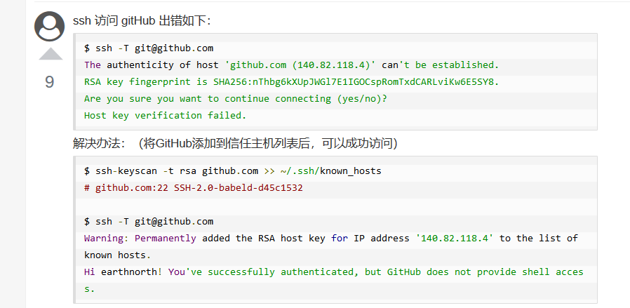

## 2.添加别名

*   自己能混了ssh 和 https

## 3.冲突

```go
error: failed to push some refs to ‘git@github.com:......git pull冲突问题

// 远程仓库的该分支有修改，但你并没有pull到本地，并且你也在本地有修改，这样就会出现系统不知道该以远程仓库为主还是本地仓库为主，所以冲突产生了
```

*   方法 一 (首推)

    ```go
    // 将本地修改保存至缓存区
    1、git stash 
    
    2、git pull
    
    3、git stash pop # 将本地修改与远程修改合并
    
    4、此时需要手动解决冲突，如下所示，删除标记线，然后确定哪些需要修改
    
    5、重新git add 和 git commit ,git push
    ```

*   方法二

    ```go
    1、git add 提交的文件
    
    2、git commit -m ‘提交信息’
    
    3、git stash
    
    4、解决冲突并保存
    
    5、git add 文件, git commit -m, git push origin 分支名
    ```

    

    *   方法三

        ```go
        放弃本地修改，强制往下拉
        
        git push -u origin master -f
        ```

        

    *   方法四

        ```go
        1、撤销本次冲突的提交，git reset --hard~
        
        2、git pull
        
        3、在新的远程文件上进行修改
        ```


## 4.git remote x

```
git remote add 
貌似是关闭 git bash 以后，别名就会失效，怎么解决
```


## 5.工作区、本地库

```go
自己吧工作区的东西，放在本地库，导致上传怎么都出现问题
```





### git pull 

```css
：推送失败，因为我的小伙伴最新提交的和我试图推送的有冲突，解决的办法也很简单，上面已经提示我们，先用git pull把最新的提交从origin/dev抓下来，然后在本地合并，解决冲突，再推送。
```

