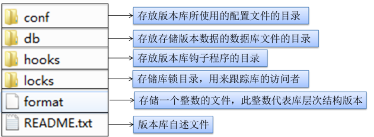

## 目录结构



```java
D:.
│  format
│  README.txt
│
├─conf   // 配置文件
│      authz
│      hooks-env.tmpl
│      passwd
│      svnserve.conf
│
├─db     // 不是我们操作的，不用管
│  │  current
│  │  format
│  │  fs-type
│  │  fsfs.conf
│  │  min-unpacked-rev
│  │  txn-current
│  │  txn-current-lock
│  │  uuid
│  │  write-lock
│  │
│  ├─revprops
│  │  └─0
│  │          0
│  │
│  ├─revs
│  │  └─0
│  │          0
│  │
│  ├─transactions
│  └─txn-protorevs
├─hooks
│      post-commit.tmpl
│      post-lock.tmpl
│      post-revprop-change.tmpl
│      post-unlock.tmpl
│      pre-commit.tmpl
│      pre-lock.tmpl
│      pre-revprop-change.tmpl
│      pre-unlock.tmpl
│      start-commit.tmpl
│
└─locks
        db-logs.lock
        db.lock
```

## config

```java
│      authz
│      hooks-env.tmpl
│      passwd
│      svnserve.conf
```


### svnserve.conf

```java
svn服务配置文件为版本库目录中的文件conf/svnserve.conf。该文件仅由一个[general]配置段组成。
    
[general]
anon-access = none
auth-access = write
password-db = /home/svn/passwd
authz-db = /home/svn/authz
realm = tiku 
    
anon-access: 
	控制非鉴权用户访问版本库的权限，
    取值范围为"write"、"read"和"none"。 
        "write"为可读可写，
        "read"为只读， // 默认值
        "none"表示无访问权限。
auth-access: 
	控制鉴权用户访问版本库的权限。
    取值范围为"write"、"read"和"none"。 
        "write"为可读可写， // 默认值
        "read"为只读，
        "none"表示无访问权限。 
        
authz-db: 
	指定权限配置文件名，通过该文件可以实现以路径为基础的访问控制。
    除非指定绝对路径，否则文件位置为相对conf目录的相对路径。 默认值：authz         
        
realm: 
	指定版本库的认证域，即在登录时提示的认证域名称。
    若两个版本库的 认证域相同，建议使用相同的用户名口令数据文件。 
    默认值：一个UUID(Universal Unique IDentifier，全局唯一标示)。 
        
password-db
	用户名口令文件

```

### passwd-- 用户名口令文件

```java
    默认为conf目录中的passwd。该文件仅由一个[users]配置段组成
	// [users]配置段的配置行格式如下：
	<用户名> = <口令>
        [users]
        admin = admin
        thinker = 123456
```

### authz -- 权限配置文件

```java
权限配置文件
默认为conf目录中的authz。该配置文件由一个[groups]配置段和若干个版本库路径权限段组成。
    
格式
    // [groups]配置段中配置行格式如下
    <用户组> = <用户列表>
    // 版本库路径权限段的段名格式如下：
    [<版本库名>:<路径>] 
例子
    // 本例是使用svnserve -d -r /opt/svn 以多库svnserve方式启动SVN，
    // 所以URL：svn://192.168.0.1/runoob01
    [groups]
    g_admin = admin,thinker

    [admintools:/]
    @g_admin = rw
    * =

    [test:/home/thinker]
    thinker = rw
    * = r
```

