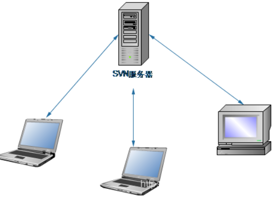
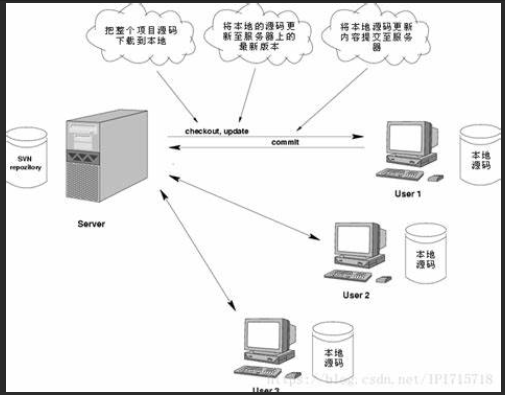

## window 下载安装

```java
https://sourceforge.net/projects/win32svn/
直接一路点击就就行
    
// 会自动创建环境变量    
```

## 介绍




```java
1. SVN是集中式版本控制系统，版本库是集中放在中央服务器的，
2. 而干活的时候，用的都是自己的电脑，所以首先要从中央服务器哪里得到最新的版本，然后干活，干完后，需要把自己做完的活推送到中央服务器。
3. 集中式版本控制系统是必须联网才能工作，如果在局域网还可以，带宽够大，速度够快，如果在互联网下，如果网速慢的话，就郁闷了。
```

