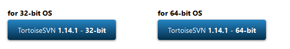

## window 下载安装

```java
svn 官网
    点击这个，可能会卡一段事件，等等之后，就会自动进入下载的流程
    // 注意下载的文件应该是： TortoiseSVN-1.14.1.29085-x64-svn-1.14.1.msi
    // 注意文件名称， 否则
// 会自动创建环境变量    
```




## 介绍


```java
1. SVN是集中式版本控制系统，版本库是集中放在中央服务器的，
2. 而干活的时候，用的都是自己的电脑，所以首先要从中央服务器哪里得到最新的版本，然后干活，干完后，需要把自己做完的活推送到中央服务器。
3. 集中式版本控制系统是必须联网才能工作，如果在局域网还可以，带宽够大，速度够快，如果在互联网下，如果网速慢的话，就郁闷了。
```

