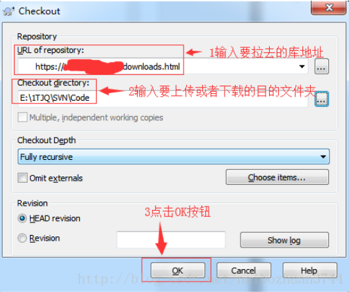
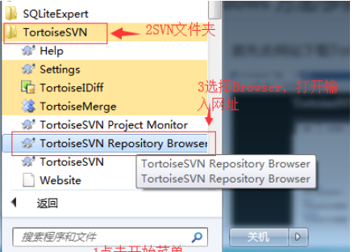
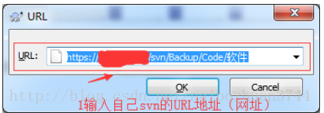
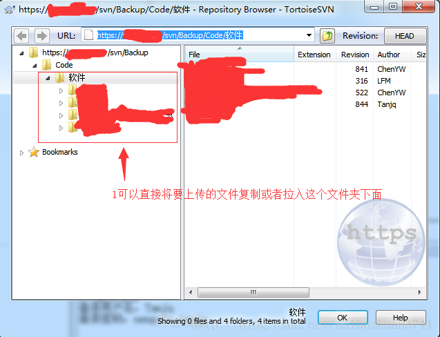

## window 拉取

```java
1. Windows桌面，点击鼠标右键，选择【SVN Checkout...】
2. 在弹出的界面，输入如下图所示信息
3. 弹出的界面输入账号和密码
4. 此时已经拉入完SVN库，也就是电脑和svn建立了连接关系    
```



## window 推送

```java
1. 点击开始菜单，选择SVN Browser    
```



```java
弹出的界面输入之前填入拉去svn库的地址。	
```



```java
登录成功后，弹出如下主界面。
    
1. 单击鼠标右键，选择Add folder，添加文件夹到svn上
2. 在弹出的界面上，选择要上传的文件夹
3. 选中后，点击OK按钮进行上传
4. 上传成功后: 能直接显示在左侧的文件栏中    
```

